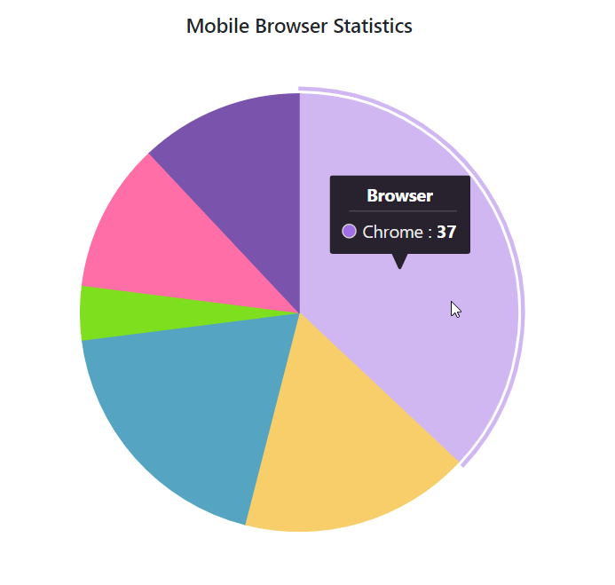
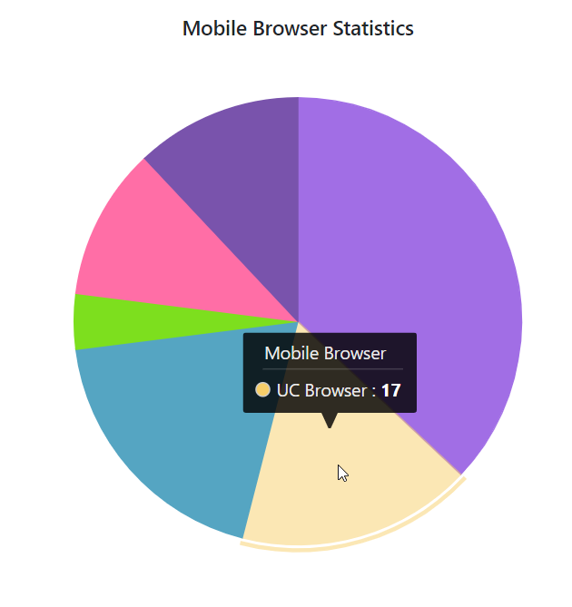

# Tooltip in Blazor Accumulation Chart Component

The [Enable](https://help.syncfusion.com/cr/blazor/Syncfusion.Blazor.Charts.AccumulationChartTooltipSettings.html#Syncfusion_Blazor_Charts_AccumulationChartTooltipSettings_Enable) property in [AccumulationChartTooltipSettings](https://help.syncfusion.com/cr/blazor/Syncfusion.Blazor.Charts.AccumulationChartTooltipSettings.html) can be set to **true** to enable the tooltip.

```cshtml 

@using Syncfusion.Blazor.Charts

<SfAccumulationChart Title="Mobile Browser Statistics">
    <AccumulationChartSeriesCollection>
        <AccumulationChartSeries DataSource="@StatisticsDetails" XName="Browser" YName="Users"
                                 Name="Browser">
        </AccumulationChartSeries>
    </AccumulationChartSeriesCollection>

    <AccumulationChartLegendSettings Visible="false"></AccumulationChartLegendSettings>

    <AccumulationChartTooltipSettings Enable="true"></AccumulationChartTooltipSettings>
</SfAccumulationChart>

@code{
    public class Statistics
    {
        public string Browser { get; set; }
        public double Users { get; set; }
    }

    public List<Statistics> StatisticsDetails = new List<Statistics>
	{
        new Statistics { Browser = "Chrome", Users = 37 },
        new Statistics { Browser = "UC Browser", Users = 17 },
        new Statistics { Browser = "iPhone", Users = 19 },
        new Statistics { Browser = "Others", Users = 4  },
        new Statistics { Browser = "Opera", Users = 11 },
        new Statistics { Browser = "Android", Users = 12 },
    };
}

```



## Header

The [Header](https://help.syncfusion.com/cr/blazor/Syncfusion.Blazor.Charts.AccumulationChartTooltipSettings.html#Syncfusion_Blazor_Charts_AccumulationChartTooltipSettings_Header) property in [AccumulationChartTooltipSettings](https://help.syncfusion.com/cr/blazor/Syncfusion.Blazor.Charts.AccumulationChartTooltipSettings.html) can be used to specify the tooltip's header.

```cshtml 

@using Syncfusion.Blazor.Charts

<SfAccumulationChart Title="Mobile Browser Statistics">
    <AccumulationChartSeriesCollection>
        <AccumulationChartSeries DataSource="@StatisticsDetails" XName="Browser" YName="Users"
                                 Name="Browser">
        </AccumulationChartSeries>
    </AccumulationChartSeriesCollection>

    <AccumulationChartLegendSettings Visible="false"></AccumulationChartLegendSettings>

    <AccumulationChartTooltipSettings Enable="true" Header="Mobile Browser"></AccumulationChartTooltipSettings>
</SfAccumulationChart>

@code{
    public class Statistics
    {
        public string Browser { get; set; }
        public double Users { get; set; }

    }

    public List<Statistics> StatisticsDetails = new List<Statistics>
	{
        new Statistics { Browser = "Chrome", Users = 37 },
        new Statistics { Browser = "UC Browser", Users = 17 },
        new Statistics { Browser = "iPhone", Users = 19 },
        new Statistics { Browser = "Others", Users = 4  },
        new Statistics { Browser = "Opera", Users = 11 },
        new Statistics { Browser = "Android", Users = 12 },
    };
}

```



## Tooltip Format

By default, tooltip shows information about x and y value in points. In addition, further customization can be done in the tooltip. For example, the format `${point.x} : <b>${point.y}%</b>` shows point x value and customized point y value.

```cshtml 

@using Syncfusion.Blazor.Charts

<SfAccumulationChart Title="Mobile Browser Statistics">
    <AccumulationChartSeriesCollection>
        <AccumulationChartSeries DataSource="@StatisticsDetails" XName="Browser" YName="Users"
                                 Name="Browser">
        </AccumulationChartSeries>
    </AccumulationChartSeriesCollection>

    <AccumulationChartLegendSettings Visible="false"></AccumulationChartLegendSettings>

    <AccumulationChartTooltipSettings Enable="true" Format="${point.x} -> <b>${point.y} users</b>"></AccumulationChartTooltipSettings>
</SfAccumulationChart>

@code{
    public class Statistics
    {
        public string Browser { get; set; }
        public double Users { get; set; }

    }

    public List<Statistics> StatisticsDetails = new List<Statistics>
    {
        new Statistics { Browser = "Chrome", Users = 37 },
        new Statistics { Browser = "UC Browser", Users = 17 },
        new Statistics { Browser = "iPhone", Users = 19 },
        new Statistics { Browser = "Others", Users = 4  },
        new Statistics { Browser = "Opera", Users = 11 },
        new Statistics { Browser = "Android", Users = 12 },
    };
}

```


## Tooltip Customization 

The [Fill](https://help.syncfusion.com/cr/blazor/Syncfusion.Blazor.Charts.AccumulationChartTooltipSettings.html#Syncfusion_Blazor_Charts_AccumulationChartTooltipSettings_Fill) and [AccumulationChartTooltipBorder](https://help.syncfusion.com/cr/blazor/Syncfusion.Blazor.Charts.AccumulationChartTooltipBorder.html) are used to customize the background color and the border of the tooltip respectively. The [AccumulationChartTooltipTextStyle](https://help.syncfusion.com/cr/blazor/Syncfusion.Blazor.Charts.AccumulationChartTooltipTextStyle.html) in the tooltip is used to customize the font size of the tooltip text.

```cshtml 

@using Syncfusion.Blazor.Charts

<SfAccumulationChart Title="Mobile Browser Statistics">
    <AccumulationChartSeriesCollection>
        <AccumulationChartSeries DataSource="@StatisticsDetails" XName="Browser" YName="Users"
                                 Name="Browser">
        </AccumulationChartSeries>
    </AccumulationChartSeriesCollection>

    <AccumulationChartLegendSettings Visible="false"></AccumulationChartLegendSettings>

    <AccumulationChartTooltipSettings Enable="true" Format="${point.x} : <b>${point.y}</b>" Fill="#7bb4eb">
        <AccumulationChartTooltipBorder Color="red" Width="2"></AccumulationChartTooltipBorder>
    </AccumulationChartTooltipSettings>
</SfAccumulationChart>

@code{
    public class Statistics
    {
        public string Browser { get; set; }
        public double Users { get; set; }
    }

    public List<Statistics> StatisticsDetails = new List<Statistics>
    {
        new Statistics { Browser = "Chrome", Users = 37 },
        new Statistics { Browser = "UC Browser", Users = 17 },
        new Statistics { Browser = "iPhone", Users = 19 },
        new Statistics { Browser = "Others", Users = 4  },
        new Statistics { Browser = "Opera", Users = 11 },
        new Statistics { Browser = "Android", Users = 12 },
    };
}

```


## Tooltip Text Mapping

By default, tooltip shows information of x and y value in points. In addition, by using the [TooltipMappingName](https://help.syncfusion.com/cr/blazor/Syncfusion.Blazor.Charts.AccumulationChartSeries.html#Syncfusion_Blazor_Charts_AccumulationChartSeries_TooltipMappingName), more information from the datasource can be displayed in the tooltip. To display the specified tooltip content, **$point.tooltip** can be used as a placeholder.

```cshtml 

@using Syncfusion.Blazor.Charts

<SfAccumulationChart Title="Sales Analysis">
    <AccumulationChartSeriesCollection>
        <AccumulationChartSeries DataSource="@StatisticsDetails" XName="XValue" YName="YValue"
                                 TooltipMappingName="Text">
        </AccumulationChartSeries>
    </AccumulationChartSeriesCollection>

    <AccumulationChartLegendSettings Visible="false"></AccumulationChartLegendSettings>

    <AccumulationChartTooltipSettings Enable="true" Format="${point.tooltip}" ></AccumulationChartTooltipSettings>
</SfAccumulationChart>

@code{
    public class ChartData
    {
        public string XValue { get; set; }
        public double YValue { get; set; }
        public string Text { get; set; }
    }

    public List<ChartData> DataSource = new List<ChartData>
    {
       new ChartData { XValue = "Jan", YValue = 3, Text= "Jan: 3M" },
       new ChartData { XValue = "Feb", YValue = 3.5, Text= "Feb: 3.5M" },
       new ChartData { XValue = "Mar", YValue = 7, Text= "Mar: 7M" },
       new ChartData { XValue = "Apr", YValue = 3.5, Text= "Apr: 13.5M" },
       new ChartData { XValue = "May", YValue = 19, Text= "May: 19M" },
       new ChartData { XValue = "Jun", YValue = 23.5, Text= "Jun: 23.5M" },
       new ChartData { XValue = "Jul", YValue = 26, Text= "Jul: 26M" },
       new ChartData { XValue = "Aug", YValue = 25, Text= "Aug: 25M" },
       new ChartData { XValue = "Sep", YValue = 21, Text= "Sep: 21M" },
       new ChartData { XValue = "Oct", YValue = 15, Text= "Oct: 15M" },
       new ChartData { XValue = "Nov", YValue = 9, Text= "Nov: 9M" },
       new ChartData { XValue = "Dec", YValue = 13.5, Text= "Dec: 3.5M" }
   };
}

```


> Refer to the [Blazor Charts](https://www.syncfusion.com/blazor-components/blazor-charts) feature tour page for its groundbreaking feature representations and also explore the [Blazor Accumulation Chart Example](https://blazor.syncfusion.com/demos/chart/pie?theme=bootstrap4) to know about the various features of accumulation charts and how it is used to represent numeric proportional data.

## See Also

* [Grouping](./grouping/)
* [Data label](./data-label/)