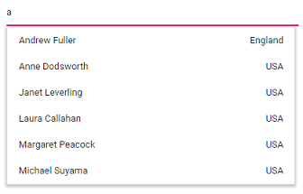
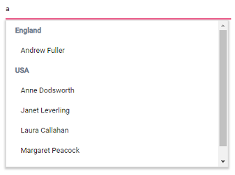
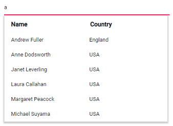
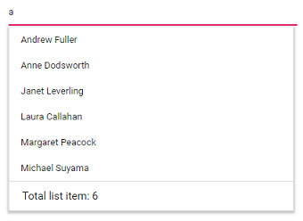

# Templates in Blazor AutoComplete Component

The AutoComplete has been provided with several options to customize each list items, group title, header, and footer elements.

## Item template

The content of each list item within the [AutoComplete](https://help.syncfusion.com/cr/blazor/Syncfusion.Blazor.DropDowns.SfAutoComplete-2.html) can be customized with the help of [ItemTemplate](https://help.syncfusion.com/cr/blazor/Syncfusion.Blazor.DropDowns.SfDropDownBase-1.html#Syncfusion_Blazor_DropDowns_SfDropDownBase_1_ItemTemplate) property.

In the following sample, each list item is split into two columns to display relevant data.

```cshtml
@using Syncfusion.Blazor.Data
@using Syncfusion.Blazor.DropDowns

<SfAutoComplete TValue="string" TItem="EmployeeData" Placeholder="Select a customer" DataSource="@Data">
    <AutoCompleteTemplates TItem="EmployeeData">
        <ItemTemplate>
            <span><span class='name'>@((context as EmployeeData).FirstName)</span><span class='country'>@((context as EmployeeData).Country)</span></span>
        </ItemTemplate>
    </AutoCompleteTemplates>
    <AutoCompleteFieldSettings Value="FirstName"></AutoCompleteFieldSettings>
</SfAutoComplete>

@code {
    public class EmployeeData
    {
        public string FirstName { get; set; }
        public string Country { get; set; }
    }
    List<EmployeeData> Data = new List<EmployeeData>
{
        new EmployeeData() { FirstName = "Andrew Fuller",  Country = "England" },
        new EmployeeData() { FirstName = "Anne Dodsworth", Country = "USA" },
        new EmployeeData() { FirstName = "Janet Leverling", Country = "USA" },
        new EmployeeData() { FirstName = "Laura Callahan", Country = "USA"},
        new EmployeeData() { FirstName = "Margaret Peacock", Country = "USA"},
        new EmployeeData() { FirstName = "Michael Suyama", Country = "USA", },
        new EmployeeData() { FirstName = "Nancy Davolio", Country = "USA"},
        new EmployeeData() { FirstName = "Robert King", Country = "England"},
        new EmployeeData() { FirstName = "Steven Buchanan", Country = "England"},
    };
}

<style>
    .country {
        right: 15px;
        position: absolute;
    }
</style>
```

The output will be as follows.



## Group template

The group header title under which appropriate sub-items are categorized can also be customized with the help of [GroupTemplate](https://help.syncfusion.com/cr/blazor/Syncfusion.Blazor.DropDowns.SfDropDownBase-1.html#Syncfusion_Blazor_DropDowns_SfDropDownBase_1_GroupTemplate) property. This template is common for both inline and floating group header templates.

In the following sample, employees are grouped according to their country.

```cshtml
@using Syncfusion.Blazor.Data
@using Syncfusion.Blazor.DropDowns

<SfAutoComplete TValue="string" TItem="EmployeeData" Placeholder="Select a customer" DataSource="@Data">
    <AutoCompleteTemplates TItem="EmployeeData">
        <GroupTemplate>
            <span class='country'>@(context.Text)</span>
        </GroupTemplate>
    </AutoCompleteTemplates>
    <AutoCompleteFieldSettings Value="FirstName" GroupBy="Country"></AutoCompleteFieldSettings>
</SfAutoComplete>

@code {
    public class EmployeeData
    {
        public string FirstName { get; set; }
        public string Country { get; set; }
    }
    List<EmployeeData> Data = new List<EmployeeData>
{
        new EmployeeData() { FirstName = "Andrew Fuller",  Country = "England" },
        new EmployeeData() { FirstName = "Anne Dodsworth", Country = "USA" },
        new EmployeeData() { FirstName = "Janet Leverling", Country = "USA" },
        new EmployeeData() { FirstName = "Laura Callahan", Country = "USA"},
        new EmployeeData() { FirstName = "Margaret Peacock", Country = "USA"},
        new EmployeeData() { FirstName = "Michael Suyama", Country = "USA", },
        new EmployeeData() { FirstName = "Nancy Davolio", Country = "USA"},
        new EmployeeData() { FirstName = "Robert King", Country = "England"},
        new EmployeeData() { FirstName = "Steven Buchanan", Country = "England"},
    };
}
<style>
    .group {
        color: slategrey;
    }
</style>
```

The output will be as follows.



## Header template

The header element is shown statically at the top of the suggestion list items within the AutoComplete, and any custom element can be placed as a header element using the `HeaderTemplate` property.

In the following sample, the list items and its headers are designed and displayed as two columns similar to multiple columns of the grid.

```cshtml
@using Syncfusion.Blazor.Data
@using Syncfusion.Blazor.DropDowns

<SfAutoComplete TValue="string" TItem="EmployeeData" Placeholder="Select a customer" DataSource="@Data">
    <AutoCompleteTemplates TItem="EmployeeData">
        <ItemTemplate>
            <span class='item'><span class='name'>@((context as EmployeeData).FirstName)</span><span class='city'>@((context as EmployeeData).Country)</span></span>
        </ItemTemplate>
        <HeaderTemplate>
            <span class='head'><span class='name'>Name</span><span class='city'>Country</span></span>
        </HeaderTemplate>
    </AutoCompleteTemplates>
    <AutoCompleteFieldSettings Value="FirstName"></AutoCompleteFieldSettings>
</SfAutoComplete>

@code {
    public class EmployeeData
    {
        public string FirstName { get; set; }
        public string Country { get; set; }
    }
    List<EmployeeData> Data = new List<EmployeeData>
{
        new EmployeeData() { FirstName = "Andrew Fuller",  Country = "England" },
        new EmployeeData() { FirstName = "Anne Dodsworth", Country = "USA" },
        new EmployeeData() { FirstName = "Janet Leverling", Country = "USA" },
        new EmployeeData() { FirstName = "Laura Callahan", Country = "USA"},
        new EmployeeData() { FirstName = "Margaret Peacock", Country = "USA"},
        new EmployeeData() { FirstName = "Michael Suyama", Country = "USA", },
        new EmployeeData() { FirstName = "Nancy Davolio", Country = "USA"},
        new EmployeeData() { FirstName = "Robert King", Country = "England"},
        new EmployeeData() { FirstName = "Steven Buchanan", Country = "England"},
    };
}

<style>
    .head, .item {
        display: table;
        width: 100%;
        margin: auto;
    }

    .head {
        height: 40px;
        font-size: 15px;
        font-weight: 600;
    }

    .name, .city {
        display: table-cell;
        vertical-align: middle;
        width: 50%;
    }

    .head .name {
        text-indent: 16px;
    }
</style>
```

The output will be as follows.



## Footer template

The AutoComplete has options to show a footer element at the bottom of the list items in the suggestion list. Here, you can place any custom element as a footer element using `FooterTemplate` property.

In the following sample, footer element displays the total number of list items present in the AutoComplete.

```cshtml
@using Syncfusion.Blazor.Data
@using Syncfusion.Blazor.DropDowns

<SfAutoComplete TValue="string" TItem="EmployeeData" DataSource="@Data" Placeholder="Select a customer">
    <AutoCompleteTemplates TItem="EmployeeData">
        <FooterTemplate>
            <span class='footer'>Total list item: 6</span>
        </FooterTemplate>
    </AutoCompleteTemplates>
    <AutoCompleteFieldSettings Value="FirstName"></AutoCompleteFieldSettings>
</SfAutoComplete>

@code {

    public class EmployeeData
    {
        public string FirstName { get; set; }
        public string Country { get; set; }
    }
    List<EmployeeData> Data = new List<EmployeeData>
{
        new EmployeeData() { FirstName = "Andrew Fuller",  Country = "England" },
        new EmployeeData() { FirstName = "Anne Dodsworth", Country = "USA" },
        new EmployeeData() { FirstName = "Janet Leverling", Country = "USA" },
        new EmployeeData() { FirstName = "Laura Callahan", Country = "USA"},
        new EmployeeData() { FirstName = "Margaret Peacock", Country = "USA"},
        new EmployeeData() { FirstName = "Michael Suyama", Country = "USA", },
    };
}

<style>
    .footer {
        text-indent: 1.2em;
        display: block;
        font-size: 15px;
        line-height: 40px;
        border-top: 1px solid #e0e0e0;
    }
</style>
```

The output will be as follows.



## No records template

The AutoComplete is provided with support to custom design the suggestion list content when no data is found and no matches found on search with the help of the [NoRecordsTemplate](https://help.syncfusion.com/cr/blazor/Syncfusion.Blazor.DropDowns.SfDropDownBase-1.html#Syncfusion_Blazor_DropDowns_SfDropDownBase_1_NoRecordsTemplate) property.

In the following sample, suggestion list content displays the notification of no data available.

```cshtml
@using Syncfusion.Blazor.DropDowns

<SfAutoComplete TValue="string" TItem="Countries" Placeholder="Select a customer" DataSource="@Country">
    <AutoCompleteTemplates TItem="Countries">
        <NoRecordsTemplate>
            <span class='norecord'> NO DATA AVAILABLE</span>
        </NoRecordsTemplate>
    </AutoCompleteTemplates>
    <AutoCompleteFieldSettings Value="Name"></AutoCompleteFieldSettings>
</SfAutoComplete>

@code {
    public class EmployeeData
    {
        public string Name { get; set; }
    }
    public EmployeeData Data = new EmployeeData();

    public class Countries
    {
        public string Name { get; set; }

        public string Code { get; set; }
    }

    List<Countries> Country = new List<Countries>
{
        new Countries() { Name = "Australia", Code = "AU" },
        new Countries() { Name = "Bermuda", Code = "BM" },
        new Countries() { Name = "Canada", Code = "CA" },
        new Countries() { Name = "Cameroon", Code = "CM" },
        new Countries() { Name = "Denmark", Code = "DK" },
    };
}
```

The output will be as follows.


## Action failure template

There is also an option to custom design the suggestion list content when the data fetch request fails at the remote server. This can be achieved using the [ActionFailureTemplate](https://help.syncfusion.com/cr/blazor/Syncfusion.Blazor.DropDowns.SfDropDownBase-1.html#Syncfusion_Blazor_DropDowns_SfDropDownBase_1_ActionFailureTemplate) property.

In the following sample, when the data fetch request fails, the AutoComplete displays the notification.

```cshtml
@using Syncfusion.Blazor.Data
@using Syncfusion.Blazor.DropDowns

<SfAutoComplete TValue="string" TItem="OrderDetails" Placeholder="Select a name" Query="@RemoteDataQuery">
    <AutoCompleteTemplates TItem="OrderDetails">
        <ActionFailureTemplate>
            <span class='norecord'>Data fetch get fails </span>
        </ActionFailureTemplate>
    </AutoCompleteTemplates>
     <SfDataManager Url="https://js.syncfusion.com/demos/ejServices/Wcf/Northwind.svc/Orders" CrossDomain="true" Adaptor="Syncfusion.Blazor.Adaptors.ODataAdaptor"></SfDataManager>
     <AutoCompleteFieldSettings Value="CustomerID"></AutoCompleteFieldSettings>
</SfAutoComplete>

@code {
    public Query RemoteDataQuery = new Query().Select(new List<string> { "CustomerID" }).Take(6).RequiresCount();

    public Syncfusion.Blazor.Lists.SortOrder Sort { get; set; } = Syncfusion.Blazor.Lists.SortOrder.Ascending;

     public class OrderDetails
    {
        public int? OrderID { get; set; }
        public string CustomerID { get; set; }
        public int? EmployeeID { get; set; }
        public double? Freight { get; set; }
        public string ShipCity { get; set; }
        public bool Verified { get; set; }
        public DateTime? OrderDate { get; set; }
        public string ShipName { get; set; }
        public string ShipCountry { get; set; }
        public DateTime? ShippedDate { get; set; }
        public string ShipAddress { get; set; }
    }
}
```