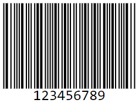
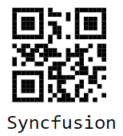
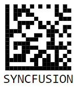

# Getting Started with Blazor Barcode Component

This section briefly explains about how to include a BarcodeGenerator in your Blazor Server-Side application. You can refer [Getting Started with Syncfusion Blazor for Server-Side in Visual Studio 2019](https://blazor.syncfusion.com/documentation/getting-started/blazor-server-side-visual-studio-2019/) page for the introduction and configuring the common specifications.

## Importing Syncfusion Blazor component in the application

 1. Install the [Syncfusion.Blazor.BarcodeGenerator](https://www.nuget.org/packages/Syncfusion.Blazor.BarcodeGenerator/) NuGet package to the application by using the [NuGet Package Manager](https://blazor.syncfusion.com/documentation/nuget-packages/).
 2. You can add the client-side resources through [CDN](https://blazor.syncfusion.com/documentation/appearance/themes#cdn-reference) or from [NuGet](https://blazor.syncfusion.com/documentation/appearance/themes#static-web-assets) package in the **HEAD** element of the **~/Pages/_Host.cshtml** page.

    ```cshtml
    <head>
        <environment include="Development">
            <link href="_content/Syncfusion.Blazor.Themes/bootstrap4.css" rel="stylesheet" />
        </environment>
    </head>
    ```

    > For Internet Explorer 11 kindly refer the polyfills. Refer the [documentation](https://blazor.syncfusion.com/documentation/common/how-to/render-blazor-server-app-in-ie/) for more information.

    ```cshtml
    <head>
        <environment include="Development">
            <link href="_content/Syncfusion.Blazor.Themes/bootstrap4.css" rel="stylesheet" />
            <script src="https://github.com/Daddoon/Blazor.Polyfill/releases/download/3.0.1/blazor.polyfill.min.js"></script>
        </environment>
    </head>

    ```

## Adding component package to the application

Open **~/_Imports.Blazor** file and import the `Syncfusion.Blazor.BarcodeGenerator` packages.

```cshtml
@using Syncfusion.Blazor
@using Syncfusion.Blazor.BarcodeGenerator
```

## Add SyncfusionBlazor service in Startup.cs

Open the **Startup.cs** file and add services required by Syncfusion components using  **services.AddSyncfusionBlazor()** method. Add this method in the **ConfigureServices** function as follows.

```cshtml
@using Syncfusion.Blazor;

namespace BlazorApplication
{
    public class Startup
    {
        ....
        ....
        public void ConfigureServices(IServiceCollection services)
        {
            ....
            ....
            services.AddSyncfusionBlazor();
        }
    }
}
```

**Note**: To enable custom client side resource loading from CRG or CDN. You need to disable resource loading by `AddSyncfusionBlazor(true)` and load the scripts in the **HEAD** element of the **~/Pages/_Host.cshtml** page.

```cshtml
<head>
    <environment include="Development">
       <script src="https://cdn.syncfusion.com/blazor/{{ site.blazorversion }}/syncfusion-blazor.min.js"></script>
   </environment>
</head>
```

## Adding BarcodeGenerator component to the Application

BarcodeGenerator component can be rendered by using the [SfBarcodeGenerator](https://help.syncfusion.com/cr/blazor/Syncfusion.Blazor.BarcodeGenerator.SfBarcodeGenerator.html) tag helper in ASP.NET Core Blazor application. Add the BarcodeGenerator component in any web page `Blazor` in the `Pages` folder. For example, the BarcodeGenerator component is added in the `~/Pages/Index.Blazor` page.

The following example shows a basic BarcodeGenerator component.

```cshtml
<SfBarcodeGenerator Width="200px" Height="150px" Mode="@RenderingMode.SVG" Type="@BarcodeType.Codabar" Value="123456789"></SfBarcodeGenerator>

```



> Running the above code will display the barcode generator component on the browser.

## Adding QR Generator control

You can add the QR code in our barcode generator component.

```cshtml
<SfQRCodeGenerator Width="200px" Height="150px"  Value="Syncfusion"></SfQRCodeGenerator>

```



## Adding Data Matrix Generator control

You can add the Data Matrix code in our barcode generator component.

```cshtml
 <SfDataMatrixGenerator Width="200" Height="150" Mode="@RenderingMode.SVG" Value="SYNCFUSION"></SfDataMatrixGenerator>

```



## See Also

* [Getting Started with Syncfusion Blazor for Client-Side in .NET Core CLI](https://blazor.syncfusion.com/documentation/getting-started/blazor-webassembly-dotnet-cli/)
* [Getting Started with Syncfusion Blazor for Server-Side in Visual Studio 2019 Preview](https://blazor.syncfusion.com/documentation/getting-started/blazor-server-side-visual-studio-2019/)
* [Getting Started with Syncfusion Blazor for Server-Side in .NET Core CLI](https://blazor.syncfusion.com/documentation/getting-started/blazor-server-side-dotnet-cli/)