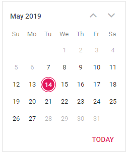

# Data Range in Blazor Calendar Component

A calendar provides an option to select a date value within a specified range by defining the [Min](https://help.syncfusion.com/cr/blazor/Syncfusion.Blazor.Calendars.CalendarBase-1.html#Syncfusion_Blazor_Calendars_CalendarBase_1_Min) and [Max](https://help.syncfusion.com/cr/blazor/Syncfusion.Blazor.Calendars.CalendarBase-1.html#Syncfusion_Blazor_Calendars_CalendarBase_1_Max) properties. The Min date should always be lesser than the Max date.

* If the value of `Min` or `Max` properties are changed through code behind, then update the `Value` property to be set within the  specified range.

* If the value is out of specified date range and less than Min date, the `Value` property will be updated with Min date or the value is higher than Max date, the `Value` property will be updated with Max date.

The following code allows you to select a date within the range of 7th to 27th days in a month.

```cshtml
@using Syncfusion.Blazor.Calendars

<SfCalendar TValue="DateTime?" Min='@MinDate' Max='@MaxDate' Value='@DateValue'></SfCalendar>

@code{
    public DateTime MinDate {get;set;} = new DateTime(DateTime.Now.Year,DateTime.Now.Month,07);
    public DateTime MaxDate {get;set;} = new DateTime(DateTime.Now.Year, DateTime.Now.Month, 27);
    public DateTime? DateValue {get;set;} = new DateTime(DateTime.Now.Year, DateTime.Now.Month, 14);
}
```

The output will be as follows.

