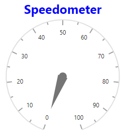
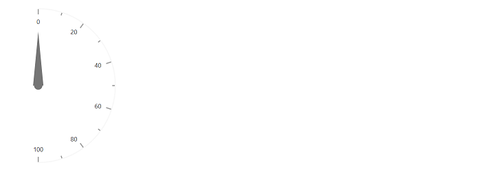
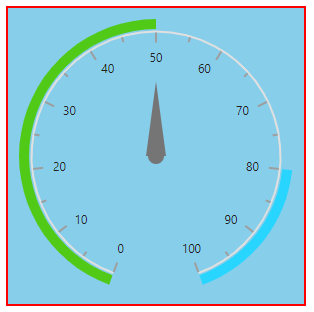
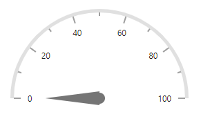

# Appearance in Blazor Circular Gauge Component

## Circular gauge title

You can add a title to the Circular Gauge using the [Title](https://help.syncfusion.com/cr/blazor/Syncfusion.Blazor.CircularGauge.SfCircularGauge.html#Syncfusion_Blazor_CircularGauge_SfCircularGauge_Title)  property. The title can be customized using the [CircularGaugeTitleStyle](https://help.syncfusion.com/cr/aspnetcore-blazor/Syncfusion.Blazor.CircularGauge.CircularGaugeTitleStyle.html) tag.

```cshtml
@using Syncfusion.Blazor.CircularGauge

<SfCircularGauge Title="Speedometer">
    <CircularGaugeTitleStyle Color="blue" FontWeight="bold" Size="25"></CircularGaugeTitleStyle>
</SfCircularGauge>
```



## Circular gauge position

The Circular Gauge can be positioned anywhere in the container using the [CenterX](https://help.syncfusion.com/cr/blazor/Syncfusion.Blazor.CircularGauge.SfCircularGauge.html#Syncfusion_Blazor_CircularGauge_SfCircularGauge_CenterX) and [CenterY](https://help.syncfusion.com/cr/blazor/Syncfusion.Blazor.CircularGauge.SfCircularGauge.html#Syncfusion_Blazor_CircularGauge_SfCircularGauge_CenterY) properties which accept values either in percentage or in pixels. The default value of the [CenterX](https://help.syncfusion.com/cr/blazor/Syncfusion.Blazor.CircularGauge.SfCircularGauge.html#Syncfusion_Blazor_CircularGauge_SfCircularGauge_CenterX) and [CenterY](https://help.syncfusion.com/cr/blazor/Syncfusion.Blazor.CircularGauge.SfCircularGauge.html#Syncfusion_Blazor_CircularGauge_SfCircularGauge_CenterY) property are 50%, so the Circular Gauge will get rendered to the center of the container.

### In pixel

You can set the mid point of the Circular Gauge in pixel as shown below.

```cshtml
@using Syncfusion.Blazor.CircularGauge

<SfCircularGauge CenterX="20px" CenterY="20px">
    <CircularGaugeAxes>
        <CircularGaugeAxis StartAngle="90" EndAngle="180"></CircularGaugeAxis>
    </CircularGaugeAxes>
</SfCircularGauge>
```


### In percentage

By setting the value in percentage, Circular Gauge gets its mid point with respect to its plot area. For example, when setting the value of [CenterX](https://help.syncfusion.com/cr/blazor/Syncfusion.Blazor.CircularGauge.SfCircularGauge.html#Syncfusion_Blazor_CircularGauge_SfCircularGauge_CenterX) to '1%' and the value of [CenterY](https://help.syncfusion.com/cr/blazor/Syncfusion.Blazor.CircularGauge.SfCircularGauge.html#Syncfusion_Blazor_CircularGauge_SfCircularGauge_CenterY) to ‘50%’, the gauge will be positioned at the top-left corner of the plot area.

```cshtml
@using Syncfusion.Blazor.CircularGauge

<SfCircularGauge CenterX="1%" CenterY="50%">
    <CircularGaugeAxes>
        <CircularGaugeAxis StartAngle="0" EndAngle="180"></CircularGaugeAxis>
    </CircularGaugeAxes>
</SfCircularGauge>
```



## Background customization

Using the [Background](https://help.syncfusion.com/cr/blazor/Syncfusion.Blazor.CircularGauge.SfCircularGauge.html#Syncfusion_Blazor_CircularGauge_SfCircularGauge_Background) and [CircularGaugeBorder](https://help.syncfusion.com/cr/aspnetcore-blazor/Syncfusion.Blazor.CircularGauge.CircularGaugeBorder.html) properties, you can change the background color and border of the Circular Gauge.

```cshtml
@using Syncfusion.Blazor.CircularGauge

<SfCircularGauge Background="skyblue">
    <CircularGaugeBorder Color="#FF0000"
                         Width="2">
    </CircularGaugeBorder>
    <CircularGaugeAxes>
        <CircularGaugeAxis>
            <CircularGaugeRanges>
                <CircularGaugeRange Start="1"
                                    End="50"
                                    Radius="110%">
                </CircularGaugeRange>
                <CircularGaugeRange Start="80"
                                    End="100"
                                    Radius="110%">
                </CircularGaugeRange>
            </CircularGaugeRanges>
            <CircularGaugePointers>
                <CircularGaugePointer Value="50"
                                      Radius="60%">
                </CircularGaugePointer>
            </CircularGaugePointers>
        </CircularGaugeAxis>
    </CircularGaugeAxes>
</SfCircularGauge>
```



## Radius calculation based on angles

You can render semi or quarter Circular Gauge by modifying the start and end angles. By enabling the radius based on angle option, the radius of circular gauge will be calculated based on the start and end angles to avoid excess white space.

```cshtml
@using Syncfusion.Blazor.CircularGauge

<SfCircularGauge>
    <CircularGaugeAxes>
        <CircularGaugeAxis Radius="60%" StartAngle="270" EndAngle="90">
            <CircularGaugeAxisLineStyle Width="5">
            </CircularGaugeAxisLineStyle>
        </CircularGaugeAxis>
    </CircularGaugeAxes>
</SfCircularGauge>
```

