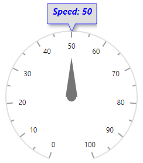
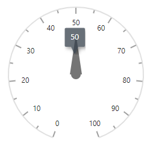
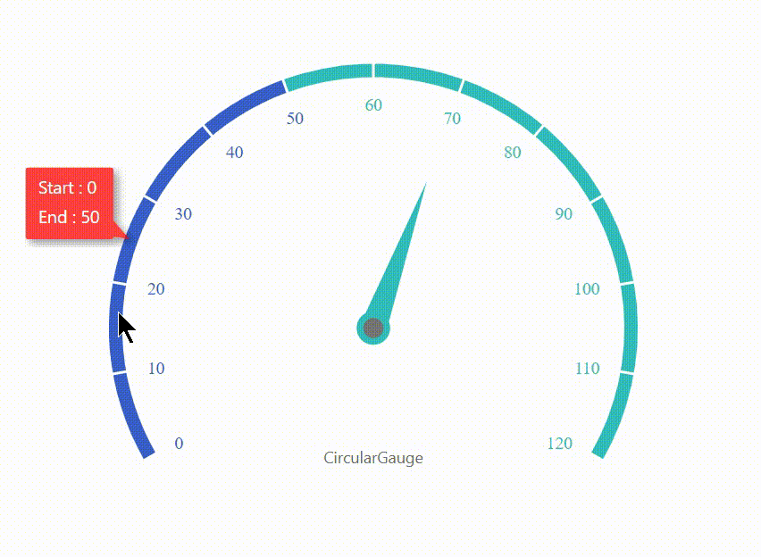

# User Interaction in Blazor Circular Gauge Component

## Tooltip for pointers

The Circular Gauge displays the pointer details through [CircularGaugeTooltipSettings](https://help.syncfusion.com/cr/aspnetcore-blazor/Syncfusion.Blazor.CircularGauge.CircularGaugeTooltipSettings.html), when the mouse is hovered over a pointer.

### Formatting the tooltip

By default, the tooltip is not visible. You can enable the tooltip by setting the [Enable](https://help.syncfusion.com/cr/blazor/Syncfusion.Blazor.CircularGauge.CircularGaugeTooltipSettings.html#Syncfusion_Blazor_CircularGauge_CircularGaugeTooltipSettings_Enable) property to true. You can use following properties to customize the tooltip.

* [CircularGaugeTooltipSettings](https://help.syncfusion.com/cr/aspnetcore-blazor/Syncfusion.Blazor.CircularGauge.CircularGaugeTooltipSettings.html)
    * [Fill](https://help.syncfusion.com/cr/blazor/Syncfusion.Blazor.CircularGauge.CircularGaugeTooltipSettings.html#Syncfusion_Blazor_CircularGauge_CircularGaugeTooltipSettings_Fill) -  Specifies fill color for tooltip
    * [EnableAnimation](https://help.syncfusion.com/cr/blazor/Syncfusion.Blazor.CircularGauge.CircularGaugeTooltipSettings.html#Syncfusion_Blazor_CircularGauge_CircularGaugeTooltipSettings_EnableAnimation) - To enable or disable animation
    * [Format](https://help.syncfusion.com/cr/blazor/Syncfusion.Blazor.CircularGauge.CircularGaugeTooltipSettings.html#Syncfusion_Blazor_CircularGauge_CircularGaugeTooltipSettings_Format) - To customize the tooltip content
* [CircularGaugeTooltipBorder](https://help.syncfusion.com/cr/aspnetcore-blazor/Syncfusion.Blazor.CircularGauge.CircularGaugeTooltipBorder.html)
    * [Color](https://help.syncfusion.com/cr/blazor/Syncfusion.Blazor.Charts.ChartSeries.html#Syncfusion_Blazor_Charts_ChartSeries_DashArray) - Specifies tooltip border color
    * [Width](https://help.syncfusion.com/cr/blazor/Syncfusion.Blazor.Charts.ChartSeries.html#Syncfusion_Blazor_Charts_ChartSeries_Type) - Specifies tooltip border width
* [CircularGaugeTooltipTextStyle](https://help.syncfusion.com/cr/aspnetcore-blazor/Syncfusion.Blazor.CircularGauge.CircularGaugeTooltipTextStyle.html)
    * [Color](https://help.syncfusion.com/cr/blazor/Syncfusion.Blazor.Charts.ChartSeries.html#Syncfusion_Blazor_Charts_ChartSeries_Fill) - Specifies tooltip text color
    * [FontStyle](https://help.syncfusion.com/cr/blazor/Syncfusion.Blazor.Charts.ChartSeries.html#Syncfusion_Blazor_Charts_ChartSeries_DashArray) - Specifies font style for tooltip text
    * [FontWeight](https://help.syncfusion.com/cr/blazor/Syncfusion.Blazor.Charts.ChartSeries.html#Syncfusion_Blazor_Charts_ChartSeries_Type) - Specifies font weight for tooltip text
    * [FontFamily](https://help.syncfusion.com/cr/blazor/Syncfusion.Blazor.Charts.ChartSeries.html#Syncfusion_Blazor_Charts_ChartSeries_Fill) - Specifies font family for tooltip
    * [Opacity](https://help.syncfusion.com/cr/blazor/) -  Specifies opacity for tooltip text
    * [Size](https://help.syncfusion.com/cr/blazor/Syncfusion.Blazor.Charts.ChartSeries.html#Syncfusion_Blazor_Charts_ChartSeries_Type) - Specifies size for tooltip text

```cshtml
@using Syncfusion.Blazor.CircularGauge

<SfCircularGauge>
    <CircularGaugeAxes>
        <CircularGaugeAxis>
            <CircularGaugePointers>
                <CircularGaugePointer Value="50">
                </CircularGaugePointer>
            </CircularGaugePointers>
            <CircularGaugeTooltipSettings Enable="true"
                                          Fill="lightgray"
                                          EnableAnimation="true"
                                          Format="Speed: {value}">
                <CircularGaugeTooltipBorder Color="blue"
                                            Width="1">
                </CircularGaugeTooltipBorder>
                <CircularGaugeTooltipTextStyle Color="blue"
                                               FontStyle="italic"
                                               FontWeight="bold"
                                               Size="15px">
                </CircularGaugeTooltipTextStyle>
            </CircularGaugeTooltipSettings>
        </CircularGaugeAxis>
    </CircularGaugeAxes>
</SfCircularGauge>
```



### Showing tooltip at mouse position

By default tooltip will be shown on the axis, you can show the tooltip at the cursor position using [ShowAtMousePosition](https://help.syncfusion.com/cr/blazor/Syncfusion.Blazor.CircularGauge.CircularGaugeTooltipSettings.html#Syncfusion_Blazor_CircularGauge_CircularGaugeTooltipSettings_ShowAtMousePosition) property.

```cshtml
@using Syncfusion.Blazor.CircularGauge

<SfCircularGauge>
    <CircularGaugeAxes>
        <CircularGaugeAxis>
            <CircularGaugePointers>
                <CircularGaugePointer Value="50">
                </CircularGaugePointer>
            </CircularGaugePointers>
            <CircularGaugeTooltipSettings Enable="true" ShowAtMousePosition="true">
            </CircularGaugeTooltipSettings>
        </CircularGaugeAxis>
    </CircularGaugeAxes>
</SfCircularGauge>
```



## Tooltip for ranges

Circular gauge displays the information about the ranges through tooltip when hovering the mouse over the ranges. You can enable this feature by setting the type property of tooltip to ‘Range’ in the array collection.

### Tooltip customization for ranges

To customize the range tooltip, use the `CircularGaugeRangeTooltipSettings` property in tooltip. The following options are available to customize the range tooltip:

* `Fill` - Specifies the range tooltip fill color.
* `CircularGaugeRangeTooltipTextStyle` - Specifies the range tooltip text style.
* `Format` - Specifies the range content format.
* `Template` - Specifies the custom template for tooltip.
* `EnableAnimation` - Animates as it moves from one point to another.
* `CircularGaugeRangeTooltipBorder` - Specifies the tooltip border.
* `showMouseAtPosition` - Displays the position of the tooltip on the cursor position.

## Tooltip for annotations

Circular gauge displays the information about the annotations through tooltip when hovering the mouse over the annotation. You can enable this feature by setting the `Type` property of tooltip to ‘Annotation’ in the array collection.

### Tooltip customization for annotations

To customize the annotation tooltip, use the `CircularGaugeAnnotationTooltipSettings` property in tooltip. The following options are available to customize the annotation tooltip:

* `Fill` - Specifies the annotation tooltip fill color.
* `CircularGaugeAnnotationTooltipTextStyle` - Specifies the annotation tooltip text style.
* `Format` - Specifies the annotation content format.
* `Template` - Specifies the tooltip content with custom template.
* `EnableAnimation` - Animates as it moves from one point to another.
* `CircularGaugeAnnotationTooltipBorder` - Specifies the tooltip border.

The following code example shows the tooltip for the pointers, ranges, and annotations.

```cshtml
@using Syncfusion.Blazor.CircularGauge

<SfCircularGauge EnablePointerDrag="true">
    <CircularGaugeTooltipSettings Enable="true" Type="@TooltipType">
        <CircularGaugeAnnotationTooltipSettings Format="Circulargauge">
        </CircularGaugeAnnotationTooltipSettings>
        <CircularGaugeRangeTooltipSettings Fill="red">
        </CircularGaugeRangeTooltipSettings>
    </CircularGaugeTooltipSettings>
    <CircularGaugeAxes>
        <CircularGaugeAxis StartAngle="240" EndAngle="120" Minimum="0" Maximum="120" Radius="90%">
            <CircularGaugePointers>
                <CircularGaugePointer Value="70" Radius="60%" Color="#33BCBD">
                    <CircularGaugeCap Radius="10" Color="white">
                        <CircularGaugeCapBorder Width="5" Color="#33BCBD"></CircularGaugeCapBorder>
                    </CircularGaugeCap>
                    <CircularGaugePointerAnimation Enable="false">
                    </CircularGaugePointerAnimation>
                </CircularGaugePointer>
            </CircularGaugePointers>
            <CircularGaugeAxisMajorTicks Color="white" Height="12" Offset="-5">
            </CircularGaugeAxisMajorTicks>
            <CircularGaugeAxisMinorTicks Color="transparent" Width="0">
            </CircularGaugeAxisMinorTicks>
            <CircularGaugeAxisLabelStyle UseRangeColor="true">
                <CircularGaugeAxisLabelFont Color="#424242" Size="13px" FontFamily="Roboto">
                </CircularGaugeAxisLabelFont>
            </CircularGaugeAxisLabelStyle>
            <CircularGaugeAxisLineStyle Width="0">
            </CircularGaugeAxisLineStyle>
            <CircularGaugeRanges>
                <CircularGaugeRange Start="0" End="50" Radius="102%">
                </CircularGaugeRange>
                <CircularGaugeRange Start="50" End="120" Radius="102%">
                </CircularGaugeRange>
            </CircularGaugeRanges>
            <CircularGaugeAnnotations>
                <CircularGaugeAnnotation Angle="180" ZIndex="1">
                    <ContentTemplate>
                        <div>Circulargauge</div>
                    </ContentTemplate>
                </CircularGaugeAnnotation>
            </CircularGaugeAnnotations>
        </CircularGaugeAxis>
    </CircularGaugeAxes>
</SfCircularGauge>
@code {
public string[] TooltipType = new string[] { "Range", "Annotation", "Pointer"};
}
```



## Dragging pointer

The pointers can be dragged over the axis values by clicking and dragging the pointer. To enable or disable the pointer drag, use the [EnablePointerDrag](https://help.syncfusion.com/cr/blazor/Syncfusion.Blazor.CircularGauge.SfCircularGauge.html#Syncfusion_Blazor_CircularGauge_SfCircularGauge_EnablePointerDrag) property.

```cshtml
@using Syncfusion.Blazor.CircularGauge

<SfCircularGauge EnablePointerDrag="true">
    <CircularGaugeAxes >
        <CircularGaugeAxis>
            <CircularGaugePointers>
                <CircularGaugePointer Value="50">
                </CircularGaugePointer>
            </CircularGaugePointers>
        </CircularGaugeAxis>
    </CircularGaugeAxes>
</SfCircularGauge>
```


## Dragging Range

The ranges can be dragged over the axis values by clicking and dragging the range. To enable or disable the range drag, use the `EnableRangeDrag` property.

```cshtml
@using Syncfusion.Blazor.CircularGauge

<SfCircularGauge EnableRangeDrag="true">
<CircularGaugeAxes >
    <CircularGaugeAxis>
        <CircularGaugePointers>
            <CircularGaugePointer Value="50">
            </CircularGaugePointer>
        </CircularGaugePointers>
    </CircularGaugeAxis>
</CircularGaugeAxes>
</SfCircularGauge>
```