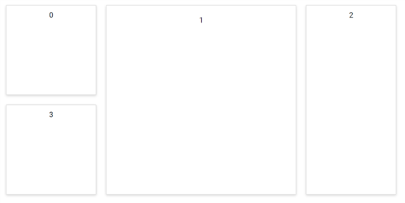
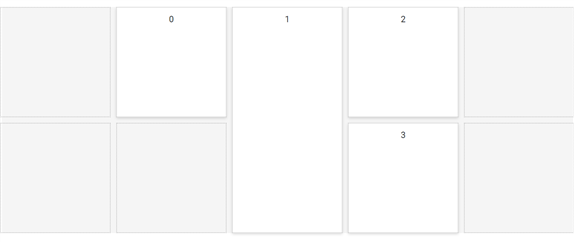

# Configuring the Grid Layout in Blazor Dashboard Layout Component

The **Dashboard Layout** is a grid structured component, which can be split into subsections of equal size known as cells.

| **Properties** | **Description** |
| --- | --- |
| <kbd>Columns</kbd> | Specifies the total number of cells in each row. |
| <kbd>CellAspectRatio</kbd> | Specifies the height of cells to any desired size. |

## Modifying cell size

The size of grid cells can be modified to the required size using the `Columns` and `CellAspectRatio` properties.

```cshtml

@using Syncfusion.Blazor.Layouts

<SfDashboardLayout CellSpacing="@(new double[]{10 ,10 })" CellAspectRatio="2" Columns="5">
    <DashboardLayoutPanels>
        <DashboardLayoutPanel>
            <ContentTemplate><div>0</div></ContentTemplate>
        </DashboardLayoutPanel>
        <DashboardLayoutPanel SizeX=2 SizeY=2 Column=1>
            <ContentTemplate><div>1</div></ContentTemplate>
        </DashboardLayoutPanel>
        <DashboardLayoutPanel SizeY=2 Column=3>
            <ContentTemplate><div>2</div></ContentTemplate>
        </DashboardLayoutPanel>
        <DashboardLayoutPanel Row=1>
            <ContentTemplate><div>3</div></ContentTemplate>
        </DashboardLayoutPanel>
    </DashboardLayoutPanels>
</SfDashboardLayout>

<style>
    .e-panel-content {
        text-align: center;
        margin-top: 10px;
    }
</style>

```

In the above sample, width of the parent element is divided into five equal cells based on the `Columns` property value resulting the width of each cell as 100px.

The height of these cells will be 50px based on the CellAspectRatio value 100/50 (that is for every 100px of width, 50px will be the height of the cell).

The following output demonstrates the setting of `cellAspectRatio` and `Columns` property in dashboard component.


## Setting cell spacing

The spacing between each panel in a row and column can be defined using the `CellSpacing` property. Adding space between the panels will make the layout effective and provides a clear data representation.

```cshtml

@using Syncfusion.Blazor.Layouts

<SfDashboardLayout CellSpacing="@(new double[]{20 ,20 })" Columns="5">
    <DashboardLayoutPanels>
        <DashboardLayoutPanel>
            <ContentTemplate><div>0</div></ContentTemplate>
        </DashboardLayoutPanel>
        <DashboardLayoutPanel SizeX=2 SizeY=2 Column=1>
            <ContentTemplate><div>1</div></ContentTemplate>
        </DashboardLayoutPanel>
        <DashboardLayoutPanel SizeY=2 Column=3>
            <ContentTemplate><div>2</div></ContentTemplate>
        </DashboardLayoutPanel>
        <DashboardLayoutPanel Row=1>
            <ContentTemplate><div>3</div></ContentTemplate>
        </DashboardLayoutPanel>
    </DashboardLayoutPanels>
</SfDashboardLayout>

<style>
    .e-panel-content {
        text-align: center;
        margin-top: 10px;
    }
</style>

```

The following output demonstrates the neat and clear representation of data by setting the `cellSpacing` property in dashboard component.



## Graphical representation of grid layout

These cells combinedly forms a grid-structured layout, which will be hidden initially. This grid-structured layout can be made visible by enabling the `ShowGridLines` property, which clearly pictures the cells split-up within the layout. These gridlines are helpful in panels sizing and placement within the layout during initial designing of a dashboard.

```cshtml

@using Syncfusion.Blazor.Layouts

<SfDashboardLayout CellSpacing="@(new double[]{10 ,10 })" Columns="5" ShowGridLines="true">
    <DashboardLayoutPanels>
        <DashboardLayoutPanel Col=1>
            <ContentTemplate><div>0</div></ContentTemplate>
        </DashboardLayoutPanel>
        <DashboardLayoutPanel SizeX=1 SizeY=2 Column=2>
            <ContentTemplate><div>1</div></ContentTemplate>
        </DashboardLayoutPanel>
        <DashboardLayoutPanel SizeY=1 Column=3>
            <ContentTemplate><div>2</div></ContentTemplate>
        </DashboardLayoutPanel>
        <DashboardLayoutPanel Row=1 Column=3>
            <ContentTemplate><div>3</div></ContentTemplate>
        </DashboardLayoutPanel>
    </DashboardLayoutPanels>
</SfDashboardLayout>

<style>
    .e-panel-content {
        text-align: center;
        margin-top: 10px;
    }
</style>

```

The following output demonstrates the gridlines indicate the cells split-up of the layout and the data containers placed over these cells are known as panels.

