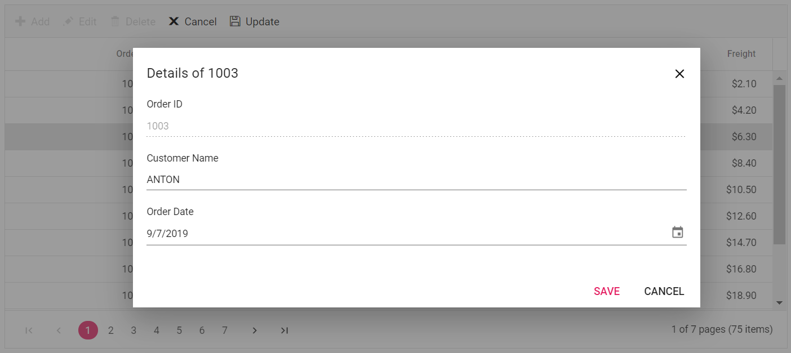

# Show or Hide columns in Dialog editing in Blazor DataGrid Component

You can show hidden columns or hide visible column’s editor in the dialog while editing the datagrid record. This can be achieved by **Template**.
In the below example, we have rendered the datagrid columns [OrderDate`] as hidden column and [Freight`] as visible column. In the edit mode, we have changed the [Freight`] column to visible state and [OrderDate`] column to hidden state.

```cshtml
@using Syncfusion.Blazor.Grids
@using Syncfusion.Blazor.DropDowns
@using Syncfusion.Blazor.Inputs
@using Syncfusion.Blazor.Calendars

<SfGrid DataSource="@Orders" AllowPaging="true" @ref="Grid" Toolbar="@(new string[] { "Add", "Edit", "Delete", "Cancel", "Update" })" Height="315">
    <GridEvents OnActionBegin="ActionBeginHandler" TValue="Order"></GridEvents>
    <GridEditSettings AllowAdding="true" AllowEditing="true" AllowDeleting="true" Mode="EditMode.Dialog">
        <Template>
            @{
                var Order = (context as Order);
                <div>
                    <div class="form-row">
                        <div class="form-group col-md-6">
                            <label>Order ID</label>
                            <SfNumericTextBox TValue="int?" FloatLabelType="FloatLabelType.Always" @bind-Value="@(Order.OrderID)" Enabled="@Data"></SfNumericTextBox>
                        </div>
                        <div class="form-group col-md-6">
                            <label>Customer Name</label>
                            <SfAutoComplete ID="customerID" FloatLabelType="FloatLabelType.Always" TItem="Order" @bind-Value="@(Order.CustomerID)" TValue="string" DataSource="@GridData">
                                <AutoCompleteFieldSettings Value="CustomerID"></AutoCompleteFieldSettings>
                            </SfAutoComplete>
                        </div>
                        <div class="form-group col-md-6">
                            <label>Order Date</label>
                            <SfDatePicker ID="OrderDate" FloatLabelType="FloatLabelType.Always" @bind-Value="@(Order.OrderDate)"></SfDatePicker>
                        </div>
                    </div>
                </div>
            }
        </Template>
    </GridEditSettings>
    <GridColumns>
        <GridColumn Field=@nameof(Order.OrderID) HeaderText="Order ID" IsPrimaryKey="true" ValidationRules="@(new ValidationRules{ Required=true})" TextAlign="TextAlign.Center" Width="120"></GridColumn>
        <GridColumn Field=@nameof(Order.CustomerID) HeaderText="Customer Name" TextAlign="TextAlign.Center" Width="120"></GridColumn>
        <GridColumn Field=@nameof(Order.OrderDate) HeaderText=" Order Date" EditType="EditType.DatePickerEdit" Visible="false" Format="d" TextAlign="TextAlign.Center" Width="130" Type="ColumnType.Date"></GridColumn>
        <GridColumn Field=@nameof(Order.Freight) HeaderText="Freight" Format="C2" TextAlign="TextAlign.Right" Width="120"></GridColumn>
    </GridColumns>
</SfGrid>

@code{
    SfGrid<Order> Grid;
    public List<Order> Orders { get; set; }
    public bool Enabled = true;
    public bool Data = false;
    public List<Order> GridData = new List<Order>
{
        new Order() { OrderID = 10248, CustomerID = "VINET", Freight = 32.38, OrderDate = DateTime.Now.AddDays(-2) },
        new Order() { OrderID = 10249, CustomerID = "TOMSP", Freight = 11.61, OrderDate = DateTime.Now.AddDays(-5) },
        new Order() { OrderID = 10250, CustomerID = "HANAR", Freight = 65.83, OrderDate = DateTime.Now.AddDays(-12) },
        new Order() { OrderID = 10251, CustomerID = "VICTE", Freight = 41.34, OrderDate = DateTime.Now.AddDays(-18)},
        new Order() { OrderID = 10252, CustomerID = "SUPRD", Freight = 51.3,  OrderDate = DateTime.Now.AddDays(-22)},
        new Order() { OrderID = 10253, CustomerID = "HANAR", Freight = 58.17, OrderDate = DateTime.Now.AddDays(-26) },

    };

    public void ActionBeginHandler(ActionEventArgs<Order> args)
    {
        if (args.RequestType == Syncfusion.Blazor.Grids.Action.Add)
        {
            Data = true;
        }
    }

    protected override void OnInitialized()
    {
        Orders = Enumerable.Range(1, 75).Select(x => new Order()
        {
            OrderID = 1000 + x,
            CustomerID = (new string[] { "ALFKI", "ANANTR", "ANTON", "BLONP", "BOLID" })[new Random().Next(5)],
            Freight = 2.1 * x,
            OrderDate = DateTime.Now.AddDays(-x),
        }).ToList();
    }

    public class Order
    {
        public int? OrderID { get; set; }
        public string CustomerID { get; set; }
        public DateTime? OrderDate { get; set; }
        public double? Freight { get; set; }
    }
}
```

Output be like the below.

