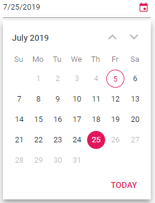

# Strict Mode in Blazor DatePicker Component

The [StrictMode](https://help.syncfusion.com/cr/blazor/Syncfusion.Blazor.Calendars.SfDatePicker-1.html#Syncfusion_Blazor_Calendars_SfDatePicker_1_StrictMode) is an act that allows the users to enter only the valid date within the specified `Min/Max` range in text box. If the date is invalid, then the component will stay with the previous value. Else, if the date is out of range, then the component will set the date to the Min/Max date.

The following example demonstrates the DatePicker in `StrictMode` with Min/Max range of 5th to 25th in a month of May. Here, it allows the users to enter only the valid date within the specified range.

* If you are trying to enter the out-of-range value like 28th of May, then the Value will be set to the Max date of 25th May since the value 28th is greater than Max value of 25th.

* If you are trying to enter the invalid date, then the Value will stay with the previous value.

```cshtml
@using Syncfusion.Blazor.Calendars

<SfDatePicker TValue="DateTime?" Min='@MinDate' Max='@MaxDate' StrictMode=true Value='@DateValue'></SfDatePicker>

@code {
    public DateTime MinDate {get;set;} = new DateTime(DateTime.Now.Year,DateTime.Now.Month,05);
    public DateTime MaxDate {get;set;} = new DateTime(DateTime.Now.Year, DateTime.Now.Month, 25);
    public DateTime? DateValue {get;set;} = new DateTime(DateTime.Now.Year, DateTime.Now.Month, 28);
}
```

The output will be as follows.



By default, the DatePicker act in `StrictMode` false state allows you to enter the invalid or out-of-range date in text box.

If the date is out-of-range or invalid, then the model value will be set to `out of range` date value or `null` respectively with highlighted  `error` class to indicate the date is out of range or invalid.

The following code demonstrates the `StrictMode` as false. Here, it allows you to enter the valid or invalid value in text box.

If you are entering out-of-range or invalid date value, then the model value will be set to `out of range` date value or `null` respectively with highlighted  `error` class to indicate the date is out of range or invalid.

```cshtml
@using Syncfusion.Blazor.Calendars

<SfDatePicker TValue="DateTime?" Min='@MinDate' Max='@MaxDate' StrictMode=false Value='@DateValue'></SfDatePicker>

@code {
    public DateTime MinDate {get;set;} = new DateTime(DateTime.Now.Year,DateTime.Now.Month,05);
    public DateTime MaxDate {get;set;} = new DateTime(DateTime.Now.Year, DateTime.Now.Month, 25);
    public DateTime? DateValue {get;set;} = new DateTime(DateTime.Now.Year, DateTime.Now.Month, 28);
}
```

The output will be as follows.


> If the value of `Min` or `Max` properties changed through code behind, you have to update the `Value` property to set within the range.