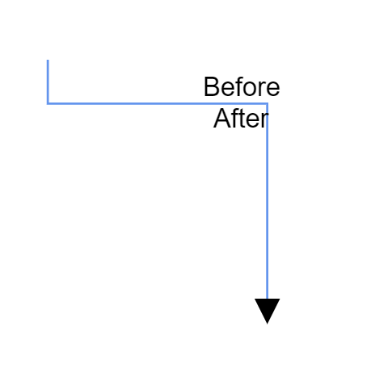

# How to position connector’s annotation

Annotations of a connector can be positioned using the following properties of Annotation class.

* Offset
* Alignment
* Displacement
* SegmentAngle
* HorizontalAlignment
* VerticalAlignment
* Margin

## Offset

The [Offset](https://help.syncfusion.com/cr/blazor/Syncfusion.Blazor.Diagram.PathAnnotation.html#Syncfusion_Blazor_Diagram_PathAnnotation_Offset) property of annotation is used to align the annotations based on fractions. 0 represents Top-Left corner, 1 represents Bottom-Right corner, and 0.5 represents half of Width/Height.

```cshtml
@using Syncfusion.Blazor.Diagram

<SfDiagramComponent Height="600px" Connectors="@connectors" />

@code
{
    //Defines diagram's connector collection
    DiagramObjectCollection<Connector> connectors;

    protected override void OnInitialized()
    {
        connectors = new DiagramObjectCollection<Connector>();
        Connector connector = new Connector()
        {
            SourcePoint = new DiagramPoint() { X = 300, Y = 40 },
            TargetPoint = new DiagramPoint() { X = 400, Y = 160 },
            Type = ConnectorSegmentType.Orthogonal,
            Style = new TextStyle() { StrokeColor = "#6495ED" },
            Annotations = new DiagramObjectCollection<PathAnnotation>()
            {
                new PathAnnotation 
                { 
                    Content = "Offset as 0",
                    // Sets the offset of the annotation as 0
                    Offset = 0 
                },
                new PathAnnotation 
                { 
                    Content = "Offset as 0.5",
                    // Sets the offset of the annotation as 0.5
                    Offset = 0.5 
                },
                new PathAnnotation 
                { 
                    Content = "Offset as 1",
                    // Sets the offset of the annotation as 1
                    Offset = 1 
                },
            }
        };
        connectors.Add(connector);
    }
}
```

The following image shows the relationship between the annotation position and offset (fraction values).


> By default, offset value of the connector annotation is 0.5.

## Alignment

The connector’s annotation can be aligned over its segment path using the [Alignment](https://help.syncfusion.com/cr/blazor/Syncfusion.Blazor.Diagram.PathAnnotation.html#Syncfusion_Blazor_Diagram_PathAnnotation_Alignment) property of annotation.

```cshtml
@using Syncfusion.Blazor.Diagram

<SfDiagramComponent Height="600px" Connectors="@connectors" />

@code
{
    //Defines diagram's connector collection
    DiagramObjectCollection<Connector> connectors;

    protected override void OnInitialized()
    {
        connectors = new DiagramObjectCollection<Connector>();
        Connector connector = new Connector()
        {
            SourcePoint = new DiagramPoint() { X = 300, Y = 40 },
            TargetPoint = new DiagramPoint() { X = 400, Y = 160 },
            Type = ConnectorSegmentType.Orthogonal,
            Style = new TextStyle() { StrokeColor = "#6495ED" },
            Annotations = new DiagramObjectCollection<PathAnnotation>()
            {
                new PathAnnotation 
                { 
                    Content = "Before",
                    // Sets the alignment of the annotation as Before
                    Alignment = AnnotationAlignment.Before 
                },
                new PathAnnotation 
                { 
                    Content = "After",
                    // Sets the alignment of the annotation as After
                    Alignment = AnnotationAlignment.After 
                },
            }
        };
        connectors.Add(connector);
    }
}
```

The following screenshot shows how the annotation of the connector aligned over its path.



> By default, Alignment value of the connector annotation is `Center`.

## Displacement

The [Displacement](https://help.syncfusion.com/cr/blazor/Syncfusion.Blazor.Diagram.PathAnnotation.html#Syncfusion_Blazor_Diagram_PathAnnotation_Displacement) property is used to dislocate the annotation by the value given. By default, annotation will be in center of the connector path. When you assign value to the Displacement property, annotation will be displaced from its position by displacement value.

```cshtml
@using Syncfusion.Blazor.Diagram

<SfDiagramComponent Height="600px" Connectors="@connectors">
</SfDiagramComponent>

@code
{
    //Defines diagram's connector collection
    public DiagramObjectCollection<Connector> connectors { get; set; }

    protected override void OnInitialized()
    {
        connectors = new DiagramObjectCollection<Connector>();
        Connector connector = new Connector()
        {
            SourcePoint = new DiagramPoint() { X = 300, Y = 40 },
            TargetPoint = new DiagramPoint() { X = 400, Y = 160 },
            Type = ConnectorSegmentType.Orthogonal,
            Style = new ShapeStyle()
            {
                StrokeColor = "#6BA5D7"
            },
            Annotations = new DiagramObjectCollection<PathAnnotation>()
            {
                new PathAnnotation()
                {
                    Content = "After",
                    // Set the displacement to the annotation
                    Displacement = new DiagramPoint() { X = 50, Y = 50 },
                    Alignment = AnnotationAlignment.After
                },
            }
        };
        connectors.Add(connector);
    }
}
```

## Segment angle

The [SegmentAngle](https://help.syncfusion.com/cr/blazor/Syncfusion.Blazor.Diagram.PathAnnotation.html#Syncfusion_Blazor_Diagram_PathAnnotation_SegmentAngle) property is used to rotate the annotation based on the connectors segment direction. By default, annotation will be rotated in the connector path. When you assign value to the SegmentPath property, annotation will be rotated from its position based on the connector segment direction.

The following code example shows how the connector annotation rotated in its path direction.

```cshtml
@using Syncfusion.Blazor.Diagram

<SfDiagramComponent Height="600px" Connectors="@connectors" />

@code
{
    // Defines diagram's connector collection
    DiagramObjectCollection<Connector> connectors;

    protected override void OnInitialized()
    {
        connectors = new DiagramObjectCollection<Connector>();
        Connector connector = new Connector()
        {
            SourcePoint = new DiagramPoint() { X = 300, Y = 40 },
            TargetPoint = new DiagramPoint() { X = 400, Y = 160 },
            Type = ConnectorSegmentType.Orthogonal,
            Style = new TextStyle() { StrokeColor = "#6495ED" },
            Annotations = new DiagramObjectCollection<PathAnnotation>()
            {
                new PathAnnotation 
                { 
                    Content = "Annotation", 
                    // Set the segment angle for the connector's annotation
                    SegmentAngle = true,
                    Offset = 0.7 
                },
            }
        };
        connectors.Add(connector);
    }
}
```

| SegmentAngle | Output |
|---|---|
| True |  |
| False |  |

> By default, the SegmentAngle will be disabled.

The `HorizontalAlignment`, `VerticalAlignment` and `Margin` properties were explained in the [NodeAnnotation](./node-annotation).

## See also

* [How to add annotation for Node](./node-annotation)

* [How to add or remove annotation constraints](../constraints/#annotation-constraints)

* [How to customize the annotation](./appearance)
