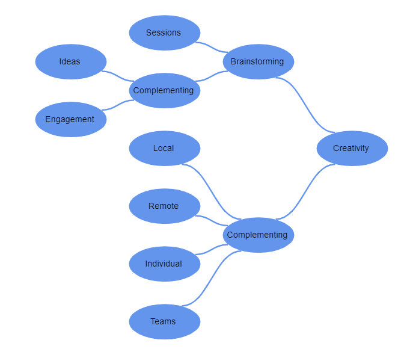

# Mind map Layout in Blazor Diagram Component

A mind map is a diagram that displays the nodes as a spider diagram organizes information around a central concept. To create mind map, the [Type](https://help.syncfusion.com/cr/blazor/Syncfusion.Blazor.Diagram.Layout.html#Syncfusion_Blazor_Diagram_Layout_Type) of layout should be set as [MindMap](https://helpstaging.syncfusion.com/cr/blazor/Syncfusion.Blazor.Diagram.LayoutType.html#Syncfusion_Blazor_Diagram_LayoutType_MindMap). The following code example illustrates how to create a mind map layout.

```csharp
@using Syncfusion.Blazor.Diagram

<SfDiagramComponent Height="600px" NodeCreating="@OnNodeCreating" ConnectorCreating="@OnConnectorCreating">
    <DataSourceSettings ID="Id" ParentID="ParentId" DataSource="@DataSource"></DataSourceSettings>
    <Layout Type="LayoutType.MindMap">
        <LayoutMargin Top="20" Left="20"></LayoutMargin>
    </Layout>
</SfDiagramComponent>

@code 
{    
    //Creates nodes with some default values
    private void OnNodeCreating(IDiagramObject obj)
    {
        Node node = obj as Node;
        node.Height = 25;
        node.Width = 25;
        node.BackgroundColor = "#6BA5D7";
        node.Style = new ShapeStyle() { Fill = "#6495ED", StrokeWidth = 1, StrokeColor = "white" };
        node.Shape = new BasicShape() { Type = Shapes.Basic }; ;
    }
    
    //Creates connectors with some default values
    private void OnConnectorCreating(IDiagramObject connector)
    {
        Connector connectors = connector as Connector;
        connectors.Type = ConnectorSegmentType.Bezier;
        connectors.Style = new ShapeStyle() { StrokeColor = "#6495ED", StrokeWidth = 2 };
        connectors.TargetDecorator = new DecoratorSettings
        {
            Shape = DecoratorShape.None,
        };
    }

    public class MindMapDetails
    {
        public string Id { get; set; }
        public string Label { get; set; }
        public string ParentId { get; set; }
        public string Branch { get; set; }
        public string Fill { get; set; }
    }

    public object DataSource = new List<object>()
    {
        new MindMapDetails() { Id= "1",Label="Creativity", ParentId ="", Branch = "Root"},
        new MindMapDetails() { Id= "2",  Label="Brainstorming", ParentId ="1", Branch = "Right" },
        new MindMapDetails() { Id= "3",  Label="Complementing", ParentId ="1", Branch = "Left" },
        new MindMapDetails() { Id= "4",  Label="Sessions", ParentId ="2", Branch = "subRight" },
        new MindMapDetails() { Id= "5",  Label="Complementing", ParentId ="2", Branch = "subRight" },
        new MindMapDetails() { Id= "6", Label= "Local", ParentId ="3", Branch = "subRight"  },
        new MindMapDetails() { Id= "7", Label= "Remote", ParentId ="3", Branch = "subRight"  },
        new MindMapDetails() { Id= "8", Label= "Individual", ParentId ="3", Branch = "subRight" },
        new MindMapDetails() { Id= "9", Label= "Teams", ParentId ="3", Branch = "subRight" },
        new MindMapDetails() { Id= "10", Label= "Ideas", ParentId ="5", Branch = "subRight" },
        new MindMapDetails() { Id= "11", Label= "Engagement", ParentId ="5", Branch = "subRight" },
    };
}
```


You can also decide the branch for mind map using [GetBranch](https://help.syncfusion.com/cr/blazor/Syncfusion.Blazor.Diagram.Layout.html#Syncfusion_Blazor_Diagram_Layout_GetBranch) method. The following code demonstrates how to set all branches on the right side for mind map layout using GetBranch method.

```csharp
@using Syncfusion.Blazor.Diagram

<SfDiagramComponent Height="600px" NodeCreating="@OnNodeCreating" ConnectorCreating="@OnConnectorCreating">
    <DataSourceSettings ID="Id" ParentID="ParentId" DataSource="@DataSource"></DataSourceSettings>
    <Layout Type="LayoutType.MindMap" GetBranch="@GetBranch">
        <LayoutMargin Top="20" Left="20"></LayoutMargin>
    </Layout>
</SfDiagramComponent>

@code 
{
    //Set all branches on the right side for mind map layout
    private BranchType GetBranch(IDiagramObject obj)
    {
        if ((obj as Node).ID == "1")
        {
            return BranchType.Root;
        }
        return BranchType.Right;
    }
    
    //Creates connectors with some default values
    private void OnNodeCreating(IDiagramObject obj)
    {
        Node node = obj as Node;
        node.Height = 50;
        node.Width = 100;
        node.Style = new ShapeStyle() { Fill = "#6495ED", StrokeWidth = 1, StrokeColor = "white" };
        node.Shape = new BasicShape() { Type = Shapes.Basic, Shape = BasicShapeType.Ellipse };
        MindMapDetails mindmapData = node.Data as MindMapDetails;
        node.Annotations = new DiagramObjectCollection<ShapeAnnotation>()
        {
            new ShapeAnnotation()
            {
                Content = mindmapData.Label
            }
        };
    }
    
    //Creates node with some default values
    private void OnConnectorCreating(IDiagramObject connector)
    {
        Connector connectors = connector as Connector;
        connectors.Type = ConnectorSegmentType.Bezier;
        connectors.Style = new TextStyle() { StrokeColor = "#6495ED", StrokeWidth = 2 };
        connectors.TargetDecorator = new DecoratorSettings
        {
            Shape = DecoratorShape.None,
        };
    }

    public class MindMapDetails
    {
        public string Id { get; set; }
        public string Label { get; set; }
        public string ParentId { get; set; }
        public string Branch { get; set; }
        public string Fill { get; set; }
    }

    public object DataSource = new List<object>()
    {
        new MindMapDetails() { Id= "1",Label="Creativity", ParentId =""},
        new MindMapDetails() { Id= "2",  Label="Brainstorming", ParentId ="1"},
        new MindMapDetails() { Id= "3",  Label="Complementing", ParentId ="1"},
        new MindMapDetails() { Id= "4",  Label="Sessions", ParentId ="2"},
        new MindMapDetails() { Id= "5",  Label="Complementing", ParentId ="2"},
        new MindMapDetails() { Id= "6", Label= "Local", ParentId ="3"},
        new MindMapDetails() { Id= "7", Label= "Remote", ParentId ="3"},
        new MindMapDetails() { Id= "8", Label= "Individual", ParentId ="3"},
        new MindMapDetails() { Id= "9", Label= "Teams", ParentId ="3"},
        new MindMapDetails() { Id= "10", Label= "Ideas", ParentId ="5"},
        new MindMapDetails() { Id= "11", Label= "Engagement", ParentId ="5"},
    };
}
```



## See also

* [How to create a node](../nodes/nodes)

* [How to create a connector](../connectors/connectors)
