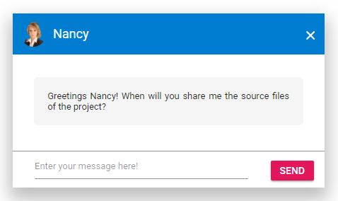

# Templates in Blazor Dialog Component

In Dialog, the template support is provided to the header and footer sections. So any text or HTML content can be appended in these sections.

## Header

The Dialog header content can be provided through the `Header` property, and it will allow both text and any HTML content as a string. Also in header, close button is provided as built-in support, and this can be enabled through the `ShowCloseIcon` property.

## Footer

The Dialog footer can be enabled by adding built-in `DialogButton` or providing any HTML string through the `FooterTemplate`.

> The `DialogButton` and `FooterTemplate` properties can't be used at the same time.

The following example demonstrates the usage of header and footer template in the Dialog.

```cshtml

@using Syncfusion.Blazor.Popups
@using Syncfusion.Blazor.Inputs

<div id="target" class="col-lg-12 control-section" style="height:100%">
    <div>
        @if (this.ShowButton)
        {
            <button class="e-btn" @onclick="@OpenDialog">Open Dialog</button>
        }
    </div>
    <SfDialog Height="75%" Width="435px" Target="#target" ShowCloseIcon="true" @bind-Visible="Visibility">
        <DialogTemplates>
            <Header>
                <span class="e-avatar template-image e-avatar-xsmall e-avatar-circle"></span>
                <div id="template" title="Nancy" class="e-icon-settings">Nancy</div>
            </Header>
            <Content>
                <div class="dialogContent">
                    <span class="dialogText">@DialogText</span>
                </div>
            </Content>
            <FooterTemplate>
                <SfTextBox ID="inVal" @bind-Value="@TextBoxValue" @ref="TextboxObj" Type="InputType.Text" Placeholder="Enter your message here!" />
                <button id="sendButton" @onclick="@SendBtnclicked" class="e-control e-btn e-primary" data-ripple="true">Send</button>
            </FooterTemplate>
        </DialogTemplates>
        <DialogEvents OnOpen="@BeforeDialogOpen" Closed="@DialogClosed"></DialogEvents>
    </SfDialog>
</div>

@code{
    SfTextBox TextboxObj;

    private string TextBoxValue;
    private bool Visibility { get; set; } = true;
    private bool ShowButton { get; set; } = false;
    private string DialogText = "Greetings Nancy! When will you share me the source files of the project?";

    private void BeforeDialogOpen(BeforeOpenEventArgs args)
    {
        this.ShowButton = false;
    }

    private void DialogClosed(CloseEventArgs args)
    {
        this.ShowButton = true;
    }

    private void OpenDialog()
    {
        this.Visibility = true;
    }

    private void SendBtnclicked()
    {
        if (this.TextboxObj.Value != "")
        {
            DialogText = this.TextboxObj.Value;
            TextBoxValue = "";
            this.StateHasChanged();
        }
    }
}

<style>
    #sendButton {
        top: 2px;
        position: relative;
    }

    .e-footer-content .e-input-group {
        width: 75%;
        float: left;
    }

    #target {
        min-height: 400px;
    }

    .e-dialog .e-dlg-header-content {
        background-color: #3f51b5;
    }

    .e-dialog .e-dlg-header-content .e-btn.e-dlg-closeicon-btn {
        top: 5px;
        left: -11px;
    }

    .e-dialog .e-dlg-header {
        position: relative;
    }

    .e-dialog .e-footer-content {
        padding: 15px;
    }

    .e-dialog .e-dlg-content {
        padding: 0;
    }

    .e-dialog .e-dlg-header-content {
        padding: 6px;
    }

    .e-open-icon::before {
        content: "\e782";
    }

    #template {
        display: inline-block;
        padding: 0px 10px;
        vertical-align: middle;
        height: 40px;
        line-height: 40px;
    }

    input {
        width: 75%;
        float: left;
    }

    .e-icon-settings.e-icons {
        float: left;
        position: relative;
        left: 14%;
        top: -33px;
    }

    .dialogContent .dialogText {
        font-size: 13px;
        padding: 5%;
        word-wrap: break-word;
        border-radius: 6px;
        text-align: justify;
        font-style: initial;
        display: block;
    }

    .e-dlg-header .e-icon-settings, .e-icon-btn {
        color: #fff;
    }

    .dialogContent .dialogText, .dialogContent .dialogText {
        background-color: #f5f5f5;
    }

    .e-dialog .e-footer-content {
        border-top: 0.5px solid rgba(0, 0, 0, 0.42);
    }

    .dialogContent {
        display: block;
        font-size: 15px;
        word-wrap: break-word;
        text-align: center;
        font-style: italic;
        border-radius: 6px;
        padding: 3%;
        position: relative;
        top: 25px;
    }

    .bootstrap .dialogContent {
        top: 7px;
    }

    .control-wrapper .e-control.e-dialog {
        width: 30%;
    }

    .e-dialog .e-dlg-header-content .e-icon-dlg-close {
        color: #fff;
    }

    .e-dialog .e-dlg-header-content .e-btn.e-dlg-closeicon-btn:hover,
    .e-dialog .e-dlg-header-content .e-btn.e-dlg-closeicon-btn:focus {
        background-color: rgba(255,255,255, 0.10);
    }

    .e-dialog .e-dlg-header-content .e-btn.e-dlg-closeicon-btn:active .e-icon-dlg-close,
    .e-dialog .e-dlg-header-content .e-btn.e-dlg-closeicon-btn:focus .e-icon-dlg-close,
    .e-dialog .e-dlg-header-content .e-btn.e-dlg-closeicon-btn:hover .e-icon-dlg-close {
        color: #fff;
    }

    .e-dialog .e-dlg-header-content .e-dlg-header .e-avatar.template-image {
        background-image: url("https://ej2.syncfusion.com/demos/src/dialog/images/1.png");
        vertical-align: middle;
        display: inline-block;
        width: 36px;
        height: 36px;
    }
</style>

```

The output will be as follows.



## See Also

* [How to add an icon to dialog buttons](./how-to/add-an-icons-to-dialog-buttons)
* [How to customize the dialog appearance](./how-to/customize-the-dialog-appearance)