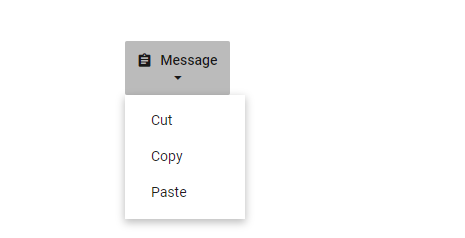

# Icons in Blazor Dropdown Menu Component

## Dropdown Menu icons

Dropdown Menu can have an icon to provide the visual representation of the action. To place the icon on a Dropdown Menu, set the [IconCss](https://help.syncfusion.com/cr/blazor/Syncfusion.Blazor.SplitButtons.SfDropDownButton.html#Syncfusion_Blazor_SplitButtons_SfDropDownButton_IconCss) property to `e-icons` with the required icon CSS. By default, the icon is positioned to the left side of the Dropdown Menu. You can customize the icon's position using the [IconPosition](https://help.syncfusion.com/cr/blazor/Syncfusion.Blazor.SplitButtons.SfDropDownButton.html#Syncfusion_Blazor_SplitButtons_SfDropDownButton_IconPosition) property.

In the following example, the Dropdown Menu with default iconPosition and iconPosition as `Top` is showcased:

```cshtml
@using Syncfusion.Blazor.SplitButtons

<SfDropDownButton IconCss="e-icons e-message" content="Message">
    <DropDownMenuItems>
        <DropDownMenuItem Text="Edit"></DropDownMenuItem>
        <DropDownMenuItem Text="Delete"></DropDownMenuItem>
        <DropDownMenuItem Text="Mark as Read"></DropDownMenuItem>
        <DropDownMenuItem Text="Like Message"></DropDownMenuItem>
    </DropDownMenuItems>
</SfDropDownButton>
<SfDropDownButton IconCss="e-icons e-message" IconPosition="SplitButtonIconPosition.Top" Content="Message">
    <DropDownMenuItems>
        <DropDownMenuItem Text="Edit"></DropDownMenuItem>
        <DropDownMenuItem Text="Delete"></DropDownMenuItem>
        <DropDownMenuItem Text="Mark as Read"></DropDownMenuItem>
        <DropDownMenuItem Text="Like Message"></DropDownMenuItem>
    </DropDownMenuItems>
</SfDropDownButton>

<style>
    .e-message::before {
        content: '\e7cb';
    }
</style>

```

Output be like


You can also use third party icons on the Dropdown Menu using the [IconCss](https://help.syncfusion.com/cr/blazor/Syncfusion.Blazor.SplitButtons.SfDropDownButton.html#Syncfusion_Blazor_SplitButtons_SfDropDownButton_IconCss) property.

### Vertical button

Vertical button in Dropdown Menu can be achieved by adding `e-vertical` class using [CssClass](https://help.syncfusion.com/cr/blazor/Syncfusion.Blazor.SplitButtons.SfDropDownButton.html#Syncfusion_Blazor_SplitButtons_SfDropDownButton_CssClass) property.

```cshtml
@using Syncfusion.Blazor.SplitButtons

<SfDropDownButton IconCss="e-icons e-message" CssClass="e-vertical" Content="Message">
    <DropDownMenuItems>
        <DropDownMenuItem Text="Cut"></DropDownMenuItem>
        <DropDownMenuItem Text="Copy"></DropDownMenuItem>
        <DropDownMenuItem Text="Paste"></DropDownMenuItem>
    </DropDownMenuItems>
</SfDropDownButton>

<style>
    .e-message::before {
        content: '\e7cb';
    }
</style>

```

Output be like



## See Also

* [Dropdown popup with icons](./popup-items#icons)
* [Customized icon size](./how-to/customize-icon-and-width)