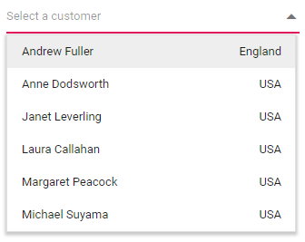
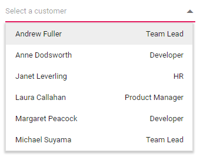
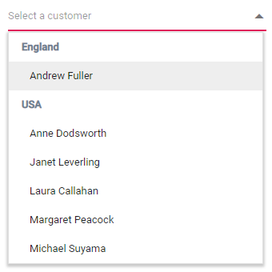
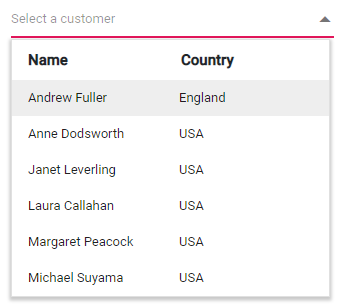
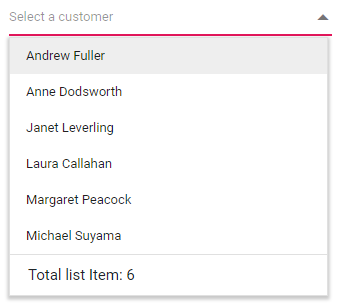

# Templates in Blazor DropDown List Component

The DropDownList has been provided with several options to customize each list item, group title, selected value, header, and footer elements.

## Item template

The content of each list item within the DropDownList can be customized with the help of [ItemTemplate](https://help.syncfusion.com/cr/blazor/Syncfusion.Blazor.DropDowns.SfDropDownBase-1.html#Syncfusion_Blazor_DropDowns_SfDropDownBase_1_ItemTemplate) property.

In the following sample, each list item is split into two columns to display relevant data.

```cshtml
@using Syncfusion.Blazor.Data
@using Syncfusion.Blazor.DropDowns

<SfDropDownList TValue="string" TItem="EmployeeData" Placeholder="Select a customer" Query="@Query">
    <DropDownListTemplates TItem="EmployeeData">
        <ItemTemplate>
            <span><span class='name'>@((context as EmployeeData).FirstName)</span><span class='country'>@((context as EmployeeData).Country)</span></span>
        </ItemTemplate>
    </DropDownListTemplates>
    <SfDataManager Url="https://ej2services.syncfusion.com/production/web-services/api/Employees" Adaptor="Syncfusion.Blazor.Adaptors.WebApiAdaptor" CrossDomain="true"></SfDataManager>
    <DropDownListFieldSettings Text="FirstName" Value="Country"></DropDownListFieldSettings>
</SfDropDownList>

@code {
    public class EmployeeData
    {
        public string FirstName { get; set; }
        public string Country { get; set; }
    }
    public EmployeeData Data = new EmployeeData();
    public Query Query = new Query();
}

<style>
    .country {
        right: 15px;
        position: absolute;
    }
</style>
```

The output will be as follows.



## Value template

The currently selected value that is displayed by default on the DropDownList input element can be customized using the [ValueTemplate](https://help.syncfusion.com/cr/blazor/Syncfusion.Blazor.DropDowns.SfDropDownList-2.html#Syncfusion_Blazor_DropDowns_SfDropDownList_2_ValueTemplate) property.

In the following sample, the selected value is displayed as a combined text of both `FirstName` and `Designation` in the DropDownList input, which is separated by a hyphen.

```cshtml
@using Syncfusion.Blazor.Data
@using Syncfusion.Blazor.DropDowns

<SfDropDownList TValue="string" TItem="EmployeeData" Placeholder="Select a customer" Query="@Query">
    <DropDownListTemplates TItem="EmployeeData">
        <ItemTemplate>
            <span><span class='name'>@((context as EmployeeData).FirstName)</span><span class='destination'>@((context as EmployeeData).Designation)</span></span>
        </ItemTemplate>
        <ValueTemplate>
            <span>@((context as EmployeeData).FirstName) - @((context as EmployeeData).Designation)</span>
        </ValueTemplate>
    </DropDownListTemplates>
    <SfDataManager Url="https://ej2services.syncfusion.com/production/web-services/api/Employees" Adaptor="Syncfusion.Blazor.Adaptors.WebApiAdaptor" CrossDomain="true"></SfDataManager>
    <DropDownListFieldSettings Text="FirstName" Value="Designation"></DropDownListFieldSettings>
</SfDropDownList>

@code {
    public class EmployeeData
    {
        public string FirstName { get; set; }
        public string Designation { get; set; }
    }
    public Query Query = new Query();
}

<style>
    .destination {
        right: 15px;
        position: absolute;
    }
</style>
```

The output will be as follows.



## Group template

The group header title under which appropriate sub-items are categorized can also be customize with the help of [GroupTemplate](https://help.syncfusion.com/cr/blazor/Syncfusion.Blazor.DropDowns.SfDropDownBase-1.html#Syncfusion_Blazor_DropDowns_SfDropDownBase_1_GroupTemplate) property. This template is common for both inline and floating group header template.

In the following sample, employees are grouped according to their city.

```cshtml
@using Syncfusion.Blazor.Data
@using Syncfusion.Blazor.DropDowns

<SfDropDownList TValue="string" TItem="EmployeeData" Placeholder="Select a customer" Query="@Query">
    <DropDownListTemplates TItem="EmployeeData">
        <GroupTemplate>
            <span class="group">@(context.Text)</span>
        </GroupTemplate>
    </DropDownListTemplates>
    <SfDataManager Url="https://ej2services.syncfusion.com/production/web-services/api/Employees" Adaptor="Syncfusion.Blazor.Adaptors.WebApiAdaptor" CrossDomain=true></SfDataManager>
    <DropDownListFieldSettings Value="FirstName" GroupBy="Country"></DropDownListFieldSettings>
</SfDropDownList>

@code {

    public class EmployeeData
    {
        public string FirstName { get; set; }
        public string Country { get; set; }
    }

   public Query Query = new Query();
}

<style>
    .group {
        color: slategrey;
    }
</style>
```

The output will be as follows.



## Header template

The header element is shown statically at the top of the popup list items within DropDownList, and any custom element can be placed as a header element using the [HeaderTemplate](https://help.syncfusion.com/cr/blazor/Syncfusion.Blazor.DropDowns.SfDropDownList-2.html#Syncfusion_Blazor_DropDowns_SfDropDownList_2_HeaderTemplate) property.

In the following sample, the list items and its headers are designed and displayed as two columns similar to multiple columns of the grid.

```cshtml
@using Syncfusion.Blazor.Data
@using Syncfusion.Blazor.DropDowns

<SfDropDownList TValue="string" TItem="EmployeeData" Placeholder="Select a customer" Query="@Query">
    <DropDownListTemplates TItem="EmployeeData">
        <ItemTemplate>
            <span class='item'><span class='name'>@((context as EmployeeData).FirstName)</span><span class='city'>@((context as EmployeeData).Country)</span></span>
        </ItemTemplate>
        <HeaderTemplate>
            <span class='head'><span class='name'>Name</span><span class='city'>Country</span></span>
        </HeaderTemplate>
    </DropDownListTemplates>
    <SfDataManager Url="https://ej2services.syncfusion.com/production/web-services/api/Employees" Adaptor="Syncfusion.Blazor.Adaptors.WebApiAdaptor" CrossDomain=true></SfDataManager>
    <DropDownListFieldSettings Value="Country" Text="FirstName"></DropDownListFieldSettings>
</SfDropDownList>

@code {
    public class EmployeeData
    {
        public string FirstName { get; set; }
        public string Country { get; set; }
    }
    public Query Query = new Query();
}

<style>
    .head, .item {
        display: table;
        width: 100%;
        margin: auto;
    }

    .head {
        height: 40px;
        font-size: 15px;
        font-weight: 600;
    }

    .name, .city {
        display: table-cell;
        vertical-align: middle;
        width: 50%;
    }

    .head .name {
        text-indent: 16px;
    }

    .head .city {
        text-indent: 10px;
    }
</style>
```

The output will be as follows.



## Footer template

The DropDownList has options to show a footer element at the bottom of the list items in the popup list. Here, you can place any custom element as a footer element using the [FooterTemplate](https://help.syncfusion.com/cr/blazor/Syncfusion.Blazor.DropDowns.SfDropDownList-2.html#Syncfusion_Blazor_DropDowns_SfDropDownList_2_FooterTemplate) property.

In the following sample, footer element displays the total number of list items present in the DropDownList.

```cshtml
@using Syncfusion.Blazor.Data
@using Syncfusion.Blazor.DropDowns

<SfDropDownList TValue="string" TItem="EmployeeData" Query="@Query" Placeholder="Select a customer">
    <DropDownListTemplates TItem="EmployeeData">
        <FooterTemplate>
            <span class='footer'>Total list Item: 6 </span>
        </FooterTemplate>
    </DropDownListTemplates>
    <SfDataManager Url="https://ej2services.syncfusion.com/production/web-services/api/Employees" Adaptor="Syncfusion.Blazor.Adaptors.WebApiAdaptor" CrossDomain=true></SfDataManager>
    <DropDownListFieldSettings Value="Country" Text="FirstName"></DropDownListFieldSettings>
</SfDropDownList>

@code {

    public class EmployeeData
    {
        public string FirstName { get; set; }
    }
    public Query Query = new Query();
}

<style>
    .footer {
        text-indent: 1.2em;
        display: block;
        font-size: 15px;
        line-height: 40px;
        border-top: 1px solid #e0e0e0;
    }
</style>
```

The output will be as follows.



## No records template

The DropDownList is provided with support to custom design the popup list content when no data is found and no matches found on search with the help of [NoRecordsTemplate](https://help.syncfusion.com/cr/blazor/Syncfusion.Blazor.DropDowns.SfDropDownBase-1.html#Syncfusion_Blazor_DropDowns_SfDropDownBase_1_NoRecordsTemplate) property.

In the following sample, popup list content displays the notification of no data available.

```cshtml
@using Syncfusion.Blazor.DropDowns

<SfDropDownList TValue="string" TItem="Countries" Placeholder="Select a customer" DataSource="@Country">
    <DropDownListTemplates TItem="Countries">
        <NoRecordsTemplate>
            <span class='norecord'> NO DATA AVAILABLE</span>
        </NoRecordsTemplate>
    </DropDownListTemplates>
</SfDropDownList>

@code {
    public class Countries { }

    List<Countries> Country = new List<Countries> { };
}
```

The output will be as follows.


## Action failure template

There is also an option to custom design the popup list content when the data fetch request fails at the remote server. This can be achieved using the [ActionFailureTemplate](https://help.syncfusion.com/cr/blazor/Syncfusion.Blazor.DropDowns.SfDropDownBase-1.html#Syncfusion_Blazor_DropDowns_SfDropDownBase_1_ActionFailureTemplate) property.

In the following sample, when the data fetch request fails, the DropDownList displays the notification.

```cshtml
@using Syncfusion.Blazor.Data
@using Syncfusion.Blazor.DropDowns

<SfDropDownList TValue="string" TItem="EmployeeData" Placeholder="Select a customer" Query="@Query">
    <DropDownListTemplates TItem="EmployeeData">
        <ActionFailureTemplate>
            <span class='norecord'>Data fetch get fails </span>
        </ActionFailureTemplate>
    </DropDownListTemplates>
    <SfDataManager Url="https://services.odata.org/V4/Northwind/Northwind.svcs/Employees" Adaptor="Syncfusion.Blazor.Adaptors.ODataV4Adaptor" CrossDomain=true></SfDataManager>
    <DropDownListFieldSettings Value="Country" Text="FirstName"></DropDownListFieldSettings>
</SfDropDownList>

@code {
    public class EmployeeData
    {
        public string FirstName { get; set; }
    }
    public Query Query = new Query();
}
```

The output will be as follows,

