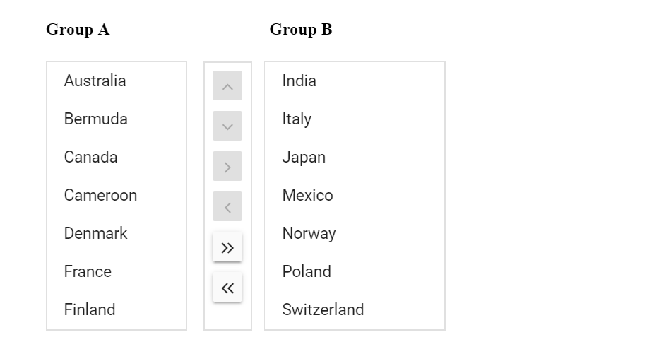

# Dual ListBox in Blazor ListBox Component

The dual ListBox allows the user to move items between two listbox by clicking the toolbar buttons. Dual ListBox can be created by listing items in the [ToolbarSettings](https://help.syncfusion.com/cr/blazor/Syncfusion.Blazor.DropDowns.SfListBox-2.html#Syncfusion_Blazor_DropDowns_SfListBox_2_ToolbarSettings) along with the [Scope](https://help.syncfusion.com/cr/blazor/Syncfusion.Blazor.DropDowns.SfListBox-2.html#Syncfusion_Blazor_DropDowns_SfListBox_2_Scope) property.

The following operations can be performed in dual ListBox,

| Options | Description |
|------|-------------|
| MoveUp | Move the selected item in the upward direction within the listbox. |
| MoveDown | Move the selected item in the downward direction within the listbox. |
| MoveTo |  Move the selected item to the another listbox. |
| MoveFrom | Move the selected item from one listbox to the another listbox. |
| MoveAllTo | Move all the items to the another listbox. |
| MoveAllFrom |  Move all the items from one listbox to the another listbox. |

The following example illustrates how to move items from `Group A` to `Group B` listbox.

```cshtml
@using Syncfusion.Blazor.DropDowns

<div id="listbox1">
    <h4>Group A</h4>
    <SfListBox TValue="string[]" DataSource="@GroupA" Scope="scope2" TItem="CountryCode" @attributes="listbox1Attr">
        <ListBoxFieldSettings Text="Name"></ListBoxFieldSettings>
        <ListBoxToolbarSettings Items="@Items"></ListBoxToolbarSettings>
    </SfListBox>
</div>
<div id="listbox2">
    <h4>Group B</h4>
    <SfListBox TValue="string[]" Scope="scope1" DataSource="@GroupB" TItem="CountryCode" @attributes="listbox2Attr">
        <ListBoxFieldSettings Text="Name"></ListBoxFieldSettings>
    </SfListBox>
</div>

@code {
    private readonly Dictionary<string, object> listbox1Attr = new Dictionary<string, object>
    {
        { "id", "scope1" }
    };
    private readonly Dictionary<string, object> listbox2Attr = new Dictionary<string, object>
    {
        { "id", "scope2" }
    };
    public string[] Items = new string[] { "MoveUp", "MoveDown", "MoveTo", "MoveFrom", "MoveAllTo", "MoveAllFrom" };
    public List<CountryCode> GroupA = new List<CountryCode>
    {
        new CountryCode{ Name = "Australia", Code = "AU" },
        new CountryCode{ Name = "Bermuda", Code = "BM" },
        new CountryCode{ Name = "Canada", Code = "CA" },
        new CountryCode{ Name = "Cameroon", Code = "CM" },
        new CountryCode{ Name = "Denmark", Code = "DK" },
        new CountryCode{ Name = "France", Code = "FR" },
        new CountryCode{ Name = "Finland", Code = "FI" }
    };

    public List<CountryCode> GroupB = new List<CountryCode>
  {
        new CountryCode{ Name = "India", Code = "IN" },
        new CountryCode{ Name = "Italy", Code = "IT" },
        new CountryCode{ Name = "Japan", Code = "JP" },
        new CountryCode{ Name = "Mexico", Code = "MX" },
        new CountryCode{ Name = "Norway", Code = "NO" },
        new CountryCode{ Name = "Poland", Code = "PL" },
        new CountryCode{ Name = "Switzerland", Code = "CH" }
    };

    public class CountryCode
    {
        public string Name { get; set; }
        public string Code { get; set; }
    }
}

<style>
    #listbox1 {
        width: 48%;
        float: left;
    }

    #listbox2 {
        width: 48%;
        float: right;
    }
</style>

```

Output will be shown as

