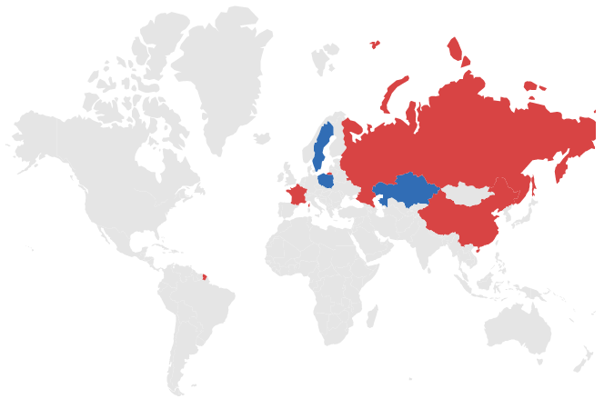
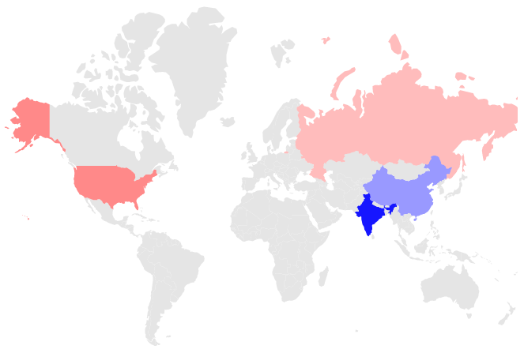
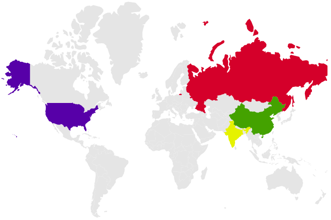
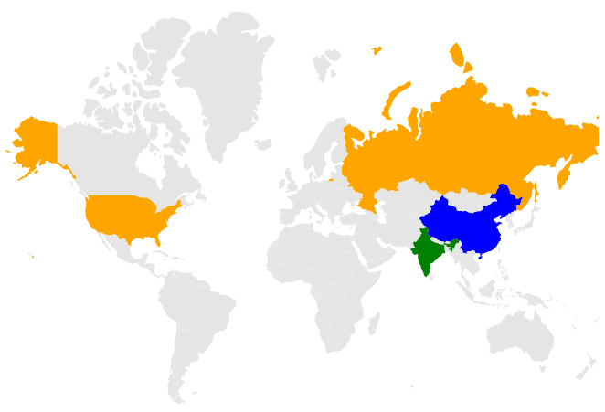
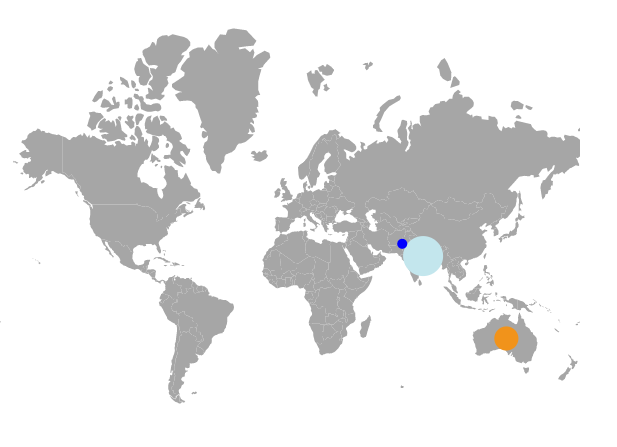

# Color Mapping in Blazor Maps Component

Color mapping is used to customize the shape colors based on the given values. It has three types.

1. Range color mapping
2. Equal color mapping
3. Desaturation color mapping.

To add color mapping to the shapes of the Maps, bind the data source to the [DataSource](https://help.syncfusion.com/cr/blazor/Syncfusion.Blazor.Maps.MapsLayer-1.html#Syncfusion_Blazor_Maps_MapsLayer_1_DataSource) property of the [MapsLayer](https://help.syncfusion.com/cr/blazor/Syncfusion.Blazor.Maps.MapsLayer-1.html) and set the field name which contains the color value in the data source to the [ColorValuePath](https://help.syncfusion.com/cr/blazor/Syncfusion.Blazor.Maps.MapsShapeSettings.html#Syncfusion_Blazor_Maps_MapsShapeSettings_ColorValuePath) property.

## Types of color mapping

### Range color mapping

Range color mapping applies the color to the shapes of the Maps which matches the numeric values in the data source within the given color mapping ranges. The [StartRange](https://help.syncfusion.com/cr/blazor/Syncfusion.Blazor.Maps.MapsColorMapping.html#Syncfusion_Blazor_Maps_MapsColorMapping_StartRange) and [EndRange](https://help.syncfusion.com/cr/blazor/Syncfusion.Blazor.Maps.MapsColorMapping.html#Syncfusion_Blazor_Maps_MapsColorMapping_EndRange) properties in the [MapsShapeColorMapping](https://help.syncfusion.com/cr/blazor/Syncfusion.Blazor.Maps.MapsShapeColorMapping.html) are used to specify the color mapping ranges in the Maps.

Bind the **PopulationDetails** data to the [DataSource](https://help.syncfusion.com/cr/blazor/Syncfusion.Blazor.Maps.MapsLayer-1.html#Syncfusion_Blazor_Maps_MapsLayer_1_DataSource) property of [MapsLayer](https://help.syncfusion.com/cr/blazor/Syncfusion.Blazor.Maps.MapsLayer-1.html) and set the [ColorValuePath](https://help.syncfusion.com/cr/blazor/Syncfusion.Blazor.Maps.MapsShapeSettings.html#Syncfusion_Blazor_Maps_MapsShapeSettings_ColorValuePath) property of [MapsShapeSettings](https://help.syncfusion.com/cr/blazor/Syncfusion.Blazor.Maps.MapsShapeSettings.html) class as **Density**. The range values can be set using the [StartRange](https://help.syncfusion.com/cr/blazor/Syncfusion.Blazor.Maps.MapsColorMapping.html#Syncfusion_Blazor_Maps_MapsColorMapping_StartRange) and [EndRange](https://help.syncfusion.com/cr/blazor/Syncfusion.Blazor.Maps.MapsColorMapping.html#Syncfusion_Blazor_Maps_MapsColorMapping_EndRange) properties in the [MapsShapeColorMapping](https://help.syncfusion.com/cr/blazor/Syncfusion.Blazor.Maps.MapsShapeColorMapping.html).

```cshtml
@using Syncfusion.Blazor.Maps

<SfMaps>
    <MapsLayers>
        <MapsLayer ShapeData='new {dataOptions ="https://cdn.syncfusion.com/maps/map-data/world-map.json"}' DataSource="PopulationDetails"
		    ShapeDataPath="Name" ShapePropertyPath='new string[] {"name"}' TValue="PopulationDetail">
            @* To apply color based on density range *@
            <MapsShapeSettings Fill="#E5E5E5" ColorValuePath="Density">
                <MapsShapeColorMappings>
                    <MapsShapeColorMapping StartRange="0.00001" EndRange="100" Color='new string[] {"yellow"}' />
                    <MapsShapeColorMapping StartRange="100" EndRange="400" Color='new string[] {"green"}' />
                </MapsShapeColorMappings>
            </MapsShapeSettings>
        </MapsLayer>
    </MapsLayers>
</SfMaps>

@code{
    public class PopulationDetail
    {
        public string Code { get; set; }
        public double Value { get; set; }
        public string Name { get; set; }
        public double Population { get; set; }
        public double Density { get; set; }
    };
    public List<PopulationDetail> PopulationDetails = new List<PopulationDetail> {
       new PopulationDetail
       {
           Code = "US", Value = 34, Name ="United States", Population = 325020000, Density = 33
       },
       new PopulationDetail
       {
           Code ="RU", Value = 9, Name = "Russia", Population = 142905208, Density = 8.3
       },
       new PopulationDetail
       {
           Code = "In", Value = 384, Name = "India", Population = 1198003000, Density = 364
       },
       new PopulationDetail
       {
           Code = "CN", Value = 143, Name = "China", Population = 1389750000,Density = 144
       }
    };
}
```


### Equal color mapping

Equal color mapping applies the color to the shapes of the Maps when the [Value](https://help.syncfusion.com/cr/blazor/Syncfusion.Blazor.Maps.MapsColorMapping.html#Syncfusion_Blazor_Maps_MapsColorMapping_Value) property of [MapsShapeColorMapping](https://help.syncfusion.com/cr/blazor/Syncfusion.Blazor.Maps.MapsShapeColorMapping.html) matches with the values provided in the data source.

The following example demonstrates the permanent and non-permanent countries in the UN security council, in 2017.  Bind the **CouncilMemberDetails** data to the [DataSource](https://help.syncfusion.com/cr/blazor/Syncfusion.Blazor.Maps.MapsLayer-1.html#Syncfusion_Blazor_Maps_MapsLayer_1_DataSource) property of [MapsLayer](https://help.syncfusion.com/cr/blazor/Syncfusion.Blazor.Maps.MapsLayer-1.html) class and set the [ColorValuePath](https://help.syncfusion.com/cr/blazor/Syncfusion.Blazor.Maps.MapsShapeSettings.html#Syncfusion_Blazor_Maps_MapsShapeSettings_ColorValuePath) property of [MapsShapeSettings](https://help.syncfusion.com/cr/blazor/Syncfusion.Blazor.Maps.MapsShapeSettings.html) class as **Membership**. Set the [Value](https://help.syncfusion.com/cr/blazor/Syncfusion.Blazor.Maps.MapsColorMapping.html#Syncfusion_Blazor_Maps_MapsColorMapping_Value) property in the [MapsShapeColorMapping](https://help.syncfusion.com/cr/blazor/Syncfusion.Blazor.Maps.MapsShapeColorMapping.html) class to **Permanent** and **Non-Permanent** in the different set of shape color mapping properties. If the corresponding value of the [ColorValuePath](https://help.syncfusion.com/cr/blazor/Syncfusion.Blazor.Maps.MapsShapeSettings.html#Syncfusion_Blazor_Maps_MapsShapeSettings_ColorValuePath) property matches with the corresponding field name in the data source, then the given color will be applied.

```cshtml
@using Syncfusion.Blazor.Maps

<SfMaps>
    <MapsLayers>
        <MapsLayer ShapeData='new {dataOptions ="https://cdn.syncfusion.com/maps/map-data/world-map.json"}' DataSource="CouncilMemberDetails" ShapeDataPath="Country" ShapePropertyPath='new string[] {"name"}' TValue="UNCouncil">
            @* To apply color based on membership type *@
            <MapsShapeSettings Fill="#E5E5E5" ColorValuePath="Membership">
                <MapsShapeColorMappings>
                    <MapsShapeColorMapping Value="Permanent" Color='new string[] {"#D84444"}' />
                    <MapsShapeColorMapping Value="Non-Permanent" Color='new string[] {"#316DB5"}' />
                </MapsShapeColorMappings>
            </MapsShapeSettings>
        </MapsLayer>
    </MapsLayers>
</SfMaps>

@code{
    public class UNCouncil
    {
        public string Country { get; set; }
        public string Membership { get; set; }
    };
    public List<UNCouncil> CouncilMemberDetails = new List<UNCouncil>{
         new UNCouncil { Country= "China", Membership= "Permanent"},
         new UNCouncil { Country= "France",Membership= "Permanent" },
         new UNCouncil { Country= "Russia",Membership= "Permanent"},
         new UNCouncil { Country= "Kazakhstan",Membership= "Non-Permanent"},
         new UNCouncil { Country= "Poland",Membership= "Non-Permanent"},
         new UNCouncil { Country= "Sweden",Membership= "Non-Permanent"}
    };
}
```



### Desaturation color mapping

Desaturation color mapping applies the color to the shapes of the Maps similar to the range color mapping. The opacity will be applied in this color mapping based on the [MinOpacity](https://help.syncfusion.com/cr/blazor/Syncfusion.Blazor.Maps.MapsColorMapping.html#Syncfusion_Blazor_Maps_MapsColorMapping_MinOpacity) and [MaxOpacity](https://help.syncfusion.com/cr/blazor/Syncfusion.Blazor.Maps.MapsColorMapping.html#Syncfusion_Blazor_Maps_MapsColorMapping_MaxOpacity) properties in the [MapsShapeColorMapping](https://help.syncfusion.com/cr/blazor/Syncfusion.Blazor.Maps.MapsShapeColorMapping.html).

>The following example shows how to apply desaturation color mapping to shapes with the data source **PopulationDetails** that is available in the [Range color mapping](#range-color-mapping) section.

Bind the **PopulationDetails** data to the [DataSource](https://help.syncfusion.com/cr/blazor/Syncfusion.Blazor.Maps.MapsLayer-1.html#Syncfusion_Blazor_Maps_MapsLayer_1_DataSource) property of [MapsLayer](https://help.syncfusion.com/cr/blazor/Syncfusion.Blazor.Maps.MapsLayer-1.html) and set the [ColorValuePath](https://help.syncfusion.com/cr/blazor/Syncfusion.Blazor.Maps.MapsShapeSettings.html#Syncfusion_Blazor_Maps_MapsShapeSettings_ColorValuePath) property of [MapsShapeSettings](https://help.syncfusion.com/cr/blazor/Syncfusion.Blazor.Maps.MapsShapeSettings.html) as **Density**. The range values can be set using the [StartRange](https://help.syncfusion.com/cr/blazor/Syncfusion.Blazor.Maps.MapsColorMapping.html#Syncfusion_Blazor_Maps_MapsColorMapping_StartRange) and [EndRange](https://help.syncfusion.com/cr/blazor/Syncfusion.Blazor.Maps.MapsColorMapping.html#Syncfusion_Blazor_Maps_MapsColorMapping_EndRange) properties in the [MapsShapeColorMapping](https://help.syncfusion.com/cr/blazor/Syncfusion.Blazor.Maps.MapsShapeColorMapping.html).

```cshtml
@using Syncfusion.Blazor.Maps

<SfMaps>
    <MapsLayers>
        <MapsLayer ShapeData='new {dataOptions ="https://cdn.syncfusion.com/maps/map-data/world-map.json"}' DataSource="populationDetails" ShapeDataPath="Name" ShapePropertyPath='new string[] {"name"}' TValue="PopulationDetail">
            <MapsShapeSettings Fill="#E5E5E5" ColorValuePath="Density">
                <MapsShapeColorMappings>
                    <MapsShapeColorMapping StartRange="100" EndRange="400" Color='new string[] {"blue"}' MinOpacity="0.3" MaxOpacity="1" />
                </MapsShapeColorMappings>
            </MapsShapeSettings>
        </MapsLayer>
    </MapsLayers>
</SfMaps>
```



## Multiple colors for a single shape

Multiple colors can be added to the color mapping which can be used as gradient effect to a specific shape based on the ranges in the data source. By using the [Color](https://help.syncfusion.com/cr/blazor/Syncfusion.Blazor.Maps.MapsColorMapping.html#Syncfusion_Blazor_Maps_MapsColorMapping_Color) property of [MapsShapeColorMapping](https://help.syncfusion.com/cr/blazor/Syncfusion.Blazor.Maps.MapsShapeColorMapping.html), any number of colors can be set to the shapes as a gradient.

>The following example demonstrates how to use multiple colors in color mapping with the data source  **PopulationDetails** that is available in the [Range color mapping](#range-color-mapping) section.

Bind the **PopulationDetails** data to the [DataSource](https://help.syncfusion.com/cr/blazor/Syncfusion.Blazor.Maps.MapsLayer-1.html#Syncfusion_Blazor_Maps_MapsLayer_1_DataSource) property of [MapsLayer](https://help.syncfusion.com/cr/blazor/Syncfusion.Blazor.Maps.MapsLayer-1.html) and set the [ColorValuePath](https://help.syncfusion.com/cr/blazor/Syncfusion.Blazor.Maps.MapsShapeSettings.html#Syncfusion_Blazor_Maps_MapsShapeSettings_ColorValuePath) property of [MapsShapeSettings](https://help.syncfusion.com/cr/blazor/Syncfusion.Blazor.Maps.MapsShapeSettings.html) as **Density**. The range values can be set using the [StartRange](https://help.syncfusion.com/cr/blazor/Syncfusion.Blazor.Maps.MapsColorMapping.html#Syncfusion_Blazor_Maps_MapsColorMapping_StartRange) and [EndRange](https://help.syncfusion.com/cr/blazor/Syncfusion.Blazor.Maps.MapsColorMapping.html#Syncfusion_Blazor_Maps_MapsColorMapping_EndRange) properties in the [MapsShapeColorMapping](https://help.syncfusion.com/cr/blazor/Syncfusion.Blazor.Maps.MapsShapeColorMapping.html).

```cshtml
@using Syncfusion.Blazor.Maps

<SfMaps>
    <MapsLayers>
        <MapsLayer ShapeData='new {dataOptions ="https://cdn.syncfusion.com/maps/map-data/world-map.json"}'
                   DataSource="populationDetails" ShapeDataPath="Name" ShapePropertyPath='new string[] {"name"}' TValue="PopulationDetail">
            <MapsShapeSettings Fill="#E5E5E5" ColorValuePath="Density">
                <MapsShapeColorMappings>
                    <MapsShapeColorMapping StartRange="0.00001" EndRange="50" Color='new string[] { "red", "blue"}' />
                    <MapsShapeColorMapping StartRange="50" EndRange="400" Color='new string[] { "green", "yellow"}' />
                </MapsShapeColorMappings>
            </MapsShapeSettings>
        </MapsLayer>
    </MapsLayers>
</SfMaps>
```



## Color for items excluded from color mapping

Color mapping can be applied to the shapes in the Maps which does not match color mapping criteria such as range or equal values using the  [Color](https://help.syncfusion.com/cr/blazor/Syncfusion.Blazor.Maps.MapsColorMapping.html#Syncfusion_Blazor_Maps_MapsColorMapping_Color) property of [MapsShapeColorMapping](https://help.syncfusion.com/cr/blazor/Syncfusion.Blazor.Maps.MapsShapeColorMapping.html).

>The following example shows how to set the color for items excluded from the color mapping with the data source  **PopulationDetails** that is available in the [Range color mapping](#range-color-mapping) section.

In the following example, color mapping is added for the ranges from 0 to 300. If there are any records in the data source that are outside of this range, the color mapping will not be applied. To apply the color for these excluded items, set the [Color](https://help.syncfusion.com/cr/blazor/Syncfusion.Blazor.Maps.MapsColorMapping.html#Syncfusion_Blazor_Maps_MapsColorMapping_Color) property alone in the [MapsShapeColorMapping](https://help.syncfusion.com/cr/blazor/Syncfusion.Blazor.Maps.MapsShapeColorMapping.html).

```cshtml
@using Syncfusion.Blazor.Maps

<SfMaps>
    <MapsLayers>
        <MapsLayer ShapeData='new {dataOptions ="https://cdn.syncfusion.com/maps/map-data/world-map.json"}' DataSource="populationDetails" ShapeDataPath="Name" ShapePropertyPath='new string[] {"name"}' TValue="PopulationDetail">
            <MapsShapeSettings Fill="#E5E5E5" ColorValuePath="Density">
                <MapsShapeColorMappings>
                    <MapsShapeColorMapping StartRange="0.00001" EndRange="100" Color='new string[] {"orange"}' />
                    <MapsShapeColorMapping StartRange="100" EndRange="300" Color='new string[] {"blue"}' />
                    @* To apply color for excluded items *@
                    <MapsShapeColorMapping Color='new string[] {"green"}' />
                </MapsShapeColorMappings>
            </MapsShapeSettings>
        </MapsLayer>
    </MapsLayers>
</SfMaps>
```



## Color mapping for bubbles

The color mapping types such as range color mapping, equal color mapping and desaturation color mapping are applicable for bubbles in the Maps. To add color mapping for bubbles of the Maps, bind the data source to the [DataSource](https://help.syncfusion.com/cr/blazor/Syncfusion.Blazor.Maps.MapsBubble-1.html#Syncfusion_Blazor_Maps_MapsBubble_1_DataSource) property of [MapsBubble](https://help.syncfusion.com/cr/blazor/Syncfusion.Blazor.Maps.MapsBubble-1.html) and set the field name which contains the color value in the data source to the [ColorValuePath](https://help.syncfusion.com/cr/blazor/Syncfusion.Blazor.Maps.MapsBubble-1.html#Syncfusion_Blazor_Maps_MapsBubble_1_ColorValuePath) property. Multiple colors for a single set of bubbles and color for excluded items from [MapsBubbleColorMapping](https://help.syncfusion.com/cr/blazor/Syncfusion.Blazor.Maps.MapsBubbleColorMapping.html) are also applicable for bubbles.

```cshtml
@using Syncfusion.Blazor.Maps

<SfMaps Height="600" Width="400">
    <MapsLayers>
        <MapsLayer ShapeData='new {dataOptions ="https://cdn.syncfusion.com/maps/map-data/world-map.json"}'
		        ShapeDataPath="Name" ShapePropertyPath='new string[] {"name"}' TValue="BubbleData">
         <MapsShapeSettings Fill="#E5E5E5"/>
            <MapsBubbleSettings>
                <MapsBubble Visible="true" ValuePath="Population" ColorValuePath="Population" MinRadius=5 DataSource="BubbleColorMapping"
				        TValue="BubbleData">
                    <MapsBubbleColorMappings>
                        <MapsBubbleColorMapping Value="38332521" Color='new string[] {"#D84444"}' />
                        <MapsBubbleColorMapping Value="19651127" Color='new string[] {"#316DB5"}' />
                        <MapsBubbleColorMapping Value="3090416" Color='new string[] {"blue"}' />
                    </MapsBubbleColorMappings>
                </MapsBubble>
            </MapsBubbleSettings>
        </MapsLayer>
    </MapsLayers>
</SfMaps>

@code{
    public class BubbleData
    {
        public string Name { get; set; }
        public string Population { get; set; }
    };
    public List<BubbleData> BubbleColorMapping = new List<BubbleData>{
         new BubbleData { Name= "India", Population= "38332521"},
         new BubbleData { Name= "Russia", Population= "19651127" },
         new BubbleData { Name= "Pakistan", Population= "3090416"},
    };
}
```

