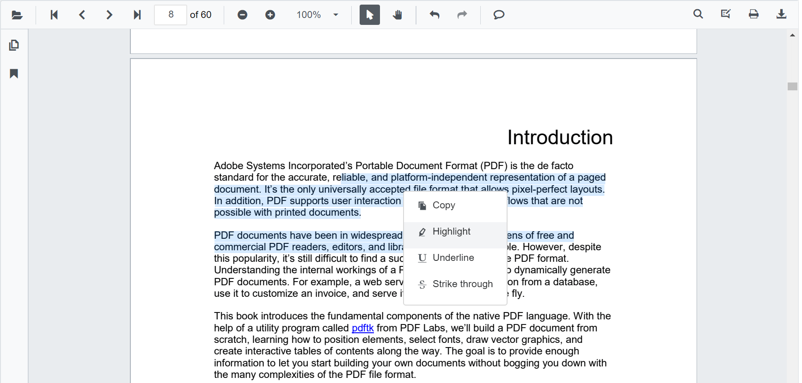
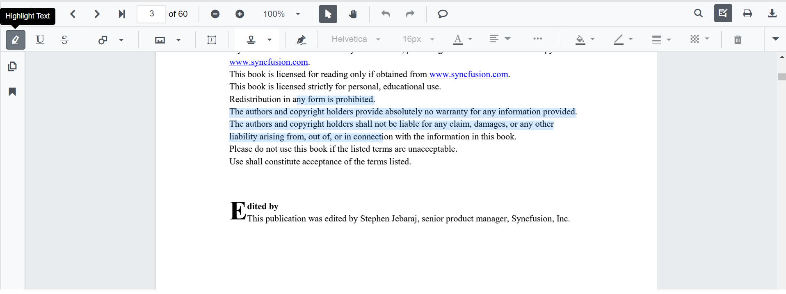

# Text markup annotations in Blazor PDF Viewer Component

The PDF Viewer control provides the options to add, edit, and delete text markup annotations such as highlight, underline, and strikethrough annotations in the PDF document.


## Adding text markup annotation to the PDF Document

Text Markup annotations can be added to the PDF document using the annotation toolbar and by using context menu.

## Highlight a text

There are two ways to highlight a text in the PDF document.

**Using the context menu.**

* Select a text in the PDF document and right-click it
* Select **Highlight** option in the context menu that appears


**Using the annotation toolbar.**

* Click the **Edit Annotation** button in the PDF Viewer toolbar.  A toolbar appears below it.
* Select the **Highlight** button in the annotation toolbar. It enables the highlight mode.
* Select the text and the highlight annotation will be added.
* You can also select the text and apply the highlight annotation using the **Highlight** button



In the pan mode, if the highlight mode is entered, the PDF Viewer control will switch to text select mode to enable the text selection for highlighting the text.

Refer to the following code snippet to switch to highlight mode

```cshtml
@using Syncfusion.Blazor.PdfViewerServer
@using Syncfusion.Blazor.Buttons
@using Syncfusion.Blazor.PdfViewer

<SfButton OnClick="OnClick">Click Here</SfButton>
<SfPdfViewerServer DocumentPath="@DocumentPath" @ref="viewer" Width="1060px" Height="500px">
</SfPdfViewerServer>

@code{
    SfPdfViewerServer viewer;

    public void OnClick(MouseEventArgs args)
    {
        viewer.SetAnnotationMode(AnnotationType.Highlight);
    }
    private string DocumentPath { get; set; } = "wwwroot/Data/PDF_Succinctly.pdf";
}
```

## Underline a text

There are two ways to underline a text in the PDF document:

**Using the context menu.**

* Select a text in the PDF document and right-click it
* Select **Underline** option in the context menu that appears.


**Using the annotation toolbar.**

* Click the **Edit Annotation** button in the PDF Viewer toolbar.  A toolbar appears below it.
* Select the **Underline** button in the annotation toolbar. It enables the underline mode.
* Select the text and the underline annotation will be added.
* You can also select the text and apply the underline annotation using the **Underline** button


In the pan mode, if the underline mode is entered, the PDF Viewer control will switch to text select mode to enable the text selection for underlining the text.

Refer to the following code snippet to switch to underline mode

```cshtml
@using Syncfusion.Blazor.PdfViewerServer
@using Syncfusion.Blazor.Buttons
@using Syncfusion.Blazor.PdfViewer

<SfButton OnClick="OnClick">Click Here</SfButton>
<SfPdfViewerServer DocumentPath="@DocumentPath" @ref="viewer" Width="1060px" Height="500px">
</SfPdfViewerServer>

@code{
    SfPdfViewerServer viewer;

    public void OnClick(MouseEventArgs args)
    {
        viewer.SetAnnotationMode(AnnotationType.Underline);
    }
    private string DocumentPath { get; set; } = "wwwroot/Data/PDF_Succinctly.pdf";
}
```

## Strikethrough a text

There are two ways to strikethrough a text in the PDF document:

Using the context menu.

* Select a text in the PDF document and right-click it
* Select **strikethrough** option in the context menu that appears.


**Using the annotation toolbar.**

* Click the **Edit Annotation** button in the PDF Viewer toolbar.  A toolbar appears below it.
* Select the **Strikethrough** button in the annotation toolbar. It enables the strikethrough mode.
* Select the text and the strikethrough annotation will be added.
* You can also select the text and apply the strikethrough annotation using the **Strikethrough** button


In the pan mode, if the strikethrough mode is entered, the PDF Viewer control will switch to text select mode to enable the text selection to strike through the text.

Refer to the following code snippet to switch to strikethrough mode

```cshtml
@using Syncfusion.Blazor.PdfViewerServer
@using Syncfusion.Blazor.Buttons
@using Syncfusion.Blazor.PdfViewer

<SfButton OnClick="OnClick">Click Here</SfButton>
<SfPdfViewerServer DocumentPath="@DocumentPath" @ref="viewer" Width="1060px" Height="500px">
</SfPdfViewerServer>

@code{
    SfPdfViewerServer viewer;

    public void OnClick(MouseEventArgs args)
    {
        viewer.SetAnnotationMode(AnnotationType.Strikethrough);
    }
    private string DocumentPath { get; set; } = "wwwroot/Data/PDF_Succinctly.pdf";
}
```

## Editing the properties of the text markup annotation

The color and the opacity of the text markup annotation can be edited using the Edit Color tool and the Edit Opacity tool in the annotation toolbar.

### Editing color

The color of the annotation can be edited using the color palette provided in the Edit Color tool.


### Editing opacity

The opacity of the annotation can be edited using the range slider provided in the Edit Opacity tool.


## Text markup annotation settings

The properties of the text markup annotation can be set before creating the control using highlightSettings, underlineSettings, and strikethroughSettings.

> After editing the default color and opacity using the Edit color tool and Edit opacity tool, they will be changed to the selected values.

Refer to the following code snippet to set the default annotation settings.

```cshtml
@using Syncfusion.Blazor
@using Syncfusion.Blazor.PdfViewerServer

<SfPdfViewerServer @ref="@viewer" DocumentPath="@DocumentPath" HighlightSettings="@HighlightSettings" UnderlineSettings="@UnderlineSettings" StrikethroughSettings="@StrikethroughSettings">
</SfPdfViewerServer>

@code{
    SfPdfViewerServer viewer;
    private string DocumentPath { get; set; } = "wwwroot/Data/PDF_Succinctly.pdf";
    PdfViewerHighlightSettings HighlightSettings = new PdfViewerHighlightSettings { Color = "green", Opacity = 0.6 };
    PdfViewerUnderlineSettings UnderlineSettings = new PdfViewerUnderlineSettings { Color = "blue", Opacity = 0.6 };
    PdfViewerStrikethroughSettings StrikethroughSettings = new PdfViewerStrikethroughSettings { Color = "orange", Opacity = 0.6 };
}
```

> You can refer to our [Blazor PDF Viewer](https://www.syncfusion.com/blazor-components/blazor-pdf-viewer) feature tour page for its groundbreaking feature representations. You can also explore our [Blazor PDF Viewer example](https://blazor.syncfusion.com/demos/pdf-viewer/default-functionalities?theme=bootstrap4) to understand how to explains core features of PDF Viewer.