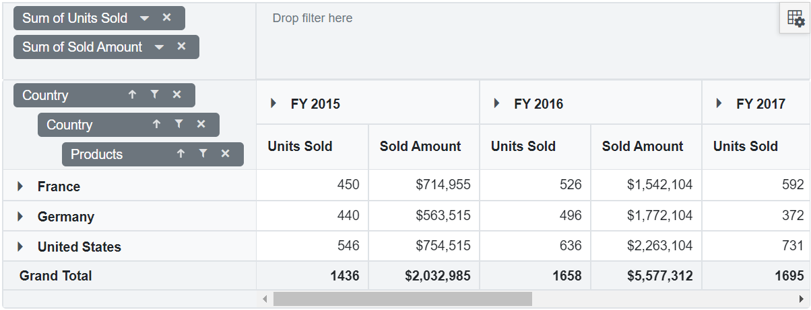
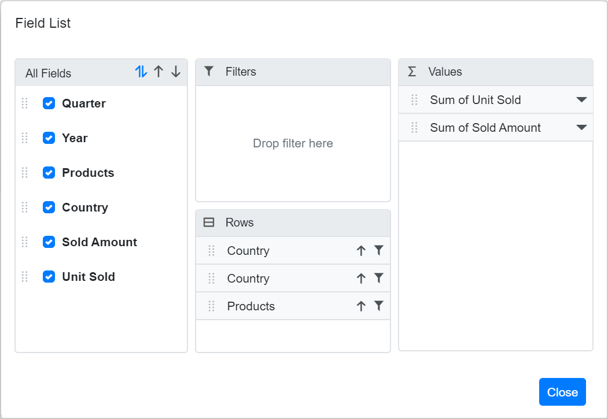

# CSS Customization in Blazor Pivot Table Component

## Hiding Axis

The visibility of row, column, value and filter axis in Field List and Grouping Bar can be changed using custom CSS setting. To do so, please refer the code sample below:

```cshtml
@using Syncfusion.Blazor.PivotView
<SfPivotView TValue="ProductDetails" ID="PivotView" ShowGroupingBar="true" ShowFieldList="true">
    <PivotViewDataSourceSettings DataSource="@data">
        <PivotViewColumns>
            <PivotViewColumn Name="Year"></PivotViewColumn>
            <PivotViewColumn Name="Quarter"></PivotViewColumn>
        </PivotViewColumns>
        <PivotViewRows>
            <PivotViewRow Name="Country" ></PivotViewRow>
            <PivotViewRow Name="Country" ></PivotViewRow>
            <PivotViewRow Name="Products"></PivotViewRow>
        </PivotViewRows>
        <PivotViewValues>
            <PivotViewValue Name="Sold" Caption="Units Sold"></PivotViewValue>
            <PivotViewValue Name="Amount" Caption="Sold Amount"></PivotViewValue>
        </PivotViewValues>
        <PivotViewFormatSettings>
            <PivotViewFormatSetting Name="Amount" Format="C"></PivotViewFormatSetting>
        </PivotViewFormatSettings>
    </PivotViewDataSourceSettings>
</SfPivotView>

<style>

    /* Hiding column axis in grouping bar */
    #PivotView .e-group-columns {
        display: none;
    }
    /* Increasing filter axis height to fill column axis portion */
    #PivotView .e-group-filters {
        min-height: 74.67px !important;
    }

    /* Hiding column axis in field list */
    .e-pivotfieldlist-container .e-field-list-columns {
        display: none;
    }
    /* Increasing value axis height to fill column axis portion */
    .e-pivotfieldlist-container .e-field-list-values {
        margin-top: 0px !important;
        min-height: 338px !important;
    }
    .e-pivotfieldlist-container .e-values {
        height: 310px !important;
    }

    /* Hiding row axis in grouping bar */
    // #PivotView .e-group-rows {
    //     display: none;
    // }

    /* Hiding row axis in field list */
    // .e-pivotfieldlist-container .e-field-list-rows {
    //     display: none;
    // }

    /* Hiding value axis in grouping bar */
    // #PivotView .e-group-values {
    //     display: none;
    // }

    /* Hiding value axis in field list */
    // .e-pivotfieldlist-container .e-field-list-values {
    //     display: none;
    // }

    /* Hiding filter axis in grouping bar */
    // #PivotView .e-group-filters {
    //     display: none;
    // }

    /* Hiding filter axis in field list */
    //.e-pivotfieldlist-container .e-field-list-filters {
    //    display: none;
    //}

</style>

@code{
    public List<ProductDetails> data { get; set; }
    protected override void OnInitialized()
    {
        this.data = ProductDetails.GetProductData().ToList();
        //Bind the data source collection here. Refer "Assigning sample data to the pivot table" section in getting started for more details.
    }
}

```





## Text Alignment

The alignment of text inside row headers, column headers, value cells and summary cells can be changed using custom CSS setting. To do so, please refer the code sample below:

```cshtml
@using Syncfusion.Blazor.PivotView
<SfPivotView TValue="ProductDetails">
    <PivotViewDataSourceSettings DataSource="@dataSource">
        <PivotViewColumns>
            <PivotViewColumn Name="Year"></PivotViewColumn>
            <PivotViewColumn Name="Quarter"></PivotViewColumn>
        </PivotViewColumns>
        <PivotViewRows>
            <PivotViewRow Name="Country" ></PivotViewRow>
            <PivotViewRow Name="Country" ></PivotViewRow>
            <PivotViewRow Name="Products"></PivotViewRow>
        </PivotViewRows>
        <PivotViewValues>
            <PivotViewValue Name="Sold" Caption="Units Sold"></PivotViewValue>
            <PivotViewValue Name="Amount" Caption="Sold Amount"></PivotViewValue>
        </PivotViewValues>
        <PivotViewFormatSettings>
            <PivotViewFormatSetting Name="Amount" Format="C"></PivotViewFormatSetting>
        </PivotViewFormatSettings>
    </PivotViewDataSourceSettings>
</SfPivotView>

<style>

/*Value Cells*/
.e-pivotview .e-valuescontent {
    text-align: center !important;
}

/*Columns Headers*/
/*.e-pivotview .e-columnsheader {
    text-align: center !important;
}*/

/*Rows Headers*/
/*.e-pivotview .e-rowsheader {
    text-align: center !important;
}*/

/*Summary Cells*/
/*.e-pivotview .e-summary {
    text-align: center !important;
}*/

</style>

@code{
    public List<ProductDetails> data { get; set; }
    protected override void OnInitialized()
    {
        this.data = ProductDetails.GetProductData().ToList();
        //Bind the data source collection here. Refer "Assigning sample data to the pivot table" section in getting started for more details.
    }
}

```


## Customize header, value and summary cell style

The elements in pivot table like header cell, value cell and summary cell style can be customized using built-in CSS names. To do so, please refer the code sample below:

```cshtml
@using Syncfusion.Blazor.PivotView
<SfPivotView TValue="ProductDetails" ID="PivotView" ShowFieldList="true">
    <PivotViewDataSourceSettings DataSource="@data">
        <PivotViewColumns>
            <PivotViewColumn Name="Year"></PivotViewColumn>
            <PivotViewColumn Name="Quarter"></PivotViewColumn>
        </PivotViewColumns>
        <PivotViewRows>
            <PivotViewRow Name="Country" ></PivotViewRow>
            <PivotViewRow Name="Products"></PivotViewRow>
        </PivotViewRows>
        <PivotViewValues>
            <PivotViewValue Name="Sold" Caption="Units Sold"></PivotViewValue>
            <PivotViewValue Name="Amount" Caption="Sold Amount"></PivotViewValue>
        </PivotViewValues>
        <PivotViewFormatSettings>
            <PivotViewFormatSetting Name="Amount" Format="C"></PivotViewFormatSetting>
        </PivotViewFormatSettings>
    </PivotViewDataSourceSettings>
</SfPivotView>

<style>

.e-pivotview .e-headercell {
    background-color: thistle !important;
}

.e-pivotview .e-rowsheader {
    background-color: skyblue !important;
}

.e-pivotview .e-summary:not(.e-gtot)  {
    background-color: pink !important;
}

.e-pivotview .e-gtot  {
    background-color: greenYellow !important;
}

</style>

@code{
    public List<ProductDetails> data { get; set; }
    protected override void OnInitialized()
    {
        this.data = ProductDetails.GetProductData().ToList();
        //Bind the data source collection here. Refer "Assigning sample data to the pivot table" section in getting started for more details.
    }
}

```


> You can refer to our [Blazor Pivot Table](https://www.syncfusion.com/blazor-components/blazor-pivot-table) feature tour page for its groundbreaking feature representations. You can also explore our [Blazor Pivot Table example](https://blazor.syncfusion.com/demos/pivot-table/default-functionalities?theme=bootstrap4) to knows how to render and configure the pivot table.