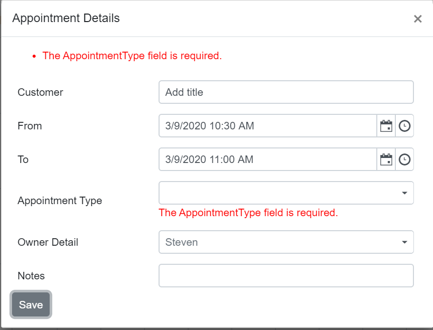

# Custom Editor With Validation in Blazor Scheduler Component

By default in Blazor Scheduler field validation is available for built-in fields, if in case you want to validate a custom field you can go with custom editor and achieve validation using Data Annotations. Data Annotations helps you to define rules to the model classes or properties to perform data validation and display suitable messages to end users.

The Data Annotation can be enabled by referencing the `System.ComponentModel.DataAnnotations` namespace which maps the data annotations to the corresponding appointment fields. In the following code example, Syncfusion Blazor Dialog is used to render the custom editor and save/update the appointments using public methods.

```cshtml
@using Newtonsoft.Json
@using Syncfusion.Blazor.Schedule
@using Syncfusion.Blazor.Calendars
@using Syncfusion.Blazor.DropDowns
@using Syncfusion.Blazor.Inputs
@using Syncfusion.Blazor.Popups
@using System.ComponentModel.DataAnnotations

<SfSchedule @ref="ScheduleRef" TValue="AppointmentData" Width="100%" Height="650px" SelectedDate="@(new DateTime(2020, 3, 11))">
    <ScheduleEvents TValue="AppointmentData" OnPopupOpen="PopupOpen"></ScheduleEvents>
    <ScheduleGroup Resources="@Resources"></ScheduleGroup>
    <ScheduleResources>
        <ScheduleResource TValue="int[]" TItem="ResourceData" DataSource="@OwnersData" Field="OwnerId" Title="Owner" Name="Owners" TextField="OwnerText" IdField="Id" ColorField="OwnerColor" AllowMultiple="true"></ScheduleResource>
    </ScheduleResources>
    <ScheduleEventSettings DataSource="@DataSource"></ScheduleEventSettings>
    <ScheduleViews>
        <ScheduleView Option="View.Day"></ScheduleView>
        <ScheduleView Option="View.Week"></ScheduleView>
        <ScheduleView Option="View.WorkWeek"></ScheduleView>
        <ScheduleView Option="View.Month"></ScheduleView>
        <ScheduleView Option="View.Agenda"></ScheduleView>
    </ScheduleViews>
</SfSchedule>

<SfDialog @bind-Visible="@DialogVisibility" IsModal="true" Width="575px" ShowCloseIcon="true">
    <DialogTemplates>
        <Header> <div>Appointment Details</div> </Header>
        <Content>
            <EditForm Model="AppointmentValidation" OnValidSubmit="@OnValidSubmit">
                <DataAnnotationsValidator />
                <ValidationSummary />
                <table class="custom-event-editor" width="550px" cellpadding="5">
                    <tbody>
                        <tr>
                            <td class="e-textlabel">Customer</td>
                            <td colspan="4">
                                <SfTextBox @ref="SubjectObj" @bind-Value="@AppointmentValidation.Subject"></SfTextBox>
                                <ValidationMessage For="@(() => AppointmentValidation.Subject)" />
                            </td>
                        </tr>
                        <tr>
                            <td class="e-textlabel">From</td>
                            <td colspan="4">
                                <SfDateTimePicker TValue="DateTime?" ID="Start" @bind-Value="@AppointmentValidation.StartTime"></SfDateTimePicker>
                                <ValidationMessage For="@(() => AppointmentValidation.StartTime)" />
                            </td>
                        </tr>
                        <tr>
                            <td class="e-textlabel">To</td>
                            <td colspan="4">
                                <SfDateTimePicker TValue="DateTime?" ID="End" @bind-Value="@AppointmentValidation.EndTime"></SfDateTimePicker>
                                <ValidationMessage For="@(() => AppointmentValidation.EndTime)" />
                            </td>
                        </tr>
                        <tr>
                            <td class="e-textlabel">Appointment Type</td>
                            <td colspan="4">
                                <SfDropDownList TValue="int?" @bind-Value="@AppointmentValidation.AppointmentType" ID="OwnerId" DataSource="@AppointmentTypes" TItem="AppointmentType">
                                    <DropDownListFieldSettings Value="Id" Text="Text"></DropDownListFieldSettings>
                                </SfDropDownList>
                                <ValidationMessage For="@(() => AppointmentValidation.AppointmentType)" />
                            </td>
                        </tr>
                        <tr>
                            <td class="e-textlabel">Owner Detail</td>
                            <td colspan="4">
                                <SfDropDownList TValue="int" @bind-Value="@AppointmentValidation.OwnerId" ID="IdOwnersData" DataSource="@OwnersData" TItem="ResourceData">
                                    <DropDownListFieldSettings Value="Id" Text="OwnerText"></DropDownListFieldSettings>
                                </SfDropDownList>
                                <ValidationMessage For="@(() => AppointmentValidation.OwnerId)" />
                            </td>
                        </tr>
                        <tr>
                            <td class="e-textlabel">Notes</td>
                            <td colspan="4">
                                <SfTextBox @ref="NotesObj" @bind-Value="@AppointmentValidation.Description"></SfTextBox>
                                <ValidationMessage For="@(() => AppointmentValidation.Description)" />
                            </td>
                        </tr>
                    </tbody>
                </table>
                <button type="submit" class="e-btn">Save</button>
            </EditForm>
        </Content>
    </DialogTemplates>
</SfDialog>

@code{
    SfTextBox SubjectObj;
    SfTextBox NotesObj;
    private string Action;
    Boolean DialogVisibility = false;
    private int Id;
    SfSchedule<AppointmentData> ScheduleRef;

    private string[] Resources { get; set; } = { "Owners" };
    List<AppointmentData> DataSource = new List<AppointmentData>
    {
        new AppointmentData { Id = 1, Subject = "Meeting", StartTime = new DateTime(2020, 1, 31, 9, 30, 0) , EndTime = new DateTime(2020, 1, 31, 11, 0, 0), OwnerId = 1 }
    };
    private List<ResourceData> OwnersData { get; set; } = new List<ResourceData>
    {
        new ResourceData{ OwnerText = "Nancy", Id = 1, OwnerColor = "#ffaa00" },
        new ResourceData{ OwnerText = "Steven", Id = 2, OwnerColor = "#f8a398" },
        new ResourceData{ OwnerText = "Michael", Id = 3, OwnerColor = "#7499e1" }
    };
    List<AppointmentType> AppointmentTypes = new List<AppointmentType>() {
        new AppointmentType{ Id= 0, Text= "Not started" },
        new AppointmentType{ Id= 1, Text= "In progress" },
        new AppointmentType{ Id= 2, Text= "Completed" }
    };

    public AppointmentData AppointmentValidation = new AppointmentData();

    private async void OnValidSubmit() //triggers on save button click
    {
        DialogVisibility = false;
        AppointmentData EventData = new AppointmentData();
        EventData.Subject = AppointmentValidation.Subject;
        EventData.EndTime = (DateTime)AppointmentValidation.EndTime;
        EventData.StartTime = (DateTime)AppointmentValidation.StartTime;
        EventData.Description = AppointmentValidation.Description;
        EventData.OwnerId = AppointmentValidation.OwnerId;
        EventData.AppointmentType = AppointmentValidation.AppointmentType;
        EventData.Id = Id;
        if (Action == "CellClick")
        {
            await ScheduleRef.AddEventAsync(EventData); //to add new appointment
        }
        else
        {
            await ScheduleRef.SaveEventAsync(EventData); // to save the existing appointment
        }
    }

    private void PopupOpen(PopupOpenEventArgs<AppointmentData> args)
    {
        if (args.Type == PopupType.Editor)
        {
            args.Cancel = true; //to prevent the default editor window
            this.Action = args.Data.Id == 0 ? "CellClick" : "AppointmentClick"; //to check whether the window opens on cell or appointment
            if (Action == "CellClick")
            {
                AppointmentValidation.StartTime = args.Data.StartTime;
                AppointmentValidation.EndTime = args.Data.EndTime;
                AppointmentValidation.Description = args.Data.Description;
                AppointmentValidation.OwnerId = args.Data.OwnerId;
                Random random = new Random();
                Id = random.Next(2, 1000);
            }
            else
            {
                Id = args.Data.Id;
                AppointmentValidation.StartTime = args.Data.StartTime;
                AppointmentValidation.EndTime = args.Data.EndTime;
                AppointmentValidation.AppointmentType = args.Data.AppointmentType;
                AppointmentValidation.OwnerId = args.Data.OwnerId;
            }
            AppointmentValidation.Description = args.Data.Description == null ? "" : args.Data.Description;
            AppointmentValidation.Subject = args.Data.Subject == null ? "Add title" : args.Data.Subject;
            DialogVisibility = true;
        }
        if (args.Type == PopupType.QuickInfo)
        {
            args.Cancel = true;
        }
    }

    class GroupData
    {
        public int OwnerId { get; set; }
    }

    public class ResourceData
    {
        public int Id { get; set; }
        public string OwnerText { get; set; }
        public string OwnerColor { get; set; }
    }

    public class AppointmentType
    {
        public int Id { get; set; }
        public string Text { get; set; }
    }

    public class AppointmentData
    {
        public int Id { get; set; }
        [Required]
        [StringLength(16, ErrorMessage = "Identifier too long (16 character limit).")]
        public string Subject { get; set; }
        [Required]
        public int? AppointmentType { get; set; }
        [Required]
        public DateTime? StartTime { get; set; }
        [Required]
        public DateTime? EndTime { get; set; }
        [Required]
        public int OwnerId { get; set; }
        public string Location { get; set; }
        public string EventType { get; set; }
        public string Description { get; set; }
        public bool IsAllDay { get; set; }
    }
}
<style>
    .custom-event-editor td {
        padding: 7px;
        padding-right: 16px;
    }
</style>
```

The validation is applied on clicking the save button with empty fields as in the following image.

