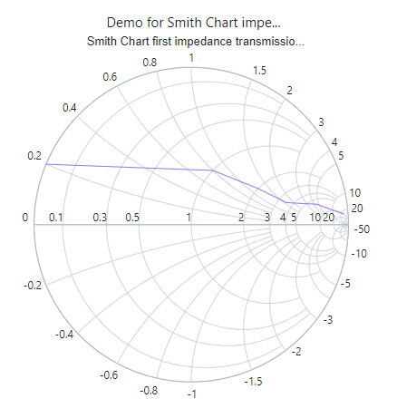
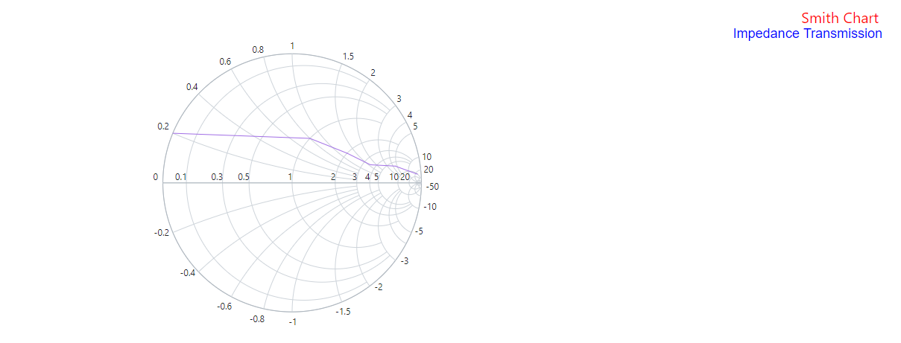

# Title and Subtitle in Blazor Smith Chart Component

## Enable Title

The information about the data plotted in the Smith Chart is depicted using the titles and the subtitles. Using the [Text](https://help.syncfusion.com/cr/blazor/Syncfusion.Blazor.Charts.SmithChartTitle.html#Syncfusion_Blazor_Charts_SmithChartTitle_Text) property in the [SmithChartTitle](https://help.syncfusion.com/cr/blazor/Syncfusion.Blazor.Charts.SmithChartTitle.html#properties) and the [SmithChartSubtitle](https://help.syncfusion.com/cr/blazor/Syncfusion.Blazor.Charts.SmithChartSubtitle.html#properties), the Smith Chart's title and subtitle can be changed. By default, the title and the subtitles are visible. As shown in the following example, use the simple text for the title and the subtitles.

```cshtml
@using Syncfusion.Blazor.Charts

<SfSmithChart>
    <SmithChartTitle Text="Smith Chart">
        <SmithChartSubtitle Text="Impedance Transmission"></SmithChartSubtitle>
    </SmithChartTitle>
    <SmithChartSeriesCollection>
        <SmithChartSeries DataSource='TransmissionData' Reactance="Reactance" Resistance="Resistance">
        </SmithChartSeries>
    </SmithChartSeriesCollection>
</SfSmithChart>

@code {
    public class SmithChartData
    {
        public double? Resistance { get; set; }
        public double? Reactance { get; set; }
    };
    public List<SmithChartData> TransmissionData = new List<SmithChartData> {
        new SmithChartData { Resistance= 10, Reactance= 25 },
        new SmithChartData { Resistance= 6, Reactance= 4.5 },
        new SmithChartData { Resistance= 3.5, Reactance= 1.6 },
        new SmithChartData { Resistance= 2, Reactance= 1.2 },
        new SmithChartData { Resistance= 1, Reactance= 0.8 },
        new SmithChartData { Resistance= 0, Reactance= 0.2 }
    };
}
```


## Trim Title

Both the title and the subtitle of the Smith Chart can be trimmed if it exceeds certain length. This length can be changed using the [MaximumWidth](https://help.syncfusion.com/cr/blazor/Syncfusion.Blazor.Charts.SmithChartTitle.html#Syncfusion_Blazor_Charts_SmithChartTitle_MaximumWidth) property. Trimming is enabled by setting the [EnableTrim](https://help.syncfusion.com/cr/blazor/Syncfusion.Blazor.Charts.SmithChartTitle.html#Syncfusion_Blazor_Charts_SmithChartTitle_EnableTrim) property to **true**.

```cshtml
@using Syncfusion.Blazor.Charts

<SfSmithChart>
    <SmithChartTitle Text="Demo for Smith Chart impedance transmission"
                     EnableTrim="true"
                     MaximumWidth="200">
        <SmithChartSubtitle Text="Smith Chart first impedance transmission. For more info."
                     EnableTrim="true"
                     MaximumWidth="250">
        </SmithChartSubtitle>
    </SmithChartTitle>
    <SmithChartSeriesCollection>
        <SmithChartSeries DataSource='TransmissionData' Reactance="Reactance" Resistance="Resistance">
        </SmithChartSeries>
    </SmithChartSeriesCollection>
</SfSmithChart>

@code {
    public class SmithChartData
    {
        public double? Resistance { get; set; }
        public double? Reactance { get; set; }
    };
    public List<SmithChartData> TransmissionData = new List<SmithChartData> {
        new SmithChartData { Resistance= 10, Reactance= 25 },
        new SmithChartData { Resistance= 6, Reactance= 4.5 },
        new SmithChartData { Resistance= 3.5, Reactance= 1.6 },
        new SmithChartData { Resistance= 2, Reactance= 1.2 },
        new SmithChartData { Resistance= 1, Reactance= 0.8 },
        new SmithChartData { Resistance= 0, Reactance= 0.2 }
    };
}
```



## Title Customization

Title and subtitle can be customized using the following properties.

* [TextAlignment](https://help.syncfusion.com/cr/blazor/Syncfusion.Blazor.Charts.SmithChartTitle.html#Syncfusion_Blazor_Charts_SmithChartTitle_TextAlignment) - It can align the Smith Chart's title text in near, centre, and far positions. By default, it is aligned in the **Center** position.
* [SmithChartTitleTextStyle](https://help.syncfusion.com/cr/blazor/Syncfusion.Blazor.Charts.SmithChartTitleTextStyle.html#properties) - Used to customize the properties such as [FontFamily](https://help.syncfusion.com/cr/blazor/Syncfusion.Blazor.Charts.SmithChartCommonFont.html#Syncfusion_Blazor_Charts_SmithChartCommonFont_FontFamily), [FontWeight](https://help.syncfusion.com/cr/blazor/Syncfusion.Blazor.Charts.SmithChartCommonFont.html#Syncfusion_Blazor_Charts_SmithChartCommonFont_FontWeight), [FontStyle](https://help.syncfusion.com/cr/blazor/Syncfusion.Blazor.Charts.SmithChartCommonFont.html#Syncfusion_Blazor_Charts_SmithChartCommonFont_FontStyle), [Opacity](https://help.syncfusion.com/cr/blazor/Syncfusion.Blazor.Charts.SmithChartCommonFont.html#Syncfusion_Blazor_Charts_SmithChartCommonFont_Opacity), [Color](https://help.syncfusion.com/cr/blazor/Syncfusion.Blazor.Charts.SmithChartTitleTextStyle.html#Syncfusion_Blazor_Charts_SmithChartTitleTextStyle_Color), and [Size](https://help.syncfusion.com/cr/blazor/Syncfusion.Blazor.Charts.SmithChartTitleTextStyle.html#Syncfusion_Blazor_Charts_SmithChartTitleTextStyle_Size) for title text.

```cshtml
@using Syncfusion.Blazor.Charts

<SfSmithChart>
    <SmithChartTitle Text="Smith Chart" TextAlignment="@SmithChartAlignment.Far">
        <SmithChartTitleTextStyle Color="red" Size="20px"></SmithChartTitleTextStyle>
        <SmithChartSubtitle Text="Impedance Transmission" TextAlignment="@SmithChartAlignment.Far">
            <SmithChartSubtitleTextStyle Color="blue" Size="18px"></SmithChartSubtitleTextStyle>
        </SmithChartSubtitle>
    </SmithChartTitle>
    <SmithChartSeriesCollection>
        <SmithChartSeries DataSource='TransmissionData' Reactance="Reactance" Resistance="Resistance">
        </SmithChartSeries>
    </SmithChartSeriesCollection>
</SfSmithChart>

@code {
    public class SmithChartData
    {
        public double? Resistance { get; set; }
        public double? Reactance { get; set; }
    };
    public List<SmithChartData> TransmissionData = new List<SmithChartData> {
        new SmithChartData { Resistance= 10, Reactance= 25 },
        new SmithChartData { Resistance= 6, Reactance= 4.5 },
        new SmithChartData { Resistance= 3.5, Reactance= 1.6 },
        new SmithChartData { Resistance= 2, Reactance= 1.2 },
        new SmithChartData { Resistance= 1, Reactance= 0.8 },
        new SmithChartData { Resistance= 0, Reactance= 0.2 }
    };
}
```

