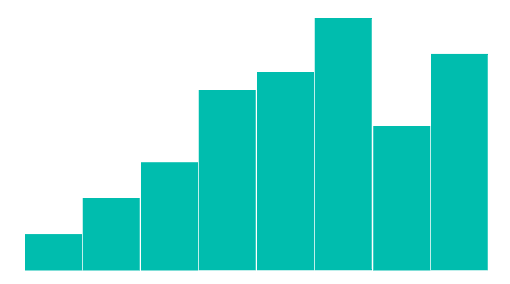
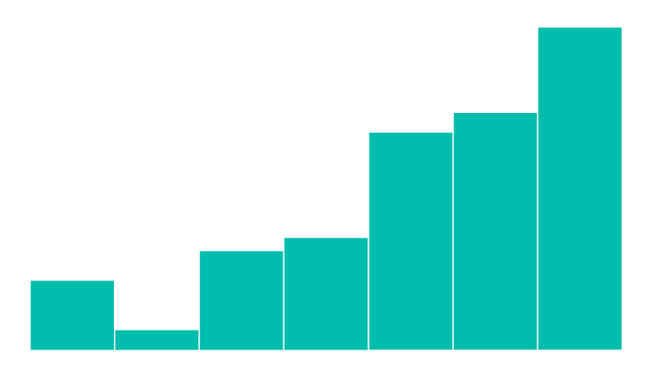
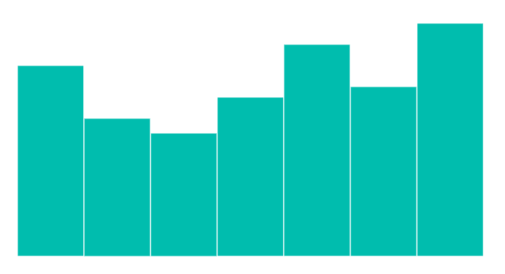
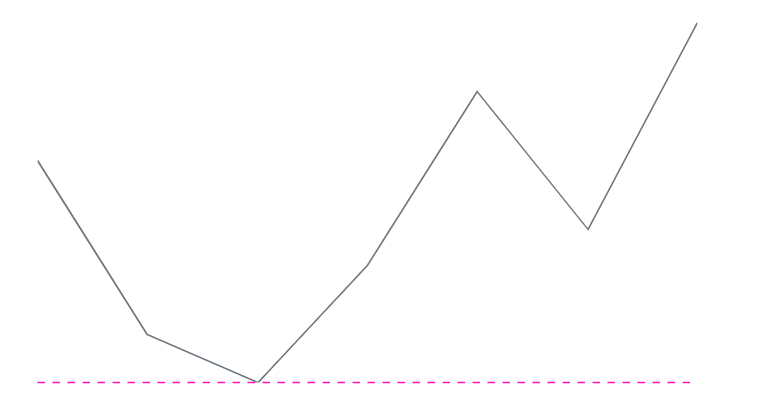

# Axis Customization in Blazor Sparkline Component

## Change the value type of the Sparkline Chart

The [ValueType](https://help.syncfusion.com/cr/blazor/Syncfusion.Blazor.Charts.SfSparkline-1.html#Syncfusion_Blazor_Charts_SfSparkline_1_ValueType) property is used to specify the Sparkline value type, which can be [Numeric](https://help.syncfusion.com/cr/blazor/Syncfusion.Blazor.Charts.SparklineValueType.html#Syncfusion_Blazor_Charts_SparklineValueType_Numeric), [Category](https://help.syncfusion.com/cr/blazor/Syncfusion.Blazor.Charts.SparklineValueType.html#Syncfusion_Blazor_Charts_SparklineValueType_Category), or [DateTime](https://help.syncfusion.com/cr/blazor/Syncfusion.Blazor.Charts.SparklineValueType.html#Syncfusion_Blazor_Charts_SparklineValueType_DateTime).

### Numeric

The numeric axis value can be provided by specifying the [ValueType](https://help.syncfusion.com/cr/blazor/Syncfusion.Blazor.Charts.SfSparkline-1.html#Syncfusion_Blazor_Charts_SfSparkline_1_ValueType) property to the [Numeric](https://help.syncfusion.com/cr/blazor/Syncfusion.Blazor.Charts.SparklineValueType.html#Syncfusion_Blazor_Charts_SparklineValueType_Numeric).

```cshtml
@using Syncfusion.Blazor.Charts

<SfSparkline DataSource="@ExpenditureReport" TValue="ExpenditureDetails" XName="Year" YName="Expense" Type="SparklineType.Column" ValueType="SparklineValueType.Numeric" Height="250px" Width="450px">
</SfSparkline>

@code {
    public class ExpenditureDetails
    {
        public int Year { get; set; }
        public int Expense { get; set; }
    };
    public List<ExpenditureDetails> ExpenditureReport = new List<ExpenditureDetails> {
        new ExpenditureDetails{ Year= 2010, Expense= 190 },
        new ExpenditureDetails{ Year= 2011, Expense= 165 },
        new ExpenditureDetails{ Year= 2012, Expense= 158 },
        new ExpenditureDetails{ Year= 2013, Expense= 175 },
        new ExpenditureDetails{ Year= 2014, Expense= 200 },
        new ExpenditureDetails{ Year= 2015, Expense= 180 },
        new ExpenditureDetails{ Year= 2016, Expense= 210 }
    };
}
```


### Category

The category axis value can be provided by specifying the [ValueType](https://help.syncfusion.com/cr/blazor/Syncfusion.Blazor.Charts.SfSparkline-1.html#Syncfusion_Blazor_Charts_SfSparkline_1_ValueType) property to the [Category](https://help.syncfusion.com/cr/blazor/Syncfusion.Blazor.Charts.SparklineValueType.html#Syncfusion_Blazor_Charts_SparklineValueType_Category).

```cshtml
@using Syncfusion.Blazor.Charts

<SfSparkline XName="EmployeeName"YName="WorkHours"TValue="WorkDetails"DataSource="@EmployeeWorkReport" Type="SparklineType.Column"ValueType="SparklineValueType.Category" Height="250px"Width="450px">
</SfSparkline>

@code {
    public class WorkDetails
    {
        public string EmployeeName { get; set; }
        public double WorkHours { get; set; }
    };
    public List<WorkDetails> EmployeeWorkReport = new List<WorkDetails> {
        new WorkDetails { EmployeeName = "Robert", WorkHours= 60 },
        new WorkDetails { EmployeeName = "Andrew", WorkHours= 65 },
        new WorkDetails { EmployeeName = "Suyama", WorkHours= 70 },
        new WorkDetails { EmployeeName = "Michael", WorkHours= 80 },
        new WorkDetails { EmployeeName = "Janet", WorkHours= 55 },
        new WorkDetails { EmployeeName = "Davolio", WorkHours= 90 },
        new WorkDetails { EmployeeName = "Fuller", WorkHours= 75 },
        new WorkDetails { EmployeeName = "Nancy", WorkHours= 85 }
    };
}
```



### DateTime

The DateTime axis value can be provided by specifying the [ValueType](https://help.syncfusion.com/cr/blazor/Syncfusion.Blazor.Charts.SfSparkline-1.html#Syncfusion_Blazor_Charts_SfSparkline_1_ValueType) property to the [DateTime](https://help.syncfusion.com/cr/blazor/Syncfusion.Blazor.Charts.SparklineValueType.html#Syncfusion_Blazor_Charts_SparklineValueType_DateTime).

```cshtml
@using Syncfusion.Blazor.Charts

<SfSparkline XName="Date" YName="Expense" TValue="ExpenditureDetail" DataSource="@ExpenditureReports" Type="SparklineType.Column" ValueType="SparklineValueType.DateTime" Height="250px" Width="450px">
</SfSparkline>

@code {
    public class ExpenditureDetail
    {
        public DateTime Date { get; set; }
        public double Expense { get; set; }
    }

    public List<ExpenditureDetail> ExpenditureReports = new List<ExpenditureDetail>
    {
        new ExpenditureDetail { Date = new DateTime(2005, 01, 01), Expense = 21 },
        new ExpenditureDetail { Date = new DateTime(2006, 01, 01), Expense = 24 },
        new ExpenditureDetail { Date = new DateTime(2007, 01, 01), Expense = 36 },
        new ExpenditureDetail { Date = new DateTime(2008, 01, 01), Expense = 38 },
        new ExpenditureDetail { Date = new DateTime(2009, 01, 01), Expense = 54 },
        new ExpenditureDetail { Date = new DateTime(2010, 01, 01), Expense = 57 },
        new ExpenditureDetail { Date = new DateTime(2011, 01, 01), Expense = 70 }
    };
}
```



## Change the min and the max values of axis

The min and the max values of the X-axis can be customized using the [MinX](https://help.syncfusion.com/cr/blazor/Syncfusion.Blazor.Charts.SparklineAxisSettings.html#Syncfusion_Blazor_Charts_SparklineAxisSettings_MinX) and the [MaxX](https://help.syncfusion.com/cr/blazor/Syncfusion.Blazor.Charts.SparklineAxisSettings.html#Syncfusion_Blazor_Charts_SparklineAxisSettings_MaxX) properties of the [SparklineAxisSettings](https://help.syncfusion.com/cr/blazor/Syncfusion.Blazor.Charts.SparklineAxisSettings.html), and the min and the max values of the Y-axis using the [MinY](https://help.syncfusion.com/cr/blazor/Syncfusion.Blazor.Charts.SparklineAxisSettings.html#Syncfusion_Blazor_Charts_SparklineAxisSettings_MinY) and the [MaxY](https://help.syncfusion.com/cr/blazor/Syncfusion.Blazor.Charts.SparklineAxisSettings.html#Syncfusion_Blazor_Charts_SparklineAxisSettings_MaxY) properties.

```cshtml
@using Syncfusion.Blazor.Charts

<SfSparkline DataSource="@ExpenditureReport" TValue="ExpenditureDetails" XName="Year" YName="Expense" Type="SparklineType.Column" ValueType="SparklineValueType.Numeric" Height="250px" Width="450px">
    <SparklineAxisSettings MinY="100" MaxY="220"></SparklineAxisSettings>
</SfSparkline>
```

> Refer to the [code block](#numeric) to know about the property value of the **ExpenditureReport**.



## Change value of axis

The horizontal axis line value can be customized by setting the [Value](https://help.syncfusion.com/cr/blazor/Syncfusion.Blazor.Charts.SparklineAxisSettings.html#Syncfusion_Blazor_Charts_SparklineAxisSettings_Value) in the [SparklineAxisSettings](https://help.syncfusion.com/cr/blazor/Syncfusion.Blazor.Charts.SparklineAxisSettings.html).

```cshtml
@using Syncfusion.Blazor.Charts

<SfSparkline DataSource="@ExpenditureReport" TValue="ExpenditureDetails" XName="Year" YName="Expense" Type="SparklineType.Column" ValueType="SparklineValueType.Numeric" Height="250px" Width="450px">
    <SparklineAxisSettings Value="170"></SparklineAxisSettings>
</SfSparkline>
```

> Refer to the [code block](#numeric) to know about the property value of the **ExpenditureReport**.


## Axis Line Customization

The axis line can be enabled by specifying the [Visible](https://help.syncfusion.com/cr/blazor/Syncfusion.Blazor.Charts.SparklineAxisLineSettings.html#Syncfusion_Blazor_Charts_SparklineAxisLineSettings_Visible) property to **true** in the [SparklineAxisLineSettings](https://help.syncfusion.com/cr/blazor/Syncfusion.Blazor.Charts.SparklineAxisLineSettings.html).

> The axis line is not applicable for the [WinLoss](https://help.syncfusion.com/cr/blazor/Syncfusion.Blazor.Charts.SparklineType.html#Syncfusion_Blazor_Charts_SparklineType_WinLoss) chart type.

The axis line can be customized using the following properties.

* [Color](https://help.syncfusion.com/cr/blazor/Syncfusion.Blazor.Charts.SparklineAxisLineSettings.html#Syncfusion_Blazor_Charts_SparklineAxisLineSettings_Color) - Specifies the color of the axis line.
* [Opacity](https://help.syncfusion.com/cr/blazor/Syncfusion.Blazor.Charts.SparklineAxisLineSettings.html#Syncfusion_Blazor_Charts_SparklineAxisLineSettings_Opacity) - Specifies the opacity for the [Color](https://help.syncfusion.com/cr/blazor/Syncfusion.Blazor.Charts.SparklineAxisLineSettings.html#Syncfusion_Blazor_Charts_SparklineAxisLineSettings_Color) of the axis line.
* [Width](https://help.syncfusion.com/cr/blazor/Syncfusion.Blazor.Charts.SparklineAxisLineSettings.html#Syncfusion_Blazor_Charts_SparklineAxisLineSettings_Width) - Specifies the width of the axis line.
* [DashArray](https://help.syncfusion.com/cr/blazor/Syncfusion.Blazor.Charts.SparklineAxisLineSettings.html#Syncfusion_Blazor_Charts_SparklineAxisLineSettings_DashArray) - Specifies the dash array of the axis line.

```cshtml
@using Syncfusion.Blazor.Charts

<SfSparkline DataSource="ExpenditureReport" TValue="ExpenditureDetails" XName="Year" YName="Expense" Type="SparklineType.Line" Height="250px" Width="450px">
    <SparklineAxisSettings>
        <SparklineAxisLineSettings Visible="true" Color="#ff14ae" DashArray="5" Opacity="1"></SparklineAxisLineSettings>
    </SparklineAxisSettings>
</SfSparkline>
```

> Refer to the [code block](#numeric) to know about the property value of **ExpenditureReport**.


