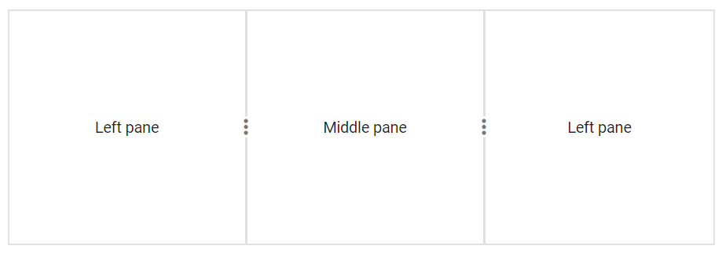

# Pane Content in Blazor Splitter Component

This section explains how to provide plain text content or HTML markup to splitter pane.

## HTML Markup

Splitter is a layout based container component. The pane contents can be rendered from existing HTML markups. Converting HTML markup as splitter pane is easy way to add the panes content dynamically.

```cshtml

@using Syncfusion.Blazor.Layouts

<SfSplitter Height="200px" Width="600px">
    <SplitterPanes>
        <SplitterPane Content="@Content1" Size="200px"></SplitterPane>
        <SplitterPane Content="@Content2" Size="200px"></SplitterPane>
        <SplitterPane Content="@Content3" Size="200px"></SplitterPane>
    </SplitterPanes>
</SfSplitter>

<style>
    .content {
        padding: 10px;
    }
</style>

@code {
    private string Content1 = "<div class='content'>" +
                    "<h3 class='h3'>Grid </h3>" +
                    "The ASP.NET DataGrid control, or DataTable is a feature-rich control used to display data in a tabular format.</div>";

    private string Content2 = "<div class='content'>" +
                    "<h3 class='h3'>Schedule </h3>" +
                    "The ASP.NET Scheduler, a.k.a. event calendar, facilitates almost all calendar features, thus allowing users to manage their time efficiently </div>";

    private string Content3 = "<div class='content'>" +
                    "<h3 class='h3'>Chart </h3>" +
                    "ASP.NET charts, a well-crafted easy-to-use charting package, is used to add beautiful charts in web and mobile applications </div>";
}

```


## Blazor UI components

Any Blazor components can be rendered along with their native and control events within splitter as pane content.

Refer [Listview within splitter](https://blazor.syncfusion.com/demos/splitter/details-view?theme=bootstrap4) example.

## Plain content

The plain text can be added as a pane contents using either inner HTML or `Content` API

```cshtml

@using Syncfusion.Blazor.Layouts

<SfSplitter Height="200px" Width="600px">
    <SplitterPanes>
        <SplitterPane Content="@Content1" Size="200px"></SplitterPane>
        <SplitterPane Content="@Content2" Size="200px"></SplitterPane>
        <SplitterPane Content="@Content3" Size="200px"></SplitterPane>
    </SplitterPanes>
</SfSplitter>

<style>
    .e-pane {
        text-align: center;
        align-items: center;
        display: grid;
    }
</style>

@code {
    private string Content1 = "Left pane";
    private string Content2 = "Middle pane";
    private string Content3 = "Left pane";
}

```



## Integrate other Blazor component inside the pane of the Splitter

Another Blazor component can be rendered inside the split pane using following solutions:

### Solution 1

The Blazor component can be directly rendered as content to split pane.

### Solution 2

The Blazor component can be integrated by rendering it as a separate page. (Each page is considered as a separate component in Blazor.)

The following example demonstrates the above two solutions. The first pane renders Grid as a direct child component, and the second pane renders Tab component from a separate page(SplitterContent.razor).

Index.razor

```cshtml

@using Syncfusion.Blazor.Grids
@using Syncfusion.Blazor.Layouts

<SfSplitter Height="220px" Width="100%" SeparatorSize="4">
    <SplitterPanes>
        <SplitterPane Size="50%" Min="300px">
            <SfGrid DataSource="@Orders">
                <GridColumns>
                    <GridColumn Field=@nameof(Order.OrderID) HeaderText="Order ID" TextAlign="TextAlign.Right" Width="120"></GridColumn>
                    <GridColumn Field=@nameof(Order.CustomerID) HeaderText="Customer Name" Width="150"></GridColumn>
                    <GridColumn Field=@nameof(Order.OrderDate) HeaderText=" Order Date" Format="yMd" Type="ColumnType.Date" TextAlign="TextAlign.Right" Width="130"></GridColumn>
                </GridColumns>
            </SfGrid>
        </SplitterPane>
        <SplitterPane Size="50%" Min="300px">
            <BlazorServer.Pages.Splitter.UGSamples.PaneContent.SplitterContent></BlazorServer.Pages.Splitter.UGSamples.PaneContent.SplitterContent>
        </SplitterPane>
    </SplitterPanes>
</SfSplitter>

@code{
    private List<Order> Orders { get; set; }

    protected override void OnInitialized()
    {
        Orders = Enumerable.Range(1, 10).Select(x => new Order()
        {
            OrderID = 1000 + x,
            CustomerID = (new string[] { "ALFKI", "ANANTR", "ANTON", "BLONP", "BOLID" })[new Random().Next(5)],
            Freight = 2.1 * x,
            OrderDate = DateTime.Now.AddDays(-x),
        }).ToList();
    }

    public class Order
    {
        public int? OrderID { get; set; }
        public string CustomerID { get; set; }
        public DateTime? OrderDate { get; set; }
        public double? Freight { get; set; }
    }
}

```

Other SplitterContent.razor page.

```cshtml

@using Syncfusion.Blazor.Navigations

<div>
    <SfTab ID="tab">
        <TabItems>
            <TabItem>
                <ContentTemplate>
                    <TabHeader Text="Twitter"></TabHeader>
                </ContentTemplate>
                <ContentTemplate>
                    <p>Twitter is an online social networking service that enables users to send and read short 140-character messages called tweets. Registered users can read and post tweets, but those who are unregistered can only read them. Users access Twitter through the website interface, SMS or mobile device app Twitter Inc. is based in SanFrancisco and has more than 25 offices around the world. Twitter was created in March 2006 by Jack Dorsey, Evan Williams, Biz Stone, and Noah Glass and launched in July 2006.  The service rapidly gained worldwide popularity, with more than 100 million users posting 340 million tweets a day in 2012.  The service also handled 1.6 billionsearch queries per day.</p>
                </ContentTemplate>
            </TabItem>
            <TabItem>
                <ContentTemplate>
                    <TabHeader Text="Facebook"></TabHeader>
                </ContentTemplate>
                <ContentTemplate>
                    <p>
                        Facebook is an online social networking service headquartered in Menlo Park, California. Its website was launched on February 4, 2004, by Mark Zuckerberg with his Harvard College roommates and fellow students EduardoSaverin, Andrew McCollum, Dustin Moskovitz and Chris Hughes.  The founders had initially limited the website membership to Harvard students, but later expanded it to colleges in the Boston area, the Ivy League, and Stanford University. It gradually added support for students at various other universities and later to high-school students.
                    </p>
                </ContentTemplate>
            </TabItem>
            <TabItem>
                <ContentTemplate>
                    <TabHeader Text="Whatsapp"></TabHeader>
                </ContentTemplate>
                <ContentTemplate>
                    <p>WhatsApp Messenger is a proprietary cross-platform instant messaging client for smartphones that operates under a subscription business model.  It uses the Internet to send text messages, images, video, user location andaudio media messages to other users using standard cellular mobile numbers.  As of February 2016, WhatsApp had a userbase of up to one billion,[10] making it the most globally popular messaging application WhatsApp Inc., based inMountain View, California, was acquired by Facebook Inc. on February 19, 2014, for approximately US $19.3 billion.</p>
                </ContentTemplate>
            </TabItem>
        </TabItems>
    </SfTab>
</div>

<style>
    .e-tab .e-content .e-item {
        padding: 10px;
    }
</style>

```

