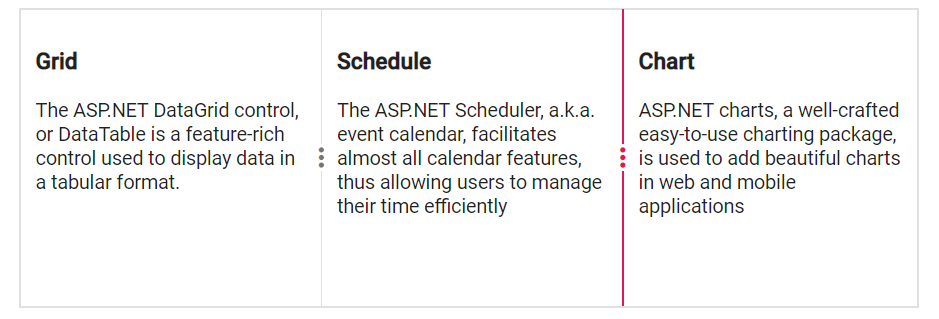
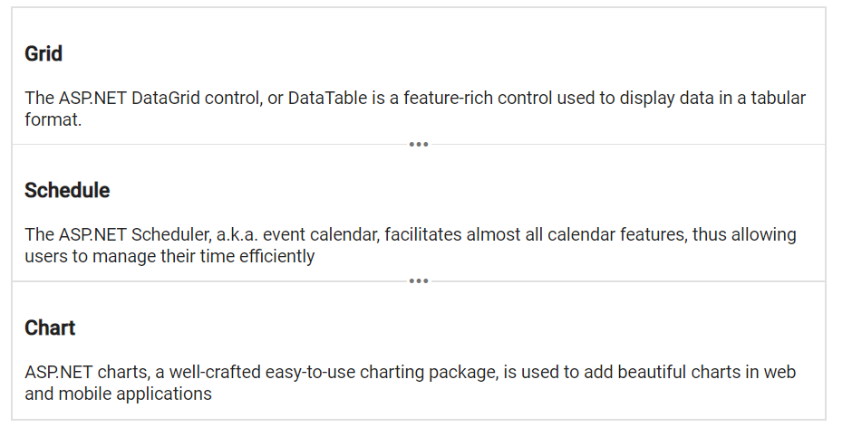
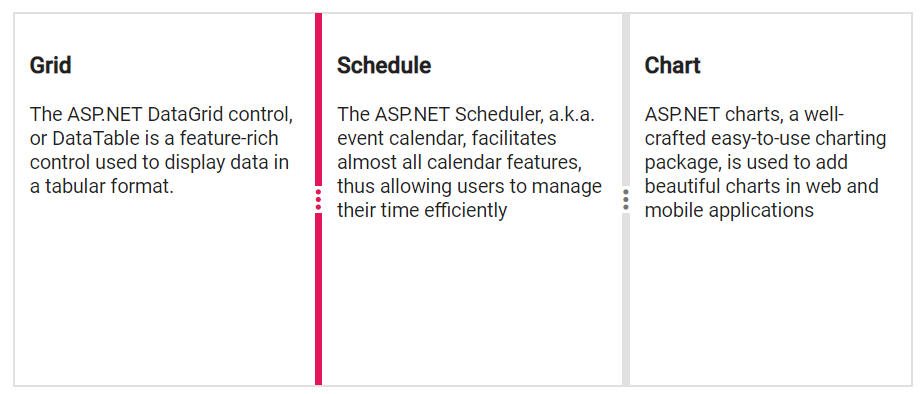
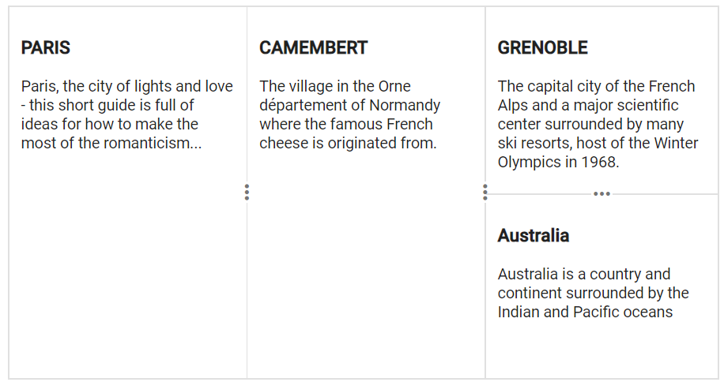

# Split Panes in Blazor Splitter Component

This section explain split-panes behaviours.

## Horizontal layout

By default, splitter will be rendered in horizontal orientation. Splitter container will be splitted as panes in horizontal flow direction with vertical separator.

```cshtml

@using Syncfusion.Blazor.Layouts

<SfSplitter Height="200px" Width="600px">
    <SplitterPanes>
        <SplitterPane Size="200px">
            <ContentTemplate>
                <div>
                    <div class="content">
                        <h3 class="h3">Grid </h3>
                        The ASP.NET DataGrid control, or DataTable is a feature-rich control used to display data in a tabular format.
                    </div>
                </div>
            </ContentTemplate>
        </SplitterPane>
        <SplitterPane Size="200px">
            <ContentTemplate>
                <div>
                    <div class="content">
                        <h3 class="h3">Schedule </h3>
                        The ASP.NET Scheduler, a.k.a. event calendar, facilitates almost all calendar features, thus allowing users to manage their time efficiently
                    </div>
                </div>
            </ContentTemplate>
        </SplitterPane>
        <SplitterPane Size="200px">
            <ContentTemplate>
                <div>
                    <div class="content">
                        <h3 class="h3">Chart </h3>
                        ASP.NET charts, a well-crafted easy-to-use charting package, is used to add beautiful charts in web and mobile applications
                    </div>
                </div>
            </ContentTemplate>
        </SplitterPane>
    </SplitterPanes>
</SfSplitter>

<style>
    .content {
        padding: 10px;
    }
</style>

```

The output will be as follows.



## Vertical layout

By setting value to `Orientation` API as `Vertical`, splitter will be rendered in vertical orientation. Splitter container will be splitted as panes in vertical flow direction with horizontal separator.

```cshtml

@using Syncfusion.Blazor.Layouts

<SfSplitter Height="305px" Width="600px" Orientation="Orientation.Vertical">
    <SplitterPanes>
        <SplitterPane Size="100px">
            <ContentTemplate>
                <div>
                    <div class="content">
                        <h3 class="h3">Grid </h3>
                        The ASP.NET DataGrid control, or DataTable is a feature-rich control used to display data in a tabular format.
                    </div>
                </div>
            </ContentTemplate>
        </SplitterPane>
        <SplitterPane Size="100px">
            <ContentTemplate>
                <div>
                    <div class="content">
                        <h3 class="h3">Schedule </h3>
                        The ASP.NET Scheduler, a.k.a. event calendar, facilitates almost all calendar features, thus allowing users to manage their time efficiently
                    </div>
                </div>
            </ContentTemplate>
        </SplitterPane>
        <SplitterPane Size="100px">
            <ContentTemplate>
                <div>
                    <div class="content">
                        <h3 class="h3">Chart </h3>
                        ASP.NET charts, a well-crafted easy-to-use charting package, is used to add beautiful charts in web and mobile applications
                    </div>
                </div>
            </ContentTemplate>
        </SplitterPane>
    </SplitterPanes>
</SfSplitter>

<style>
    .content {
        padding: 9px;
    }
</style>

```

The output will be as follows.



> You can also render multiple panes in splitter with both `Horizontal/Vertical` orientations.

## Separator

By default, pane separator will be render with `1px` width/height. You can customize the separator size by using `SeparatorSize` API.

> For horizontal orientation, it will be considered as separator width. For vertical orientation, it will be considered as separator height.

```cshtml

@using Syncfusion.Blazor.Layouts

<SfSplitter Height="250px" Width="600px" SeparatorSize="5">
    <SplitterPanes>
        <SplitterPane Size="200px">
            <ContentTemplate>
                <div>
                    <div class="content">
                        <h3 class="h3">Grid </h3>
                        The ASP.NET DataGrid control, or DataTable is a feature-rich control used to display data in a tabular format.
                    </div>
                </div>
            </ContentTemplate>
        </SplitterPane>
        <SplitterPane Size="200px">
            <ContentTemplate>
                <div>
                    <div class="content">
                        <h3 class="h3">Schedule </h3>
                        The ASP.NET Scheduler, a.k.a. event calendar, facilitates almost all calendar features, thus allowing users to manage their time efficiently
                    </div>
                </div>
            </ContentTemplate>
        </SplitterPane>
        <SplitterPane Size="200px">
            <ContentTemplate>
                <div>
                    <div class="content">
                        <h3 class="h3">Chart </h3>
                        ASP.NET charts, a well-crafted easy-to-use charting package, is used to add beautiful charts in web and mobile applications
                    </div>
                </div>
            </ContentTemplate>
        </SplitterPane>
    </SplitterPanes>
</SfSplitter>

<style>
    .content {
        padding: 10px;
    }
</style>

```

The output will be as follows.



## Nested Splitter

Splitter provides support to render the nested pane to achieve the complex layouts. You can use the same `SplitterPane` tag for splitter pane and nested splitter.

> Also you can render the nested splitter using direct child of the splitter pane. For this, nested splitter should have `100%` width and height to match with the parent pane dimensions.

```cshtml

@using Syncfusion.Blazor.Layouts

<SfSplitter Height="316px" Width="600px">
    <SplitterPanes>
        <SplitterPane Size="200px">
            <ContentTemplate>
                <div>
                    <div class="content">
                        <h3 class="h3">PARIS </h3>
                        Paris, the city of lights and love - this short guide is full of ideas for how to make the most of the romanticism...
                    </div>
                </div>
            </ContentTemplate>
        </SplitterPane>
        <SplitterPane Size="200px">
            <ContentTemplate>
                <div>
                    <div class="content">
                        <h3 class="h3">CAMEMBERT </h3>
                        The village in the Orne département of Normandy where the famous French cheese is originated from.
                    </div>
                </div>
            </ContentTemplate>
        </SplitterPane>
        <SplitterPane Size="200px">
            <div>
                <SfSplitter ID="innerSplitter" Orientation="Orientation.Vertical">
                    <SplitterPanes>
                        <SplitterPane Size="150px" Min="20%">
                            <ContentTemplate>
                                <div>
                                    <div class="content">
                                        <h3 class="h3">GRENOBLE </h3>
                                        The capital city of the French Alps and a major scientific center surrounded by many ski resorts, host of the Winter Olympics in 1968.
                                    </div>
                                </div>
                            </ContentTemplate>
                        </SplitterPane>
                        <SplitterPane Size="100px" Min="20%">
                            <ContentTemplate>
                                <div>
                                    <div class="content">
                                        <h3 class="h3">Australia </h3>
                                        Australia is a country and continent surrounded by the Indian and Pacific oceans
                                    </div>
                                </div>
                            </ContentTemplate>
                        </SplitterPane>
                    </SplitterPanes>
                </SfSplitter>
            </div>
        </SplitterPane>
    </SplitterPanes>
</SfSplitter>

<style>
    .content {
        padding: 10px;
    }
    #innerSplitter {
        border: none;
    }
</style>

```

The output will be as follows.



## Add or remove pane

You can add the panes programmatic but it will makes you complex. For this, you can use the `AddPane/RemovePane` methods to add and remove the panes dynamically in the splitter.

### Add pane

You can add the panes dynamically in the splitter by passing `PaneProperties` along with index to the `AddPane` method

```cshtml

@using Syncfusion.Blazor.Layouts
@using Syncfusion.Blazor.Buttons

<SfSplitter @ref="SplitterObj" Height="200px" Width="600px">
    <SplitterPanes>
        <SplitterPane Size="190px">
            <ContentTemplate>
                <div>
                    <div class='content'>
                        Pane 1
                    </div>
                </div>
            </ContentTemplate>
        </SplitterPane>
        <SplitterPane Size="190px">
            <ContentTemplate>
                <div>
                    <div class='content'>
                        Pane 2
                    </div>
                </div>
            </ContentTemplate>
        </SplitterPane>
    </SplitterPanes>
</SfSplitter>

<SfButton Content="Add Pane" @onclick="@Add"></SfButton>

<style>
    .content {
      padding: 9px;
    }
    #defaultBtn {
      margin-top: 15px;
    }
</style>

@code  {
    SfSplitter SplitterObj;

    private SplitterPane AddingPane = new SplitterPane() {
        Size = "190px",
        Content = "New Pane",
        Min = "30px",
        Max = "250px"
    };

    private async Task Add()
    {
       await this.SplitterObj.AddPaneAsync(AddingPane, 1);
    }
}

```

### Remove pane

You can remove the split panes dynamically by passing the pane index to `RemovePane` method.

```cshtml

@using Syncfusion.Blazor.Layouts
@using Syncfusion.Blazor.Buttons

<SfSplitter @ref="SplitterObj" Height="200px" Width="600px">
    <SplitterPanes>
        <SplitterPane Size="200px">
            <ContentTemplate>
                <div>
                    <div class='content'>
                        Pane 1
                    </div>
                </div>
            </ContentTemplate>
        </SplitterPane>
        <SplitterPane Size="200px">
            <ContentTemplate>
                <div>
                    <div class='content'>
                        Pane 2
                    </div>
                </div>
            </ContentTemplate>
        </SplitterPane>
        <SplitterPane Size="200px">
            <ContentTemplate>
                <div>
                    <div class='content'>
                        Pane 3
                    </div>
                </div>
            </ContentTemplate>
        </SplitterPane>
    </SplitterPanes>
</SfSplitter>

<SfButton Content="Remove Pane" @onclick="@Remove"></SfButton>

<style>
    .content {
      padding: 9px;
    }
    #defaultBtn {
      margin-top: 15px;
    }
</style>

@code  {
    SfSplitter SplitterObj;

    private async Task Remove()
    {
       await this.SplitterObj.RemovePaneAsync(1);
    }
}

```

## See Also

* [Resizable split panes](./resizing/)
* [Collapsible panes](./expand-and-collapse/)
* [Define size to a panes](./pane-sizing/)
* [Specify content to a panes](./pane-content/)