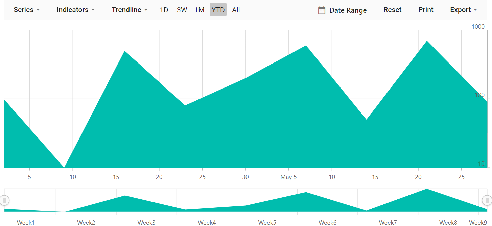

<!-- markdownlint-disable MD036 -->

# Axis Types in Blazor Stock Chart Component

## DateTime Axis

Date time axis uses date time scale and displays the date time values as axis labels in the specified format and set the [ValueType](https://help.syncfusion.com/cr/blazor/Syncfusion.Blazor.Charts.StockChartAxis.html#Syncfusion_Blazor_Charts_StockChartAxis_ValueType) of axis to DateTime.

```cshtml
@using Syncfusion.Blazor.Charts

<SfStockChart>
    <StockChartPrimaryXAxis ValueType="@Syncfusion.Blazor.Charts.ValueType.DateTime">
    </StockChartPrimaryXAxis>

    <StockChartSeriesCollection>
        <StockChartSeries DataSource="@StockDetails" Type="ChartSeriesType.Column" XName="Date" YName="Y">
        </StockChartSeries>
    </StockChartSeriesCollection>
</SfStockChart>

@code{
    public class ChartData
    {
        public DateTime Date;
        public Double Y;
    }
    public List<ChartData> StockDetails = new List<ChartData>
{
        new ChartData { Date = new DateTime(2012, 04, 02), Y= 100},
        new ChartData { Date = new DateTime(2012, 04, 09), Y= 10},
        new ChartData { Date = new DateTime(2012, 04, 16), Y= 500},
        new ChartData { Date = new DateTime(2012, 04, 23), Y= 80},
        new ChartData { Date = new DateTime(2012, 04, 30), Y= 200},
        new ChartData { Date = new DateTime(2012, 05, 07), Y= 600},
        new ChartData { Date = new DateTime(2012, 05, 14), Y= 50},
        new ChartData { Date = new DateTime(2012, 05, 21), Y= 700},
        new ChartData { Date = new DateTime(2012, 05, 28), Y= 90}
   };
}
```


## Logarithmic Axis

<!-- markdownlint-disable MD033 -->

Logarithmic axis uses logarithmic scale and it is very useful in visualizing data, when it has numerical values in both lower order of magnitude (eg: 10<sup>-6</sup>) and higher order of magnitude (eg: 10<sup>6</sup>) and set the [ValueType](https://help.syncfusion.com/cr/blazor/Syncfusion.Blazor.Charts.StockChartAxis.html#Syncfusion_Blazor_Charts_StockChartAxis_ValueType) of axis to `Logarithmic`.

```cshtml
@using Syncfusion.Blazor.Charts

<SfStockChart>
    <StockChartPrimaryXAxis ValueType="@Syncfusion.Blazor.Charts.ValueType.DateTime">
    </StockChartPrimaryXAxis>
    <StockChartPrimaryYAxis ValueType="@Syncfusion.Blazor.Charts.ValueType.Logarithmic">
    </StockChartPrimaryYAxis>
    <StockChartSeriesCollection>
        <StockChartSeries DataSource="@StockDetails" Type="ChartSeriesType.Area" XName="Date" YName="Y">
        </StockChartSeries>
    </StockChartSeriesCollection>
</SfStockChart>

@code{
    public class ChartData
    {
        public DateTime Date;
        public Double Y;
    }
    public List<ChartData> StockDetails = new List<ChartData>
{
        new ChartData { Date = new DateTime(2012, 04, 02), Y= 100},
        new ChartData { Date = new DateTime(2012, 04, 09), Y= 10},
        new ChartData { Date = new DateTime(2012, 04, 16), Y= 500},
        new ChartData { Date = new DateTime(2012, 04, 23), Y= 80},
        new ChartData { Date = new DateTime(2012, 04, 30), Y= 200},
        new ChartData { Date = new DateTime(2012, 05, 07), Y= 600},
        new ChartData { Date = new DateTime(2012, 05, 14), Y= 50},
        new ChartData { Date = new DateTime(2012, 05, 21), Y= 700},
        new ChartData { Date = new DateTime(2012, 05, 28), Y= 90}
   };
}
```



## See Also

* [Axis Customization](./axis-customization/)