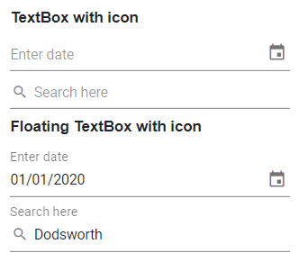
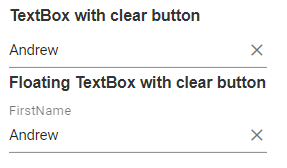

# Groups in Blazor TextBox Component

The following section explains you the steps required to create TextBox with `icon` and `floating label`.

**TextBox:**

* Create a parent div element with the class `e-input-group`.

* Place input element with the class `e-input` inside the parent div element.

```html
<div class="e-input-group">
    <input class="e-input" name='input' type="text" Placeholder="Enter Date"/>
</div>
```

**Floating label:**

* Add the `e-float-input` class to the parent div element.

* Remove the e-input class and add `required` attribute to the input element.

* Place the span element with class `e-float-line` after the input element.

* Place the label element with class `e-float-text` after the above created span element. When you focus or filled with value in the TextBox, the label floats above the TextBox.

> Creating the Floating label TextBox, you have to set the `required` attribute to the Input element to achieve the floating label functionality which is used for validating the value existence in TextBox.

```html
<div class="e-float-input e-input-group">
    <input type="text" required/>
    <span class="e-float-line"></span>
    <label class="e-float-text">Enter Name </label>
</div>
```

Refer to the following sections to add the icons to the TextBox.

## With icon and floating label

Create an icon element as a span with the class `e-input-group-icon`, and the users can place the icon in either side of TextBox by adding the created icon element before/after the input.

For the floating label enabled TextBox add the icon element as first or last element inside the TextBox wrapper, and based on the element position, it will act as prefix or suffix icon.

```cshtml
@using Syncfusion.Blazor.Inputs

<label> Input with icons </label>
<div class="@(TextClass)">
    <div class="e-input-in-wrap">
        <input class="e-input" type="text" Placeholder="Enter Date" @onfocus="@Focus" @onblur="@Blur" />
        <span class="e-input-group-icon e-input-date"></span>
    </div>
</div>

<label> Floating label with icons </label>
<div class="@(FloatTextClass) e-input-group e-float-icon-left">
    <div class="e-input-in-wrap">
        <input required type="text" @onfocus="@FlaotFocus" @onblur="@FloatBlur" />
        <span class="e-float-line"></span>
        <label class="e-float-text"> Enter Date </label>
        <span class="e-input-group-icon e-input-date"></span>
    </div>
</div>

<style>
.e-input-group-icon:before {
  font-family: e-icons;
}

.e-input-group .e-input-group-icon.e-input-date {
  font-size:16px;
}

.e-input-group-icon.e-input-date:before {
  content: "";
}
</style>

@code {
    private string FocusClass { get; set; } = " e-input-focus";
    private string TextClass { get; set; } = "e-input-group";
    private string FloatTextClass { get; set; } = "e-float-input";
    private void Focus(FocusEventArgs args)
    {
        this.TextClass = this.TextClass + FocusClass;
        StateHasChanged();
    }

    private void FlaotFocus(FocusEventArgs args)
    {
        this.FloatTextClass = this.FloatTextClass + FocusClass;
        StateHasChanged();
    }

    private void Blur(FocusEventArgs args)
    {
       if (this.TextClass.Contains(FocusClass)) {
            this.TextClass = this.TextClass.Replace(FocusClass, "");
        }
        StateHasChanged();
    }

    private void FloatBlur(FocusEventArgs args)
    {
       if (this.FloatTextClass.Contains(FocusClass)) {
            this.FloatTextClass = this.FloatTextClass.Replace(FocusClass, "");
        }
        StateHasChanged();
    }
}
```

The output will be as follows.



## With clear button and floating label

The clear button is added to the input for clearing the value given in the TextBox. It is shown only when the input field has a value, otherwise not shown.

You can add the clear button to the TextBox by enabling the `ShowClearButton` API.

```cshtml
@using Syncfusion.Blazor.Inputs

<label> TextBox with clear button </label>
<SfTextBox Placeholder="FirstName" ShowClearButton=true></SfTextBox>
<label> Floating TextBox with clear button </label>
<SfTextBox Placeholder="FirstName" ShowClearButton=true FloatLabelType="@FloatLabelType.Auto"></SfTextBox>
```

The output will be as follows.



## Multi-line input with floating label

The following example demonstrates how to set [Multiline](https://help.syncfusion.com/cr/blazor/Syncfusion.Blazor.Inputs.SfTextBox.html#Syncfusion_Blazor_Inputs_SfTextBox_Multiline) in the `TextBox` component with float label structure.

```cshtml
@using Syncfusion.Blazor.Inputs

<SfTextBox Placeholder="Enter text" Multiline=true FloatLabelType="@FloatLabelType.Auto"></SfTextBox>
```

The output will be as follows.

