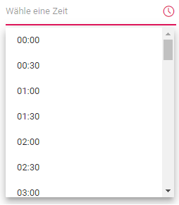
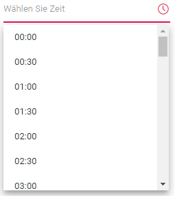
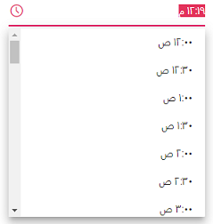

# Globalization in Blazor TimePicker Component

Globalization is the combination of adapting the control to various languages by means of parsing and formatting the date or number `Internationalization` and also by adding cultural specific customizations and translating the text `localization`.

## Blazor server side

Add `UseRequestLocalization` middle-ware in Configure method in **Startup.cs** file to get browser Culture Info.

Refer the following code to add configuration in Startup.cs file

```csharp
using Microsoft.AspNetCore.Builder;
using Microsoft.AspNetCore.Localization;

namespace BlazorApplication
{
    public class Startup
    {
        ....
        ....

        public void Configure(IApplicationBuilder app, IWebHostEnvironment env)
        {
            app.UseRequestLocalization();
            ....
            ....
        }
    }
}
```

The **Localization** library allows to localize default text content. The TimePicker component has static text that can be changed to other cultures (Arabic, Deutsch, French, etc.).

In the following examples, demonstrate how to enable **Localization** for TimePicker in server side Blazor samples. Here, Resource file is used to translate the static text.

The Resource file is an XML file which contains the strings(key and value pairs) that has to be translated into different language. Refer Localization [link](https://blazor.syncfusion.com/documentation/common/localization/) to know more about how to configure and use localization in the ASP.NET Core application framework.

* Open the **Startup.cs** file and add the below configuration in the **ConfigureServices** function as follows.

```csharp
using Syncfusion.Blazor;
using System.Globalization;
using Microsoft.AspNetCore.Localization;

namespace BlazorApplication
{
    public class Startup
    {
        ....
        ....
        public void ConfigureServices(IServiceCollection services)
        {
            ....
            ....
            services.AddSyncfusionBlazor();
            services.AddLocalization(options => options.ResourcesPath = "Resources");
            services.Configure<RequestLocalizationOptions>(options =>
            {
                // define the list of cultures your app will support
                var supportedCultures = new List<CultureInfo>()
                {
                    new CultureInfo("de")
                };
                // set the default culture
                options.DefaultRequestCulture = new RequestCulture("de");
                options.SupportedCultures = supportedCultures;
                options.SupportedUICultures = supportedCultures;
                options.RequestCultureProviders = new List<IRequestCultureProvider>() {
                 new QueryStringRequestCultureProvider() // Here, you can also use other localization provider
                };
            });
            services.AddSingleton(typeof(ISyncfusionStringLocalizer), typeof(SampleLocalizer));
        }
    }
}
```

* Then, write a **class** by inheriting **ISyncfusionStringLocalizer** interface and override the Manager property to get the resource file details from the application end.

```csharp
using Syncfusion.Blazor;

namespace blazorCalendars
{
     public class SampleLocalizer : ISyncfusionStringLocalizer
    {

        public string Get(string key)
        {
            return this.Manager.GetString(key);
        }

        public System.Resources.ResourceManager Manager
        {
            get
            {
                return blazorCalendars.Resources.SyncfusionBlazorLocale.ResourceManager;
            }
        }
    }
}
```

* Add **.resx** file to Resource folder and enter the key value (Locale Keywords) in the **Name** column and the translated string in the Value column as follows.

| **Name** | **Value (in Deutsch culture)** |
| --- | --- |
| TimePicker_Placeholder | Wähle eine Zeit |

* Finally, specify the culture for TimePicker using `locale` property.

```cshtml
@using Syncfusion.Blazor.Calendars

<SfTimePicker TValue="DateTime?" Locale="de"></SfTimePicker>
```

## Blazor WebAssembly

By default, the TimePicker week and month names are specific to the `American English` culture. It utilizes the `Blazor Internationalization` package to parse and format the date object based on the culture by using the official [UNICODE CLDR](http://cldr.unicode.org/) JSON data.

The following steps explain how to render the TimePicker in German culture (‘de-DE’) in Blazor Web Assembly application.

* Open the **program.cs** file and add the below configuration in the **Builder ConfigureServices** function as follows.

```csharp
using Syncfusion.Blazor;
using Microsoft.AspNetCore.Builder;

namespace WebAssemblyLocale
{
    public class Program
    {
        public static async Task Main(string[] args)
        {
            ....
            ....
            builder.Services.Configure<RequestLocalizationOptions>(options =>
            {
                // Define the list of cultures your app will support
                var supportedCultures = new List<System.Globalization.CultureInfo>()
                {
                    new System.Globalization.CultureInfo("en-US"),
                    new System.Globalization.CultureInfo("de"),
                };

                // Set the default culture
                options.DefaultRequestCulture = new Microsoft.AspNetCore.Localization.RequestCulture("de");

                options.SupportedCultures = supportedCultures;
                options.SupportedUICultures = supportedCultures;
                options.RequestCultureProviders = new List<Microsoft.AspNetCore.Localization.IRequestCultureProvider>() {
                 new Microsoft.AspNetCore.Localization.QueryStringRequestCultureProvider()
                };
            });
            ....
            ....
        }
    }
}
```

* Download the required locale packages to render the Blazor TimePicker component with specified locale.

* To download the locale definition of Blazor components, use this [link](https://github.com/syncfusion/ej2-locale).

* After downloading the `blazor-locale` package, copy the `blazor-locale` folder with required local definition file into `wwwroot` folder.

* By default, the `blazor-locale` package contains the localized text for static text present in components like button text, placeholder, tooltip, and more.

* Set the culture by using the `SetCulture` method.

```cshtml
@using Syncfusion.Blazor.Calendars
@inject HttpClient Http;

<SfTimePicker TValue="DateTime?" Locale="de"></SfTimePicker>

@code {
    [Inject]
    protected IJSRuntime JsRuntime { get; set; }
    protected override async Task OnInitializedAsync()
    {
        this.JsRuntime.Sf().LoadLocaleData(await Http.GetJsonAsync<object>("blazor-locale/src/de.json")).SetCulture("de");
    }
}
```



## Customize the localized text

* The localized text of particular component can be changed by editing the `wwwroot/blazor-locale/src/{{locale name}}.json` file.

* In the following code, modified the localized text of `placeholder` in `de` culture.

[`wwwroot/blazor-locale/src/de.json`]

```csharp
{
  "de": {
    "timepicker": {
      "placeholder": "Wählen Sie Zeit"
    }
  }
}
```



## Right-To-Left

The TimePicker supports RTL (right-to-left) functionality for languages like Arabic and Hebrew to display the text in the right-to-left direction. Use the [EnableRtl](https://help.syncfusion.com/cr/blazor/Syncfusion.Blazor.Calendars.SfTimePicker-1.html#Syncfusion_Blazor_Calendars_SfTimePicker_1_EnableRtl) property to set the RTL direction.

The following code example initializes the TimePicker component in `Arabic` culture.

```cshtml
@using Syncfusion.Blazor.Calendars
@inject HttpClient Http;

<SfTimePicker TValue="DateTime?" Locale="ar" EnableRtl=true></SfTimePicker>

@code {
    [Inject]
    protected IJSRuntime JsRuntime { get; set; }
    protected override async Task OnInitializedAsync()
    {
        this.JsRuntime.Sf().LoadLocaleData(await Http.GetJsonAsync<object>("blazor-locale/src/ar.json")).SetCulture("ar");
    }
}
```


