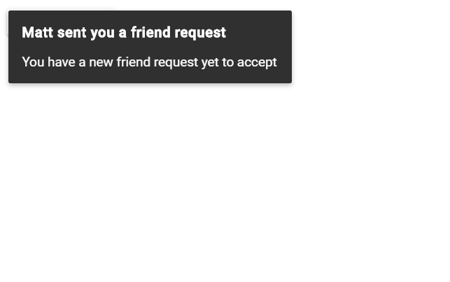

# Accessibility in Blazor Toast Component

The toast component has been designed with [WAI-ARIA](https://www.w3.org/TR/wai-aria-practices/) specifications in mind by applying the prompt WAI-ARIA roles, states, and properties with the keyboard support. It helps users who use assistive WAI-ARIA accessibility support, which is achieved using attributes.

It provides information about the elements in a document for assistive technology.

The toast component implements the keyboard navigation support by using the following [WAI-ARIA practices](https://www.w3.org/TR/wai-aria-practices/) and is tested in major screen readers.

## ARIA attributes

<!-- markdownlint-disable MD033 -->

| Class | Description |
| -------- | -------- |
| role |  <b>alert:</b> Identifies the element as a container when alert content will be added or updated. |

```cshtml

@using Syncfusion.Blazor.Notifications

<SfToast @ref="ToastObj" Title="Matt sent you a friend request" Content="@ToastContent" Timeout="0">
    <ToastEvents Created="@OnCreate"></ToastEvents>
</SfToast>

@code {
    SfToast ToastObj;

    private string ToastContent { get; set; } = "You have a new friend request yet to accept";

    private async Task OnCreate()
    {
       await this.ToastObj.ShowAsync();
    }
}

```

