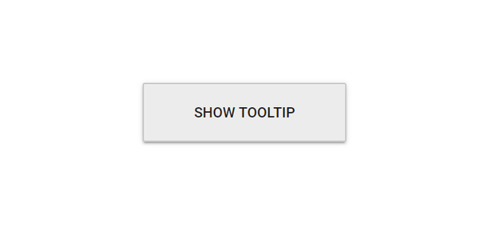
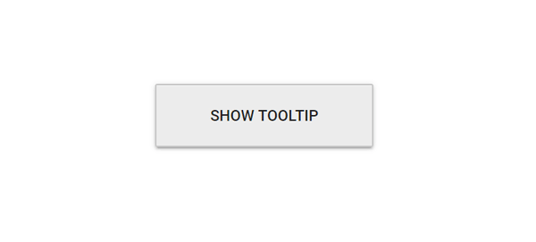

# Open Mode in Blazor Tooltip Component

The mode on which the Tooltip is to be opened on a page, i.e., on hovering, focusing, or clicking on the target elements can be decided.

> On mobile devices, Tooltips appear when you tap and hold the element, even if the `OpensOn` option is assigned with `Hover`.
> Tooltips are also displayed as long as the element is continued to tap and hold. On lift, it disappears in the next 1.5 seconds.
> If there is another action before that time ends, then the Tooltip disappears.

The `OpensOn` property can take either a single or a combination of multiple values, separated by space from the following options. The table below explains how the Tooltip opens on both desktop and mobile based on the value(s) assigned to the `OpensOn` property. By default, it takes `Auto` value.

| Values | Desktop | Mobile |
| ------------- | ------------- | ------------- |
| `Auto` | Tooltip appears when you hover over the target or when the target element receives the focus. | Tooltip opens on tap and hold of the target element. |
| `Hover` | Tooltip appears when you hover over the target. | Tooltip opens on tap and hold of the target element. |
| `Click` | Tooltip appears when you click a target element. | Tooltip appears when you single tap the target element. |
| `Focus` | Tooltip appears when you focus (say through tab key) on a target element. | Tooltip appears with a single tap on the target element. |
| `Custom` | Tooltip is not triggered by any default action. So, you have to bind your own events and use either `open` or `close` public methods. | Same as Desktop. |

To open the Tooltip for multiple actions, say while hovering over or clicking on a target element, the `OpensOn` property can be assigned with multiple values, separated by space as `Hover Click`.

> `Auto` value cannot be used with any combination for multiple values.

```cshtml
@using Syncfusion.Blazor.Popups

<SfTooltip ID="tooltiphover" Target=".blocks" Content="@Content" OpensOn="Click">
    <div class="blocks"><span>Click Me !</span></div>
</SfTooltip>
<SfTooltip ID="tooltipclick" Target=".blocks" Content="@Content" OpensOn="Hover">
    <div class="blocks"><span>Hover Me !(Default)</span></div>
</SfTooltip>
<SfTooltip ID="tooltipfocus" Target=".e-info" Content="@Content" OpensOn="Focus">
    <div class="blocks"><span><input class="e-info" type="text" placeholder="Focus and blur" /></span></div>
</SfTooltip>

@code
{
    string Content="Tooltip content";
}

<style>
    #tooltiphover {
        width: 200px;
        box-sizing: border-box;
        display: inline-block;
    }

    #tooltipclick {
        width: 200px;
        box-sizing: border-box;
        display: inline-block;
    }

    #tooltipfocus {
        width: 200px;
        box-sizing: border-box;
        display: inline-block;
        line-height: 17px;
    }

    #tooltipfocus .blocks span {
        line-height: 17px;
    }

    #tooltipcustom .blocks #tooltipopen {
        line-height: 17px;
    }

    .blocks {
        background-color: #ececec;
        border: 1px solid #c8c8c8;
        box-sizing: border-box;
        display: inline-block;
        line-height: 50px;
        margin: 0 10px 10px 0;
        overflow: hidden;
        text-align: center;
        vertical-align: middle;
        width: 200px;
    }
</style>
```


## Sticky mode

With this mode set to `true`, Tooltips can be made to show up on the screen as long as the close icon is pressed. In this mode, close icon is attached to the Tooltip located at the top right corner. This mode can be enabled or disabled using the `IsSticky` property.

```cshtml
@using Syncfusion.Blazor.Popups
@using Syncfusion.Blazor.Buttons

<SfTooltip Target="#target" Content="@Content" IsSticky="true">
    <SfButton ID="target" Content="Show Tooltip"></SfButton>
</SfTooltip>

@code
{
    string Content="Click close icon to close me";
}

<style>
    #target {
        background-color: #ececec;
        border: 1px solid #c8c8c8;
        box-sizing: border-box;
        margin: 80px auto;
        padding: 20px;
        width: 200px;
    }
</style>

```



## Open or Close tooltip with delay

The Tooltips can be opened or closed after some delay by using the `OpenDelay` and `CloseDelay` properties.

```cshtml
@using Syncfusion.Blazor.Popups
@using Syncfusion.Blazor.Buttons

<SfTooltip Target="#target" Content="@Content" OpenDelay="1000" CloseDelay="1000">
    <SfButton ID="target" Content="Show Tooltip"></SfButton>
</SfTooltip>

@code
{
    string Content="Tooltip with delay";
}

<style>
    #target {
        background-color: #ececec;
        border: 1px solid #c8c8c8;
        box-sizing: border-box;
        margin: 80px auto;
        padding: 20px;
        width: 200px;
    }
</style>
```

