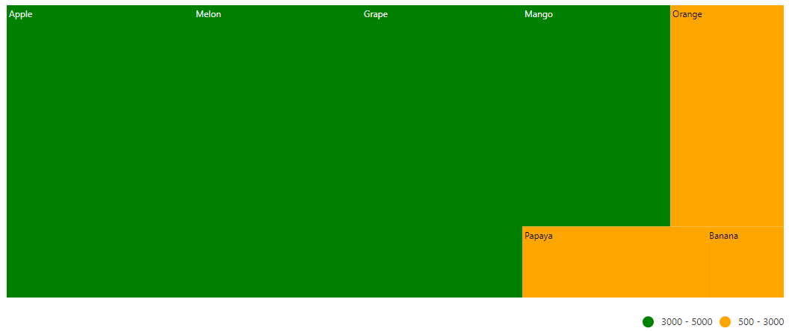
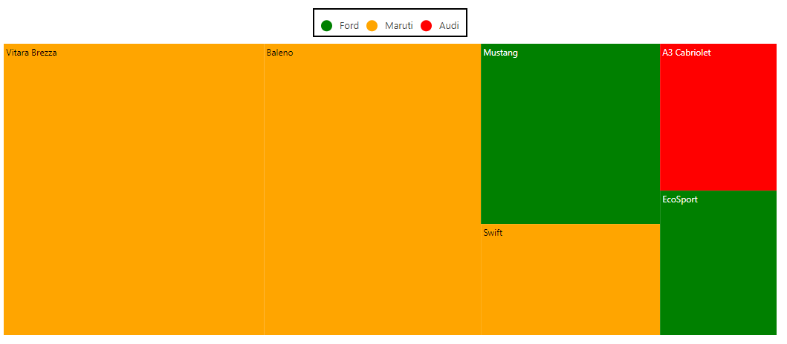
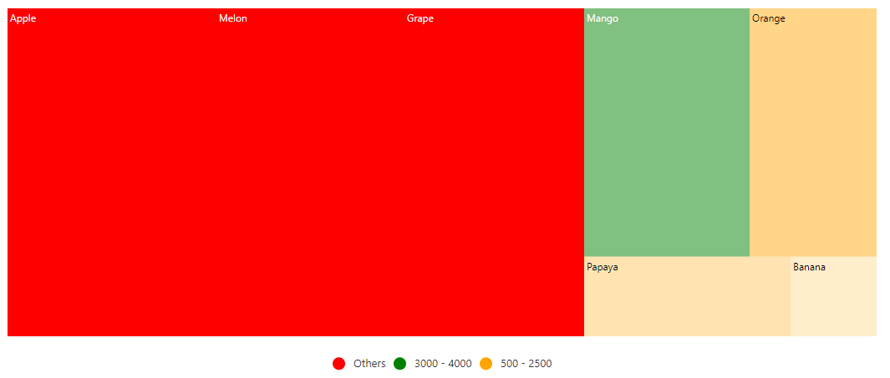

# Legend in Blazor TreeMap Component

Legend is used to provide valuable information for interpreting what the TreeMap displays. The legends can be represented in various colors, shapes or other identifiers based on the data.

## Types of legend

TreeMap component supports two different types of legend mode as following.

* [Default](https://help.syncfusion.com/cr/aspnetcore-blazor/Syncfusion.Blazor.TreeMap.LegendMode.html)
* [Interactive](https://help.syncfusion.com/cr/aspnetcore-blazor/Syncfusion.Blazor.TreeMap.LegendMode.html)

### Default legend

In the default mode, the legends have symbols with legend labels that are used to identify the items in the TreeMap component.

```cshtml
@using Syncfusion.Blazor.TreeMap

<SfTreeMap DataSource="Cars" TValue="Car" WeightValuePath="Count" EqualColorValuePath="Brand">
    <TreeMapLeafItemSettings LabelPath="Name">
        <TreeMapLeafColorMappings>
            <TreeMapLeafColorMapping Value="Ford" Color='new string[]{ "green" }'></TreeMapLeafColorMapping>
            <TreeMapLeafColorMapping Value="Audi" Color='new string[]{ "red" }'></TreeMapLeafColorMapping>
            <TreeMapLeafColorMapping Value="Maruti" Color='new string[]{ "orange" }'></TreeMapLeafColorMapping>
        </TreeMapLeafColorMappings>
    </TreeMapLeafItemSettings>
    <TreeMapLegendSettings Visible="true" Position="LegendPosition.Top">
    </TreeMapLegendSettings>
</SfTreeMap>

@code {
    public class Car
    {
        public string Name { get; set; }
        public string Brand { get; set; }
        public int Count { get; set; }
    };
    public List<Car> Cars = new List<Car> {
        new Car { Name="Mustang", Brand="Ford", Count=232},
        new Car { Name="EcoSport", Brand="Ford", Count=121},
        new Car { Name="Swift", Brand="Maruti", Count=143},
        new Car { Name="Baleno", Brand="Maruti", Count=454},
        new Car { Name="Vitara Brezza", Brand="Maruti", Count=545},
        new Car { Name="A3 Cabriolet", Brand="Audi", Count=123}
    };
}
```


### Interactive legend

The legends can be made interactive with an arrow mark that indicates exact range color in the legend when the mouse hovers on the TreeMap item. Enable this option by setting the [Mode](https://help.syncfusion.com/cr/blazor/Syncfusion.Blazor.TreeMap.TreeMapLegendSettings.html#Syncfusion_Blazor_TreeMap_TreeMapLegendSettings_Mode) property in the [TreeMapLegendSettings](https://help.syncfusion.com/cr/blazor/Syncfusion.Blazor.TreeMap.TreeMapLegendSettings.html) to [Interactive](https://help.syncfusion.com/cr/blazor/Syncfusion.Blazor.TreeMap.LegendMode.html#Syncfusion_Blazor_TreeMap_LegendMode_Interactive).

```cshtml
@using Syncfusion.Blazor.TreeMap

<SfTreeMap DataSource="Cars" TValue="Car" WeightValuePath="Count" EqualColorValuePath="Brand">
    <TreeMapLeafItemSettings LabelPath="Name">
        <TreeMapLeafColorMappings>
            <TreeMapLeafColorMapping Value="Ford" Color='new string[]{ "green" }'></TreeMapLeafColorMapping>
            <TreeMapLeafColorMapping Value="Audi" Color='new string[]{ "red" }'></TreeMapLeafColorMapping>
            <TreeMapLeafColorMapping Value="Maruti" Color='new string[]{ "orange" }'></TreeMapLeafColorMapping>
        </TreeMapLeafColorMappings>
    </TreeMapLeafItemSettings>
    <TreeMapLegendSettings Visible="true" Position="LegendPosition.Top" Mode="LegendMode.Interactive">
    </TreeMapLegendSettings>
</SfTreeMap>
```

> Refer to the [code block](#default-legend) to know about the property value of **Cars**.


## Position and Alignment

The legend position is used to place the legend in various positions. Based on the legend position, the legend item will be aligned. For example, if the position is [Top](https://help.syncfusion.com/cr/blazor/Syncfusion.Blazor.TreeMap.LegendPosition.html#Syncfusion_Blazor_TreeMap_LegendPosition_Top) or [Bottom](https://help.syncfusion.com/cr/blazor/Syncfusion.Blazor.TreeMap.LegendPosition.html#Syncfusion_Blazor_TreeMap_LegendPosition_Bottom), the legend items are placed by rows. If the position is [Left](https://help.syncfusion.com/cr/blazor/Syncfusion.Blazor.TreeMap.LegendPosition.html#Syncfusion_Blazor_TreeMap_LegendPosition_Left) or [Right](https://help.syncfusion.com/cr/blazor/Syncfusion.Blazor.TreeMap.LegendPosition.html#Syncfusion_Blazor_TreeMap_LegendPosition_Right), the legend items are placed by columns.

The following options are available to customize the legend position:

* [Top](https://help.syncfusion.com/cr/blazor/Syncfusion.Blazor.TreeMap.LegendPosition.html#Syncfusion_Blazor_TreeMap_LegendPosition_Top)
* [Bottom](https://help.syncfusion.com/cr/blazor/Syncfusion.Blazor.TreeMap.LegendPosition.html#Syncfusion_Blazor_TreeMap_LegendPosition_Bottom)
* [Left](https://help.syncfusion.com/cr/blazor/Syncfusion.Blazor.TreeMap.LegendPosition.html#Syncfusion_Blazor_TreeMap_LegendPosition_Left)
* [Right](https://help.syncfusion.com/cr/blazor/Syncfusion.Blazor.TreeMap.LegendPosition.html#Syncfusion_Blazor_TreeMap_LegendPosition_Right)
* [Float](https://help.syncfusion.com/cr/blazor/Syncfusion.Blazor.TreeMap.LegendPosition.html#Syncfusion_Blazor_TreeMap_LegendPosition_Float)
* [Auto](https://help.syncfusion.com/cr/blazor/Syncfusion.Blazor.TreeMap.LegendPosition.html#Syncfusion_Blazor_TreeMap_LegendPosition_Auto)

```cshtml
@using Syncfusion.Blazor.TreeMap

<SfTreeMap DataSource="Fruits" TValue="Fruit" WeightValuePath="Count" RangeColorValuePath="Count">
    <TreeMapLeafItemSettings LabelPath="FruitName">
        <TreeMapLeafColorMappings>
            <TreeMapLeafColorMapping From="500" To="3000" Color='new string[] { "Orange" }'></TreeMapLeafColorMapping>
            <TreeMapLeafColorMapping From="3000" To="5000" Color='new string[] { "Green" }'></TreeMapLeafColorMapping>
        </TreeMapLeafColorMappings>
    </TreeMapLeafItemSettings>
    <TreeMapLegendSettings Visible="true" Position="LegendPosition.Top"></TreeMapLegendSettings>
</SfTreeMap>

@code {
    public class Fruit
    {
        public string FruitName { get; set; }
        public double Count { get; set; }
    };
    public List<Fruit> Fruits = new List<Fruit> {
        new Fruit { FruitName="Apple", Count=5000 },
        new Fruit { FruitName="Mango", Count=3000 },
        new Fruit { FruitName="Orange", Count=2300 },
        new Fruit { FruitName="Banana", Count=500 },
        new Fruit { FruitName="Grape", Count=4300 },
        new Fruit { FruitName="Papaya", Count=1200 },
        new Fruit { FruitName="Melon", Count=4500 }
    };
}
```


The legend alignment is used to align the legend items in a specific location. The following options are available to customize the legend alignment:

* [Near](https://help.syncfusion.com/cr/blazor/Syncfusion.Blazor.TreeMap.Alignment.html#Syncfusion_Blazor_TreeMap_Alignment_Near)
* [Center](https://help.syncfusion.com/cr/blazor/Syncfusion.Blazor.TreeMap.Alignment.html#Syncfusion_Blazor_TreeMap_Alignment_Center)
* [Far](https://help.syncfusion.com/cr/blazor/Syncfusion.Blazor.TreeMap.Alignment.html#Syncfusion_Blazor_TreeMap_Alignment_Far)

```cshtml
@using Syncfusion.Blazor.TreeMap

<SfTreeMap DataSource="Fruits" TValue="Fruit" WeightValuePath="Count" RangeColorValuePath="Count">
    <TreeMapLeafItemSettings LabelPath="FruitName">
        <TreeMapLeafColorMappings>
            <TreeMapLeafColorMapping From="500" To="3000" Color='new string[]{"Orange"}'></TreeMapLeafColorMapping>
            <TreeMapLeafColorMapping From="3000" To="5000" Color='new string[]{"Green"}'></TreeMapLeafColorMapping>
        </TreeMapLeafColorMappings>
    </TreeMapLeafItemSettings>
    <TreeMapLegendSettings Visible="true" Alignment="Alignment.Far">
    </TreeMapLegendSettings>
</SfTreeMap>
```

> Refer to the [code block](#position-and-alignment) to know about the property value of **Fruits**.



## Legend size

Customize the legend size by modifying the [Height](https://help.syncfusion.com/cr/blazor/Syncfusion.Blazor.TreeMap.TreeMapLegendSettings.html#Syncfusion_Blazor_TreeMap_TreeMapLegendSettings_Height) and the [Width](https://help.syncfusion.com/cr/blazor/Syncfusion.Blazor.TreeMap.TreeMapLegendSettings.html#Syncfusion_Blazor_TreeMap_TreeMapLegendSettings_Width) properties in the [TreeMapLegendSettings](https://help.syncfusion.com/cr/blazor/Syncfusion.Blazor.TreeMap.TreeMapLegendSettings.html). It accepts values in both percentage and pixel.

```cshtml
@using Syncfusion.Blazor.TreeMap

<SfTreeMap DataSource="Cars" WeightValuePath="Count" EqualColorValuePath="Brand">
    <TreeMapLeafItemSettings LabelPath="Name">
        <TreeMapLeafColorMappings>
            <TreeMapLeafColorMapping Value="Ford" Color='new string[] { "green"}'></TreeMapLeafColorMapping>
            <TreeMapLeafColorMapping Value="Audi" Color='new string[] { "red" }'></TreeMapLeafColorMapping>
            <TreeMapLeafColorMapping Value="Maruti" Color='new string[] { "orange"}'></TreeMapLeafColorMapping>
        </TreeMapLeafColorMappings>
    </TreeMapLeafItemSettings>
    <TreeMapLegendSettings Visible="true" Height="50px" Width="200px" Position="LegendPosition.Top">
    </TreeMapLegendSettings>
</SfTreeMap>

@code {
    public class Car
    {
        public string Name { get; set; }
        public string Brand { get; set; }
        public int Count { get; set; }
    };
    public List<Car> Cars = new List<Car> {
        new Car { Name="Mustang", Brand="Ford", Count=232},
        new Car { Name="EcoSport", Brand="Ford", Count=121},
        new Car { Name="Swift", Brand="Maruti", Count=143},
        new Car { Name="Baleno", Brand="Maruti", Count=454},
        new Car { Name="Vitara Brezza", Brand="Maruti", Count=545},
        new Car { Name="A3 Cabriolet", Brand="Audi", Count=123},
        new Car { Name="RS7 Sportback", Brand="Audi", Count=523 }
    };
}
```



### Legend with paging support

TreeMap supports legend paging, if the legend items cannot be placed within the provided [Height](https://help.syncfusion.com/cr/blazor/Syncfusion.Blazor.TreeMap.TreeMapLegendSettings.html#Syncfusion_Blazor_TreeMap_TreeMapLegendSettings_Height) and [Width](https://help.syncfusion.com/cr/blazor/Syncfusion.Blazor.TreeMap.TreeMapLegendSettings.html#Syncfusion_Blazor_TreeMap_TreeMapLegendSettings_Width) of the legend.

```cshtml
@using Syncfusion.Blazor.TreeMap

<SfTreeMap DataSource="Cars" TValue="Car" WeightValuePath="Count" EqualColorValuePath="Brand">
    <TreeMapLeafItemSettings LabelPath="Name">
        <TreeMapLeafColorMappings>
            <TreeMapLeafColorMapping Value="Ford" Color='new string[] { "green" }'></TreeMapLeafColorMapping>
            <TreeMapLeafColorMapping Value="Audi" Color='new string[] { "red" }'></TreeMapLeafColorMapping>
            <TreeMapLeafColorMapping Value="Maruti" Color='new string[] { "orange" }'></TreeMapLeafColorMapping>
        </TreeMapLeafColorMappings>
    </TreeMapLeafItemSettings>
    <TreeMapLegendSettings Visible="true" Height="50px" Width="100px" Position="LegendPosition.Top">
        <TreeMapLegendBorder Width="1"></TreeMapLegendBorder>
    </TreeMapLegendSettings>
</SfTreeMap>

@code {
    public class Car
    {
        public string Name { get; set; }
        public string Brand { get; set; }
        public int Count { get; set; }
    };
    public List<Car> Cars = new List<Car> {
        new Car { Name="Mustang", Brand="Ford", Count=232},
        new Car { Name="EcoSport", Brand="Ford", Count=121},
        new Car { Name="Swift", Brand="Maruti", Count=143},
        new Car { Name="Baleno", Brand="Maruti", Count=454},
        new Car { Name="Vitara Brezza", Brand="Maruti", Count=545},
        new Car { Name="A3 Cabriolet", Brand="Audi", Count=123},
        new Car { Name="RS7 Sportback", Brand="Audi", Count=523 }
    };
}
```


## Excluded legend items from the color mapping

Based on the mapping ranges in the data source, get the excluded ranges from the color mapping, and show the legend with the excluded range values that are bound to the specific legend.

```cshtml
@using Syncfusion.Blazor.TreeMap

<SfTreeMap DataSource="Fruits" TValue="Fruit" WeightValuePath="Count" RangeColorValuePath="Count">
    <TreeMapLeafItemSettings LabelPath="FruitName">
        <TreeMapLeafColorMappings>
            <TreeMapLeafColorMapping From="500" To="3000" Color='new string[] { "Orange" }'></TreeMapLeafColorMapping>
            <TreeMapLeafColorMapping From="3000" To="4000" Color='new string[] { "Green" }' ></TreeMapLeafColorMapping>
            <TreeMapLeafColorMapping Color='new string[] { "red" }'></TreeMapLeafColorMapping>
        </TreeMapLeafColorMappings>
    </TreeMapLeafItemSettings>
    <TreeMapLegendSettings Visible="true">
    </TreeMapLegendSettings>
</SfTreeMap>

@code {
    public class Fruit
    {
        public string FruitName { get; set; }
        public double Count { get; set; }
    };
    public List<Fruit> Fruits = new List<Fruit> {
        new Fruit { FruitName="Apple", Count=5000 },
        new Fruit { FruitName="Mango", Count=3000 },
        new Fruit { FruitName="Orange", Count=2300 },
        new Fruit { FruitName="Banana", Count=500 },
        new Fruit { FruitName="Grape", Count=4300 },
        new Fruit { FruitName="Papaya", Count=1200 },
        new Fruit { FruitName="Melon", Count=4500 }
    };
}
```



## Hide desired legend items

To enable or disable the desired legend item for each color mapping, set the [ShowLegend](https://help.syncfusion.com/cr/aspnetcore-blazor/Syncfusion.Blazor.TreeMap.TreeMapLegendSettings.html) property to **true** in the [TreeMapLeafColorMappings](https://help.syncfusion.com/cr/blazor/Syncfusion.Blazor.TreeMap.TreeMapLeafItemSettings.html#Syncfusion_Blazor_TreeMap_TreeMapLeafItemSettings_ColorMapping).

```cshtml
@using Syncfusion.Blazor.TreeMap

<SfTreeMap DataSource="Fruits" TValue="Fruit" WeightValuePath="Count" RangeColorValuePath="Count">
    <TreeMapLeafItemSettings LabelPath="FruitName">
        <TreeMapLeafColorMappings>
            <TreeMapLeafColorMapping From="500" To="3000" Color='new string[] { "Orange" }'></TreeMapLeafColorMapping>
            <TreeMapLeafColorMapping From="3000" To="4000" Color='new string[] { "Green" }' ShowLegend="false"></TreeMapLeafColorMapping>
            <TreeMapLeafColorMapping Color='new string[] { "red" }'></TreeMapLeafColorMapping>
        </TreeMapLeafColorMappings>
    </TreeMapLeafItemSettings>
    <TreeMapLegendSettings Visible="true">
    </TreeMapLegendSettings>
</SfTreeMap>

@code {
    public class Fruit
    {
        public string FruitName { get; set; }
        public double Count { get; set; }
    };
    public List<Fruit> Fruits = new List<Fruit> {
        new Fruit { FruitName="Apple", Count=5000 },
        new Fruit { FruitName="Mango", Count=3000 },
        new Fruit { FruitName="Orange", Count=2300 },
        new Fruit { FruitName="Banana", Count=500 },
        new Fruit { FruitName="Grape", Count=4300 },
        new Fruit { FruitName="Papaya", Count=1200 },
        new Fruit { FruitName="Melon", Count=4500 }
    };
}
```


## Hide legend items based on the data source value

To enable or disable the legend visibility for each item through the data source, bind the appropriate data source property name to [ShowLegendPath](https://help.syncfusion.com/cr/blazor/Syncfusion.Blazor.TreeMap.TreeMapLegendSettings.html#Syncfusion_Blazor_TreeMap_TreeMapLegendSettings_ShowLegendPath) property in the [TreeMapLegendSettings](https://help.syncfusion.com/cr/aspnetcore-blazor/Syncfusion.Blazor.TreeMap.TreeMapLegendSettings.html).

```cshtml
@using Syncfusion.Blazor.TreeMap

<SfTreeMap DataSource="Fruits" TValue="Fruit" WeightValuePath="Count" ColorValuePath="Color">
    <TreeMapLeafItemSettings LabelPath="Name">
    </TreeMapLeafItemSettings>
    <TreeMapLegendSettings Visible="true" ShowLegendPath="Visibility">
    </TreeMapLegendSettings>
</SfTreeMap>

@code{
    public class Fruit
    {
        public string Name { get; set; }
        public int Count { get; set; }
        public bool Visibility { get; set; }
        public string Color { get; set; }
    };
    public List<Fruit> Fruits = new List<Fruit> {
        new Fruit { Name="Apple", Count=5000, Visibility= true , Color="red" },
        new Fruit { Name="Mango", Count=3000, Visibility= false , Color="blue"},
        new Fruit { Name="Orange", Count=2300, Visibility= true , Color="green" },
        new Fruit { Name="Banana", Count=500, Visibility= false , Color = "yellow"},
        new Fruit { Name="Grape", Count=4300, Visibility= true , Color="pink"},
        new Fruit { Name="Papaya", Count=1200, Visibility= false, Color="orange" },
        new Fruit { Name="Melon", Count=4500, Visibility= true , Color="purple"}
    };
}
```


## Bind legend item text from the data source

To show the legend item text from the data source, bind the property name from the data source to the [ValuePath](https://help.syncfusion.com/cr/blazor/Syncfusion.Blazor.TreeMap.TreeMapLegendSettings.html#Syncfusion_Blazor_TreeMap_TreeMapLegendSettings_ValuePath) property in the [TreeMapLegendSettings](https://help.syncfusion.com/cr/aspnetcore-blazor/Syncfusion.Blazor.TreeMap.TreeMapLegendSettings.html).

```cshtml
@using Syncfusion.Blazor.TreeMap

<SfTreeMap DataSource="Fruits" TValue="Fruit" WeightValuePath="Count" ColorValuePath="Color">
    <TreeMapLeafItemSettings LabelPath="Name">
    </TreeMapLeafItemSettings>
    <TreeMapLegendSettings Visible="true" ValuePath="Name">
    </TreeMapLegendSettings>
</SfTreeMap>

@code{
    public class Fruit
    {
        public string Name { get; set; }
        public int Count { get; set; }
        public string Color { get; set; }
    };
    public List<Fruit> Fruits = new List<Fruit> {
        new Fruit { Name="Apple", Count=5000, Color="red" },
        new Fruit { Name="Mango", Count=3000, Color="blue"},
        new Fruit { Name="Orange", Count=2300, Color="green" },
        new Fruit { Name="Banana", Count=500, Color = "yellow"},
        new Fruit { Name="Grape", Count=4300, Color="pink"},
        new Fruit { Name="Papaya", Count=1200, Color="orange" },
        new Fruit { Name="Melon", Count=4500, Color="purple"}
    };
}
```


## Hide duplicate legend items

To enable or disable the duplicate legend items, set the [RemoveDuplicateLegend](https://help.syncfusion.com/cr/blazor/Syncfusion.Blazor.TreeMap.TreeMapLegendSettings.html#Syncfusion_Blazor_TreeMap_TreeMapLegendSettings_RemoveDuplicateLegend) property to **true** in the [TreeMapLegendSettings](https://help.syncfusion.com/cr/aspnetcore-blazor/Syncfusion.Blazor.TreeMap.TreeMapLegendSettings.html).

```cshtml
@using Syncfusion.Blazor.TreeMap

<SfTreeMap DataSource="Fruits" TValue="Fruit" WeightValuePath="Count" ColorValuePath="Color">
    <TreeMapLeafItemSettings LabelPath="Name">
    </TreeMapLeafItemSettings>
    <TreeMapLegendSettings Visible="true" ValuePath="Name" RemoveDuplicateLegend="true">
    </TreeMapLegendSettings>
</SfTreeMap>

@code{
    public class Fruit
    {
        public string Name { get; set; }
        public int Count { get; set; }
        public string Color { get; set; }
    };
    public List<Fruit> Fruits = new List<Fruit> {
        new Fruit { Name="Apple", Count=5000, Color="red" },
        new Fruit { Name="Apple", Count=2300, Color="yellow" },
        new Fruit { Name="Mango", Count=3000, Color="blue"},
        new Fruit { Name="Orange", Count=2300, Color="green" },
        new Fruit { Name="Banana", Count=500, Color = "yellow"},
        new Fruit { Name="Grape", Count=4300, Color="pink"},
        new Fruit { Name="Papaya", Count=1200, Color="orange" },
        new Fruit { Name="Melon", Count=4500, Color="purple"}
    };
}
```


## Positioning based on size

Use a responsive legend that switches positions between the right and the bottom based on the available height and width. To enable the responsive legend, set the [Position](https://help.syncfusion.com/cr/aspnetcore-blazor/Syncfusion.Blazor.TreeMap.LegendPosition.html) property to [Auto](https://help.syncfusion.com/cr/aspnetcore-blazor/Syncfusion.Blazor.TreeMap.LegendPosition.html) in the [TreeMapLegendSettings](https://help.syncfusion.com/cr/aspnetcore-blazor/Syncfusion.Blazor.TreeMap.TreeMapLegendSettings.html) and the legend position is changed based on the available height and width.

```cshtml
@using Syncfusion.Blazor.TreeMap

<SfTreeMap DataSource="Fruits" TValue="Fruit" WeightValuePath="Count" Width="700px" Height="500px" Palette='new string[] { "#71B081", "#5A9A77", "#498770", "#39776C", "#266665", "#124F5E" }'>
    <TreeMapLeafItemSettings LabelPath="Name">
    </TreeMapLeafItemSettings>
    <TreeMapLegendSettings Visible="true" Position="LegendPosition.Auto">
    </TreeMapLegendSettings>
</SfTreeMap>

@code{
    public class Fruit
    {
        public string Name { get; set; }
        public int Count { get; set; }
    };
    public List<Fruit> Fruits = new List<Fruit> {
        new Fruit { Name="Apple", Count=5000 },
        new Fruit { Name="Mango", Count=3000 },
        new Fruit { Name="Orange", Count=2300 },
        new Fruit { Name="Banana", Count=500 },
        new Fruit { Name="Grape", Count=4300 },
        new Fruit { Name="Papaya", Count=1200 },
        new Fruit { Name="Melon", Count=4500 }
    };
}
```


## Legend with RTL support

Set the [EnableRtl](https://help.syncfusion.com/cr/blazor/Syncfusion.Blazor.TreeMap.SfTreeMap-1.html#Syncfusion_Blazor_TreeMap_SfTreeMap_1_EnableRtl) property to **true**, the legend icon will be rendered on the right and the legend text will be rendered on the left of the legend icon.

```cshtml
@using Syncfusion.Blazor.TreeMap

<SfTreeMap DataSource="Cars" WeightValuePath="Count" ColorValuePath="Color" EnableRtl="true">
    <TreeMapLeafItemSettings LabelPath="Name">
    </TreeMapLeafItemSettings>
    <TreeMapLegendSettings Visible="true" Position="LegendPosition.Top">
    </TreeMapLegendSettings>
</SfTreeMap>

@code {
    public class Car
    {
        public string Name { get; set; }
        public string Brand { get; set; }
        public int Count { get; set; }
        public string Color { get; set; }
    };
    public List<Car> Cars = new List<Car> {
        new Car { Name="Mustang", Brand="Ford", Count=232, Color= "#71B081" },
        new Car { Name="EcoSport", Brand="Ford", Count=121,  Color= "#5A9A77" },
        new Car { Name="Swift", Brand="Maruti", Count=143, Color= "#498770" },
        new Car { Name="Baleno", Brand="Maruti", Count=454, Color= "#39776C" },
        new Car { Name="Vitara Brezza", Brand="Maruti", Count=545 , Color= "#266665" },
        new Car { Name="A3 Cabriolet", Brand="Audi",Count=123, Color= "#124F5E" }
    };
}
```

