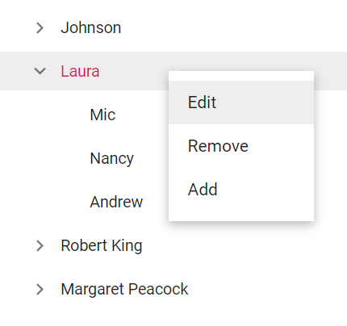

# Process the Blazor TreeView node operations using context menu

The context menu can be integrated with `TreeView` component in order to perform the TreeView related operations like add, remove and renaming node.

Following example demonstrates the above cases which are used to manipulate TreeView operations in the `ItemSelected` event of context menu.

```cshtml
@using Syncfusion.Blazor.Navigations

<div id="treeview">
    <SfTreeView TValue="EmployeeData" @ref="tree" AllowDragAndDrop="true" @bind-SelectedNodes="@selectedNodes" @bind-ExpandedNodes="expandedNodes">
        <TreeViewFieldsSettings Id="Id" ParentID="Pid" DataSource="@ListData" Text="Name" HasChildren="HasChild"></TreeViewFieldsSettings>
        <TreeViewEvents TValue="EmployeeData" NodeSelected="OnSelect" NodeClicked="nodeClicked"></TreeViewEvents>
        <SfContextMenu TValue="MenuItem" @ref="menu" Target="#treeview" Items="@MenuItems">
            <MenuEvents TValue="MenuItem" ItemSelected="MenuSelect"></MenuEvents>
        </SfContextMenu>
    </SfTreeView>
</div>

@code
{
    // Reference for treeview
    SfTreeView<EmployeeData> tree;

    // Reference for context menu
    SfContextMenu<MenuItem> menu;
    string selectedId;
    public string[] selectedNodes = Array.Empty<string>();
    public string[] expandedNodes = new string[] { "" };
    int index = 100;

    // Datasource for menu items
    public List<MenuItem> MenuItems = new List<MenuItem>{
        new MenuItem { Text = "Edit" },
        new MenuItem { Text = "Remove" },
        new MenuItem { Text = "Add" }
    };

    public class EmployeeData
    {
        public string Id { get; set; }
        public string Name { get; set; }
        public string Pid { get; set; }
        public bool HasChild { get; set; }
    }

    // Triggers when TreeView Node is selected
    public void OnSelect(NodeSelectEventArgs args)
    {
        this.selectedId = args.NodeData.Id;
    }

    // Triggers when TreeView node is clicked
    public void nodeClicked(NodeClickEventArgs args)
    {
        selectedId = args.NodeData.Id;
        selectedNodes = new string[] { args.NodeData.Id };
    }

    // To add a new node
    async Task AddNodes()
    {
        // Expand the selected nodes
        expandedNodes = new string[] { this.selectedId };
        string NodeId = "tree_" + this.index.ToString();
        ListData.Add(new EmployeeData
        {
            Id = NodeId,
            Name = "NewItem",
            Pid = this.selectedId
        });
        await Task.Delay(100);
        // Edit the added node.
        await this.tree.BeginEditAsync(NodeId);
        this.index = this.index + 1;

    }

    // To delete a tree node
    void RemoveNodes()
    {
        List<EmployeeData> removeNode = tree.GetTreeData(selectedId);
        ListData.Remove(removeNode.ElementAt(0));
    }

    // To edit a tree node
    async Task RenameNodes()
    {
        await this.tree.BeginEdit(this.selectedId);
    }

    // Triggers when context menu is selected
    public async Task MenuSelect(MenuEventArgs<MenuItem> args)
    {
        string selectedText;
        selectedText = args.Item.Text;
        if (selectedText == "Edit")
        {
            await this.RenameNodes();
        }
        else if (selectedText == "Remove")
        {
            this.RemoveNodes();
        }
        else if (selectedText == "Add")
        {
            await this.AddNodes();
        }
    }

    // local data source
    List<EmployeeData> ListData = new List<EmployeeData>();

    protected override void OnInitialized()
    {
        selectedNodes = new string[] { "1" };
        base.OnInitialized();
        ListData = new List<EmployeeData>();
        ListData.Add(new EmployeeData
        {
            Id = "1",
            Name = "Johnson",
            HasChild = true,
        });
        ListData.Add(new EmployeeData
        {
            Id = "2",
            Pid = "1",
            Name = "Sourav",
        });
        ListData.Add(new EmployeeData
        {
            Id = "3",
            Pid = "1",
            Name = "Sanjay",
        });

        ListData.Add(new EmployeeData
        {
            Id = "4",
            Pid = "1",
            Name = "Steve",
        });
        ListData.Add(new EmployeeData
        {
            Id = "6",
            Pid = "1",
            Name = "Martin",
        });
        ListData.Add(new EmployeeData
        {
            Id = "7",
            Name = "Laura",
            HasChild = true,
        });
        ListData.Add(new EmployeeData
        {
            Id = "8",
            Pid = "7",
            Name = "Mic",
        });
        ListData.Add(new EmployeeData
        {
            Id = "9",
            Pid = "7",
            Name = "Nancy",
        });
        ListData.Add(new EmployeeData
        {
            Id = "10",
            Pid = "7",
            Name = "Andrew",
        });
        ListData.Add(new EmployeeData
        {
            Id = "11",
            Name = "Robert King",
            HasChild = true,
        });
        ListData.Add(new EmployeeData
        {
            Id = "12",
            Pid = "11",
            Name = "Richard",
        });
        ListData.Add(new EmployeeData
        {
            Id = "13",
            Pid = "11",
            Name = "James",
        });
        ListData.Add(new EmployeeData
        {
            Id = "14",
            Pid = "11",
            Name = "Murrey",
        });
        ListData.Add(new EmployeeData
        {
            Id = "15",
            Pid = "11",
            Name = "Chris",
        });
        ListData.Add(new EmployeeData
        {
            Id = "16",
            Name = "Margaret Peacock",
            HasChild = true,
        });
        ListData.Add(new EmployeeData
        {
            Id = "17",
            Pid = "16",
            Name = "Ryaz",
        });
        ListData.Add(new EmployeeData
        {
            Id = "18",
            Pid = "16",
            Name = "Mary",
        });
        ListData.Add(new EmployeeData
        {
            Id = "19",
            Pid = "16",
            Name = "Stephen",
        });
        ListData.Add(new EmployeeData
        {
            Id = "20",
            Pid = "16",
            Name = "Raffel",
        });
    }
}
```

