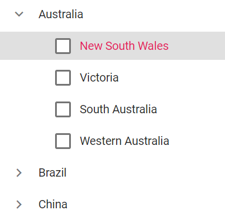

# Remove the checkbox of the parent node in Blazor TreeView Component

By enabling the `ShowCheckBox` property, check box could be rendered before each node of TreeView. However, some application needs to render check box in child nodes alone. In such case, remove the check box of the parent node by customizing the CSS.

```cshtml
@using Syncfusion.Blazor.Navigations
<SfTreeView TValue="Country" ShowCheckBox="true" CssClass="CustomTree">
    <TreeViewFieldsSettings TValue="Country" Id="Id" DataSource="@Countries" Text="Name" ParentID="ParentId" HasChildren="HasChild" Expanded="Expanded" Selected="IsSelected"></TreeViewFieldsSettings>
</SfTreeView>

@code{
    public class Country
    {
        public int Id { get; set; }
        public int? ParentId { get; set; }
        public string Name { get; set; }
        public bool HasChild { get; set; }
        public bool Expanded { get; set; }
        public bool IsSelected { get; set; }
    }
    List<Country> Countries = new List<Country>();

    protected override void OnInitialized()
    {
        base.OnInitialized();
        Countries.Add(new Country
        {
            Id = 1,
            Name = "Australia",
            HasChild = true,
            Expanded = true
        });
        Countries.Add(new Country
        {
            Id = 2,
            ParentId = 1,
            Name = "New South Wales",
            IsSelected = true
        });
        Countries.Add(new Country
        {
            Id = 3,
            ParentId = 1,
            Name = "Victoria",
            IsSelected = true
        });
        Countries.Add(new Country
        {
            Id = 4,
            ParentId = 1,
            Name = "South Australia"
        });
        Countries.Add(new Country
        {
            Id = 5,
            ParentId = 1,
            Name = "Western Australia"
        });
        Countries.Add(new Country
        {
            Id = 6,
            Name = "Brazil",
            HasChild = true
        });
        Countries.Add(new Country
        {
            Id = 7,
            ParentId = 6,
            Name = "Paraná"
        });
        Countries.Add(new Country
        {
            Id = 8,
            ParentId = 6,
            Name = "Ceará"
        });
        Countries.Add(new Country
        {
            Id = 9,
            Name = "China",
            HasChild = true
        });
        Countries.Add(new Country
        {
            Id = 10,
            ParentId = 9,
            Name = "Guangzhou"
        });
        Countries.Add(new Country
        {
            Id = 11,
            ParentId = 9,
            Name = "Shantou"
        });
    }
}

<style>
    .CustomTree .e-list-item.e-level-1 .e-text-content.e-icon-wrapper
    .e-checkbox-wrapper {
        display: none
    }
</style>
```

