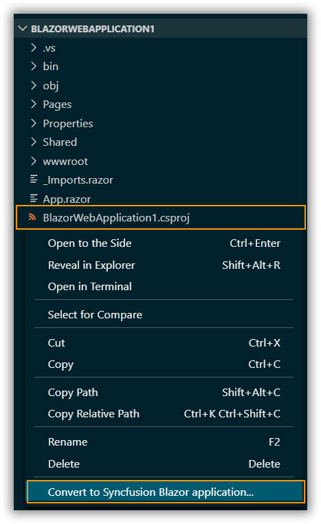

# Convert Project in Blazor

Syncfusion project conversion is a Visual Studio Code add-in that converts an existing Blazor application into a Syncfusion Blazor Web Application by adding the required NuGet packages and CDN links.

   > The Syncfusion Blazor Web Application Project Conversion utility is available from `v17.4.0.39`.

The following steps helps to use the Syncfusion Project conversion in the existing Blazor Web Application:

1. Open an existing Blazor Web Application or create a new Microsoft Blazor Web Application in Visual Studio Code.

2. Right-click on the **Project file** from Explorer (Workspace), select the **Convert to Syncfusion Blazor Application…** Refer to the following screenshot for more information.

    

3. **Select Blazor Version** (which published in `nuget.org`) from the palette appears.

    

4. Choose the **Theme** from the palette appears.

    

5. The project configured with Syncfusion Blazor required NuGet packages and CDN links.

6. If the trial setup or NuGet packages are installed from the nuget.org, register the Syncfusion license key to the project since Syncfusion introduced the licensing system from 2018 Volume 2 (v16.2.0.41) Essential Studio release. Navigate to the [help topic](https://help.syncfusion.com/common/essential-studio/licensing/license-key#how-to-generate-syncfusion-license-key) to generate and register the Syncfusion license key to the project. Refer to this [blog](https://blog.syncfusion.com/post/Whats-New-in-2018-Volume-2-Licensing-Changes-in-the-1620x-Version-of-Essential-Studio.aspx?_ga=2.11237684.1233358434.1587355730-230058891.1567654773) post for understanding the licensing changes introduced in Essential Studio.

## NuGet Packages

The following NuGet packages are added as NuGet references based on application type.

| Syncfusion Blazor NuGet packages  | Application type  |
|---|---|
| `Syncfusion.Blazor`  | Syncfusion Blazor Server App   Syncfusion Blazor WebAssembly App   Syncfusion Blazor WebAssembly App (ASPNET Core hosted)   Syncfusion Blazor WebAssembly App (Progressive Web Application)|
| `Syncfusion.Blazor.PdfViewerServer.Windows`  | Syncfusion Blazor Server App  |
| `Syncfusion.Blazor.WordProcessor`  | Syncfusion Blazor Server App   Syncfusion Blazor WebAssembly App   Syncfusion Blazor WebAssembly App (ASPNET Core hosted)   Syncfusion Blazor WebAssembly App (Progressive Web Application)|

## CDN links

The Syncfusion Blazor scripts and the selected theme (while converting the project) are added as a CDN link in the following location of Blazor type application.

| Application type  | File location  |
|---|---|
| Syncfusion Blazor Server App | {Project location}\Pages\\_Host.cshtml |
| Syncfusion Blazor WebAssembly App (ASPNET Core hosted)   Syncfusion Blazor WebAssembly App (Progressive Web Application)| {Client Project location}\wwwroot\index.html  |
| Syncfusion Blazor WebAssembly App  | {Project location}\wwwroot\index.html|

