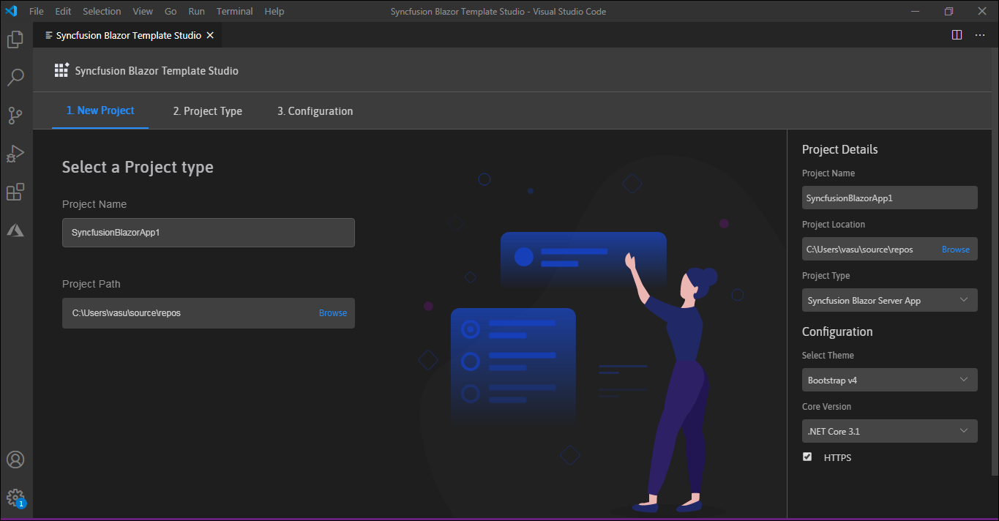
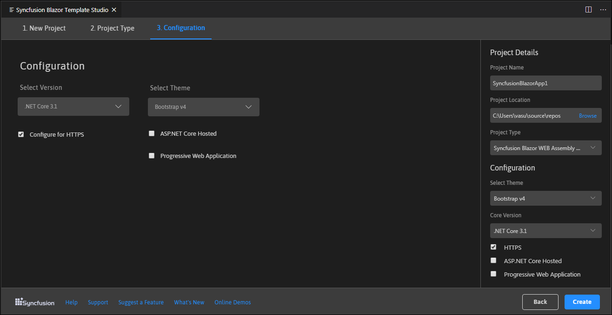
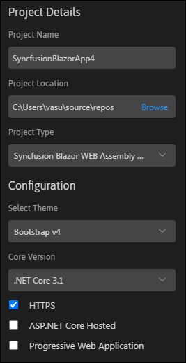
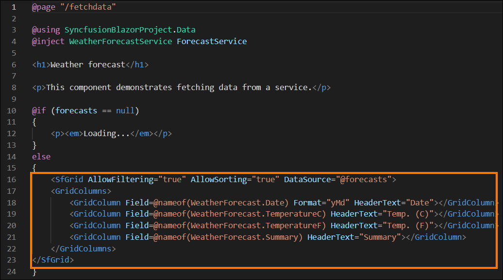

# Create project in Blazor 

Syncfusion provides **project templates** for **Visual Studio Code** to create Syncfusion Blazor applications. Syncfusion Blazor creates applications with the required Syncfusion NuGet packages, namespaces, and component render code for the Calendar, Button, and DataGrid components, and the style for making development easier with Syncfusion components.

> The Syncfusion Visual Studio Code project template provides support for Blazor project templates from `v17.4.0.39`.

The following steps help you create **Syncfusion Blazor Applications** through the **Visual Studio Code:**

1. In Visual Studio Code, open the command palette by pressing **Ctrl+Shift+P** to create a Syncfusion Blazor project. When the Visual Studio Code palette opens, search for the word **Syncfusion** so you can get the templates provided.

    

2. Select **Syncfusion Blazor Template Studio: Launch** and then press **Enter**. The Template Studio wizard for configuring the Syncfusion Blazor app will appear. Provide the require Project Name and Path to create the new Syncfusion Blazor application.

    

3. Click either **Next** or the **Project Type** tab. The Syncfusion Blazor Project Types will appears. Choose one of the Syncfusion Blazor project types:
   * Syncfusion Blazor Server App
   * Syncfusion Blazor WebAssembly App

    In the Syncfusion Blazor WebAssembly App project type, we can choose ASP.NET Core hosted, Progressive Web Application, or both.

    

4. Click either **Next** or the **Configuration** tab, and the Configuration section will be loaded. You can choose the required .NET Core version, themes, https configuration, and Blazor Web Assembly project types (ASP.NET Core hosted and Progressive Web Application).

    

    > ASP.NET Core hosted and Progressive Web Application options are only visible for the Blazor Web Assembly App project type.

5. You can change the configuration details below in the Project Details section to change the project name, location, project types, or change the configurations.

    

6. Click **Create**. The Syncfusion Blazor application has been created. The created Syncfusion Blazor app is configured with the Syncfusion NuGet packages, styles, and the component render code for the Syncfusion component added to the Index, Counter, and FetchData pages.

7. To show the Syncfusion components, you can run the application. Click on **F5** or navigate to **Debug>Start Debugging**.

    

8. If you installed the trial setup or NuGet packages from nuget.org you have to register the Syncfusion license key to your project since Syncfusion introduced the licensing system from 2018 Volume 2 (v16.2.0.41) Essential Studio release. Navigate to the [help topic](https://help.syncfusion.com/common/essential-studio/licensing/license-key#how-to-generate-syncfusion-license-key) to generate and register the Syncfusion license key to your project. Refer to this [blog](https://blog.syncfusion.com/post/Whats-New-in-2018-Volume-2-Licensing-Changes-in-the-1620x-Version-of-Essential-Studio.aspx?_ga=2.11237684.1233358434.1587355730-230058891.1567654773) post for understanding the licensing changes introduced in Essential Studio.

## Syncfusion integration

The latest Syncfusion Blazor NuGet packages, styles, namespaces, and component render code for Syncfusion components are added in the created application.

### NuGet Packages

The `Syncfusion.Blazor` NuGet package will be added as NuGet references for all application types.

### Style

The selected theme is added from Syncfusion NuGet and its reference at these applications locations in Blazor.

| Application type  | File location  |
|---|---|
| Syncfusion Blazor Server App | {Project location}\Pages\\_Host.cshtml |
| Syncfusion Blazor WebAssembly App (ASPNET Core hosted)   Syncfusion Blazor WebAssembly App (Progressive Web Application) | {Client Project location}\wwwroot\index.html  |
| Syncfusion Blazor WebAssembly App  | {Project location}\wwwroot\index.html|

### Namespaces

The Syncfusion Blazor namespaces are added in the **`_imports.razor`** file.

### Component render code

The Calendar, Button, and DataGrid component render code is in the Razor files in the pages folder. The render code is updated in these Razor files.

| File name  | Code snippet added |
|---|---|
| `~/Pages/Index.razor`  |  |
| `~/Pages/Counter.razor` |  |
| `~/Pages/FetchData.razor`  |  |